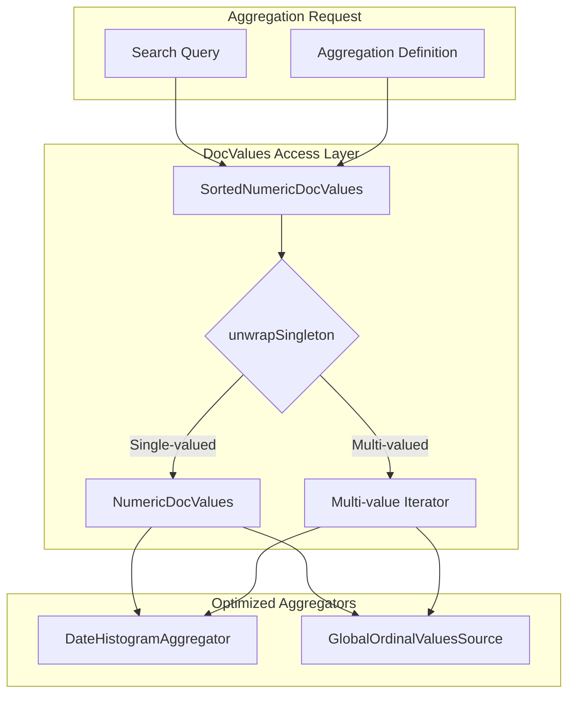
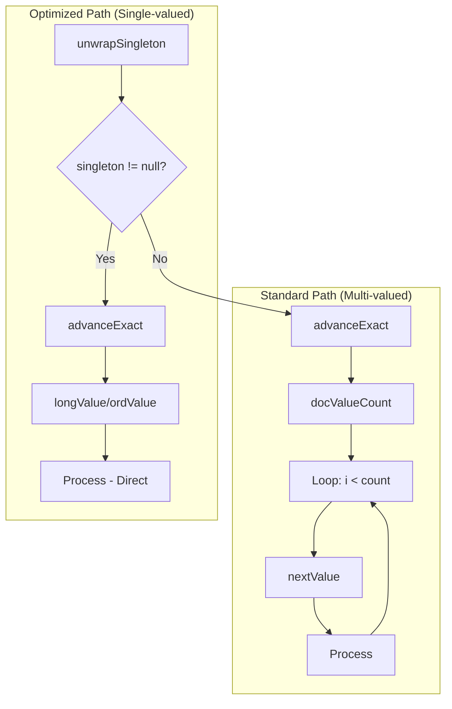

---
tags:
  - performance
  - search
---

# DocValues Singleton Optimization

## Summary

DocValues singleton optimization is a performance enhancement for OpenSearch aggregations that provides a specialized fast path for single-valued fields. By using Lucene's `DocValues.unwrapSingleton()` method, aggregators can bypass unnecessary iteration logic and access values directly, reducing method call overhead and improving aggregation performance by 3-10%.

## Details

### Architecture



### Data Flow



### Components

| Component | Description |
|-----------|-------------|
| `DocValues.unwrapSingleton()` | Lucene utility to detect and unwrap single-valued DocValues |
| `NumericDocValues` | Direct access interface for single numeric values |
| `SortedDocValues` | Direct access interface for single ordinal values |
| `DateHistogramAggregator` | Date histogram with singleton optimization |
| `GlobalOrdinalValuesSource` | Composite aggregation source with singleton optimization |

### Configuration

No configuration required. The optimization is automatically applied when:

| Condition | Description |
|-----------|-------------|
| Single-valued field | Field contains at most one value per document |
| DocValues enabled | Field has `doc_values: true` (default for most field types) |

### How It Works

#### Before Optimization

```java
SortedNumericDocValues values = valuesSource.longValues(ctx);
return new LeafBucketCollectorBase(sub, values) {
    @Override
    public void collect(int doc, long owningBucketOrd) throws IOException {
        if (values.advanceExact(doc)) {
            int valuesCount = values.docValueCount();  // Always 1 for single values
            for (int i = 0; i < valuesCount; ++i) {    // Unnecessary loop
                long value = values.nextValue();
                // ... processing
            }
        }
    }
};
```

#### After Optimization

```java
final SortedNumericDocValues values = valuesSource.longValues(ctx);
final NumericDocValues singleton = DocValues.unwrapSingleton(values);

if (singleton != null) {
    // Optimized path for single-valued fields
    return new LeafBucketCollectorBase(sub, values) {
        @Override
        public void collect(int doc, long owningBucketOrd) throws IOException {
            if (singleton.advanceExact(doc)) {
                long value = singleton.longValue();  // Direct access
                collectValue(sub, doc, owningBucketOrd, value);
            }
        }
    };
}

// Original path for multi-valued fields
return new LeafBucketCollectorBase(sub, values) {
    // ... iteration logic preserved
};
```

### Performance Benefits

| Optimization | Benefit |
|--------------|---------|
| Eliminated loop | No iteration overhead for single values |
| Reduced method calls | `advanceExact → longValue` instead of `advanceExact → docValueCount → nextValue` |
| Better memory access | Direct value access without iteration state |
| Preserved compatibility | Multi-valued fields use original path |

### Usage Example

```json
// Date histogram on single-valued timestamp field
GET /logs/_search
{
  "size": 0,
  "aggs": {
    "events_over_time": {
      "date_histogram": {
        "field": "@timestamp",
        "calendar_interval": "hour"
      }
    }
  }
}

// Composite aggregation on single-valued keyword field
GET /sales/_search
{
  "size": 0,
  "aggs": {
    "sales_by_region": {
      "composite": {
        "size": 100,
        "sources": [
          { "region": { "terms": { "field": "region.keyword" } } }
        ]
      }
    }
  }
}
```

## Limitations

- Only benefits single-valued fields; multi-valued fields use the standard path
- Requires DocValues to be enabled on the field
- Performance improvement varies based on query complexity and data characteristics
- Currently implemented for DateHistogramAggregator and GlobalOrdinalValuesSource

## Change History

- **v3.0.0** (2025-04): Initial implementation for DateHistogramAggregator and GlobalOrdinalValuesSource

## Related Features
- [OpenSearch Dashboards](../opensearch-dashboards/opensearch-dashboards-ai-chat.md)

## References

### Documentation
- [Date Histogram Documentation](https://docs.opensearch.org/3.0/aggregations/bucket/date-histogram/)
- [Bucket Aggregations Documentation](https://docs.opensearch.org/3.0/aggregations/bucket/index/)
- [Lucene DocValues](https://lucene.apache.org/core/9_0_0/core/org/apache/lucene/index/DocValues.html)

### Pull Requests
| Version | PR | Description | Related Issue |
|---------|-----|-------------|---------------|
| v3.0.0 | [#17643](https://github.com/opensearch-project/OpenSearch/pull/17643) | Unwrap singleton DocValues in date histogram aggregation |   |
| v3.0.0 | [#17740](https://github.com/opensearch-project/OpenSearch/pull/17740) | Unwrap singleton DocValues in global ordinal value source of composite aggregation |   |
