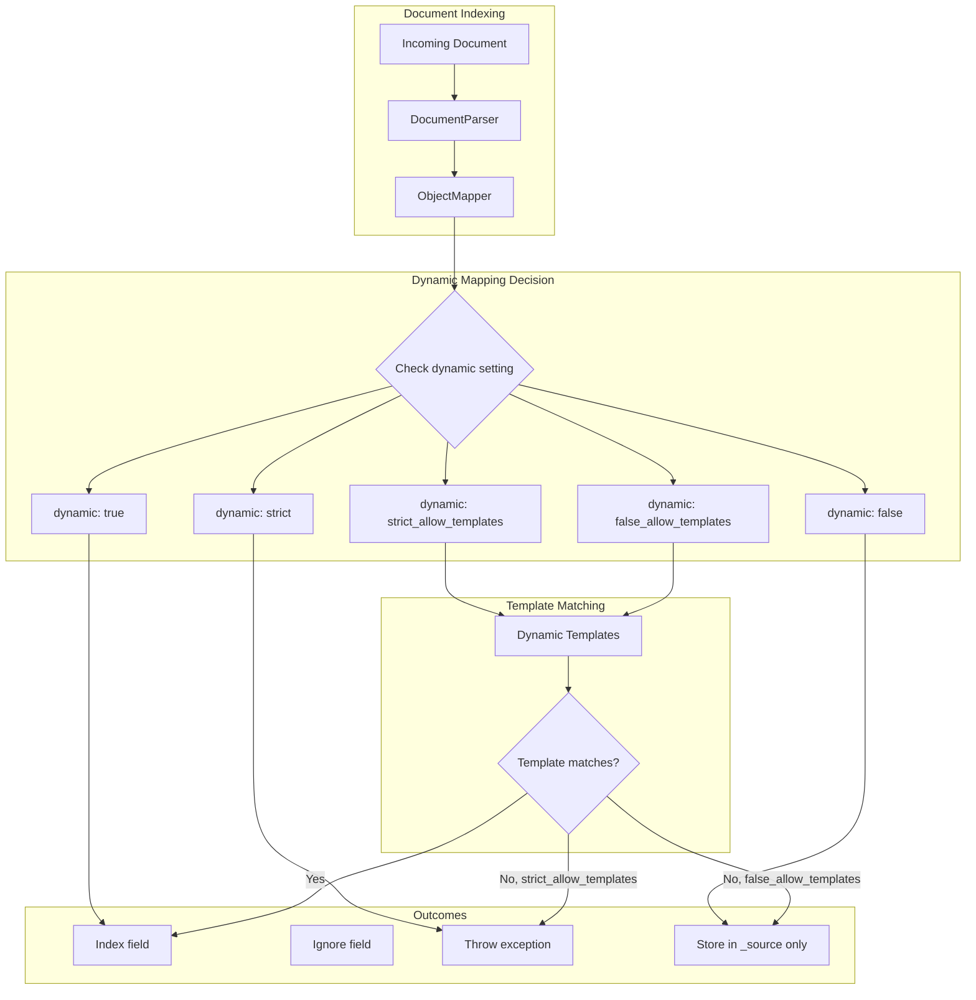

---
tags:
  - opensearch
---
# Dynamic Mapping

## Summary

Dynamic mapping in OpenSearch controls how new fields are handled when indexing documents. The `dynamic` parameter determines whether unmapped fields are automatically added to the index mapping, ignored, or cause an error. This feature is essential for managing schema evolution and controlling index mapping growth.

## Details

### Architecture



### Dynamic Mapping Options

| Option | New Fields Indexed | Template Support | Unknown Fields |
|--------|-------------------|------------------|----------------|
| `true` | Yes | Yes | Auto-mapped |
| `false` | No | No | Stored in `_source` only |
| `strict` | No | No | Throws exception |
| `strict_allow_templates` | Template matches only | Yes | Throws exception |
| `false_allow_templates` | Template matches only | Yes | Stored in `_source` only |

### Components

| Component | Description |
|-----------|-------------|
| `ObjectMapper.Dynamic` | Enum defining dynamic mapping options |
| `DocumentParser` | Parses documents and applies dynamic mapping rules |
| `RootObjectMapper` | Root-level mapper handling document-wide dynamic settings |

### Configuration

| Setting | Description | Default |
|---------|-------------|---------|
| `dynamic` | Controls dynamic field mapping behavior | `true` |
| `dynamic_templates` | Array of templates for pattern-based field mapping | `[]` |
| `date_detection` | Enable automatic date field detection | `true` |
| `numeric_detection` | Enable automatic numeric field detection | `false` |

### Usage Examples

#### Basic false_allow_templates Usage

```json
PUT my-index
{
  "mappings": {
    "dynamic": "false_allow_templates",
    "dynamic_templates": [
      {
        "dates": {
          "match": "date_*",
          "mapping": { "type": "date" }
        }
      },
      {
        "metrics": {
          "match": "metric_*",
          "mapping": { "type": "double" }
        }
      }
    ],
    "properties": {
      "id": { "type": "keyword" },
      "name": { "type": "text" }
    }
  }
}
```

#### Nested Object with Dynamic Templates

```json
PUT my-index
{
  "mappings": {
    "dynamic": "false_allow_templates",
    "dynamic_templates": [
      {
        "nested_strings": {
          "path_match": "metadata.*",
          "match_mapping_type": "string",
          "mapping": { "type": "keyword" }
        }
      }
    ],
    "properties": {
      "title": { "type": "text" }
    }
  }
}
```

#### Combining Multiple Template Types

```json
PUT my-index
{
  "mappings": {
    "dynamic": "false_allow_templates",
    "dynamic_templates": [
      {
        "strings": {
          "match": "str_*",
          "match_mapping_type": "string",
          "mapping": { "type": "keyword" }
        }
      },
      {
        "longs": {
          "match": "long_*",
          "match_mapping_type": "long",
          "mapping": { "type": "long" }
        }
      },
      {
        "objects": {
          "match": "obj_*",
          "match_mapping_type": "object",
          "mapping": { "type": "object" }
        }
      }
    ]
  }
}
```

## Limitations

- Dynamic mapping settings are applied at index creation and cannot be changed for existing fields
- `false_allow_templates` requires OpenSearch 3.3.0 or later
- Fields ignored by dynamic mapping are still stored in `_source` but cannot be searched
- Template matching is evaluated in order; first match wins
- Deeply nested objects require templates for each level of the hierarchy

## Change History

- **v3.3.0** (2025): Added `false_allow_templates` dynamic mapping option


## References

### Documentation
- [Documentation: Dynamic mapping parameter](https://docs.opensearch.org/3.0/field-types/mapping-parameters/dynamic/): Official documentation
- [Documentation: Mappings and field types](https://docs.opensearch.org/3.0/field-types/): Field types overview
- [Documentation PR #10388](https://github.com/opensearch-project/documentation-website/pull/10388): Documentation update
- [API Specification PR #944](https://github.com/opensearch-project/opensearch-api-specification/pull/944): API spec update

### Pull Requests
| Version | PR | Description | Related Issue |
|---------|-----|-------------|---------------|
| v3.3.0 | [#19065](https://github.com/opensearch-project/OpenSearch/pull/19065) | Add `false_allow_templates` as a dynamic mapping option | [#18617](https://github.com/opensearch-project/OpenSearch/issues/18617) |

### Issues (Design / RFC)
- [Issue #18617](https://github.com/opensearch-project/OpenSearch/issues/18617): Feature request for `false_allow_templates`
- [Issue #11276](https://github.com/opensearch-project/OpenSearch/issues/11276): Related feature request
