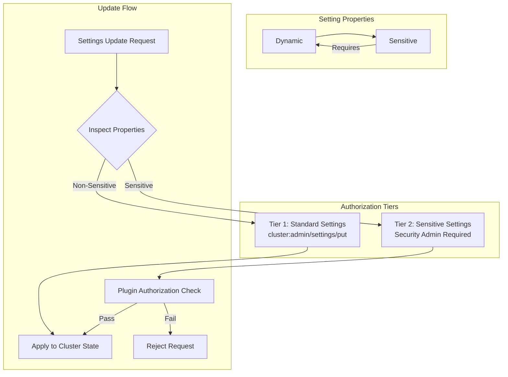

---
tags:
  - opensearch
---
# Dynamic Settings Authorization

## Summary

OpenSearch supports tiered authorization for dynamic cluster settings through the `Setting.Property.Sensitive` property. Settings marked as `Sensitive` require elevated privileges to update, enabling plugins (such as the Security plugin) to enforce different authorization policies for different settings. This allows security-critical settings to be managed via the standard cluster settings API while still requiring security admin privileges for modification.

## Details

### Architecture



### Components

| Component | Description |
|-----------|-------------|
| `Setting.Property.Sensitive` | Enum value marking a setting as requiring elevated authorization |
| `Setting.isSensitive()` | Method to check if a setting has the `Sensitive` property |
| `AbstractScopedSettings.isSensitiveSetting(key)` | Lookup method to check if a registered setting key is sensitive |
| `SettingsUpdater` | Validates that sensitive settings cannot be set via transient settings |

### Configuration

Settings are marked as sensitive at registration time by including `Property.Sensitive` alongside `Property.Dynamic`:

```java
Setting.simpleString(
    "plugins.security.dfm_empty_overrides_all",
    Property.Dynamic,
    Property.NodeScope,
    Property.Sensitive
);
```

### Constraints

| Constraint | Description |
|------------|-------------|
| Must be Dynamic | `Sensitive` can only be applied to settings that also have `Property.Dynamic` |
| No Transient Updates | Sensitive settings must be updated via persistent settings only |
| Plugin Enforcement | Actual elevated authorization is enforced by plugins (e.g., Security plugin) |

### Usage Example

Updating a sensitive setting requires security admin privileges:

```json
PUT _cluster/settings
{
  "persistent": {
    "plugins.security.dfm_empty_overrides_all": true
  }
}
```

Attempting to update a sensitive setting via transient settings is rejected:

```json
PUT _cluster/settings
{
  "transient": {
    "plugins.security.dfm_empty_overrides_all": true
  }
}
// Error: sensitive setting [plugins.security.dfm_empty_overrides_all] must be updated using persistent settings
```

## Limitations

- The `Sensitive` property can only be applied to dynamic settings
- Core provides the metadata and transient-blocking enforcement; actual privilege checks are implemented by plugins
- No core OpenSearch settings are marked `Sensitive` as of v3.6.0; the property is currently used by the Security plugin

## Change History

- **v3.6.0**: Initial implementation of `Setting.Property.Sensitive` for tiered dynamic settings authorization

## References

### Pull Requests
| Version | PR | Description |
|---------|-----|-------------|
| v3.6.0 | [opensearch-project/OpenSearch#20901](https://github.com/opensearch-project/OpenSearch/pull/20901) | Add new `Sensitive` setting property for tiering dynamic settings authorization |
| v3.6.0 | [opensearch-project/security#6016](https://github.com/opensearch-project/security/pull/6016) | Make `plugins.security.dfm_empty_overrides_all` dynamically toggleable using Sensitive property |

### Related Issues
- [opensearch-project/OpenSearch#20905](https://github.com/opensearch-project/OpenSearch/issues/20905) - Feature request: tiering dynamic cluster settings for authorization
- [opensearch-project/security#5219](https://github.com/opensearch-project/security/issues/5219) - RFC: Fine grained settings permissions
- [opensearch-project/security#6002](https://github.com/opensearch-project/security/issues/6002) - Make `plugins.security.dfm_empty_overrides_all` dynamically toggleable
