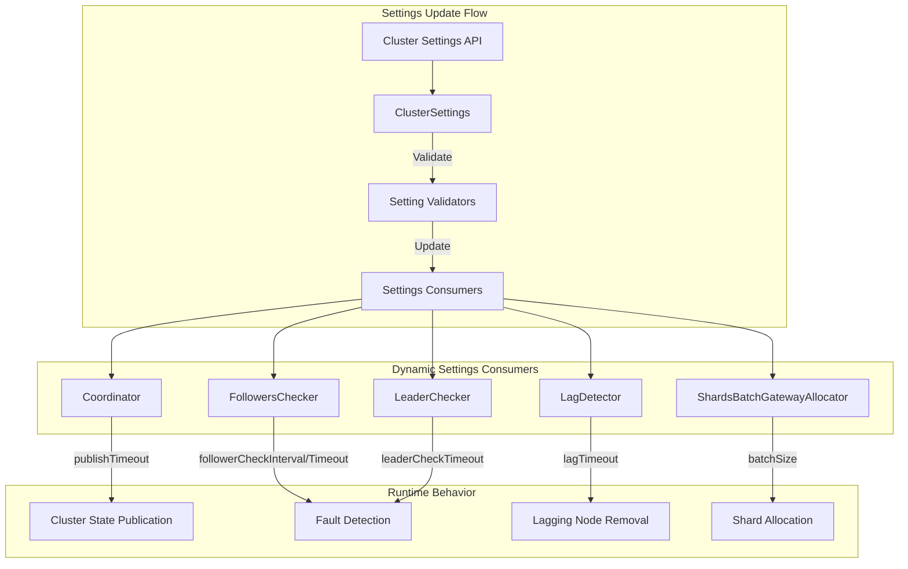

---
tags:
  - domain/core
  - component/server
  - indexing
---
# Dynamic Settings

## Summary

OpenSearch provides dynamic cluster settings that can be updated at runtime without restarting nodes. This feature allows operators to tune cluster behavior for different workloads and cluster sizes, particularly useful for larger clusters where default values may not be optimal.

## Details

### Architecture



### Dynamic Cluster Coordination Settings

| Setting | Description | Default | Min | Max |
|---------|-------------|---------|-----|-----|
| `cluster.fault_detection.follower_check.interval` | Interval between follower health checks | 1000ms | 100ms | - |
| `cluster.fault_detection.follower_check.timeout` | Timeout for follower check response | 10000ms | 1ms | 150000ms |
| `cluster.fault_detection.leader_check.timeout` | Timeout for leader check response | 10000ms | 1ms | 60000ms |
| `cluster.publish.timeout` | Timeout for cluster state publication | 30000ms | 1ms | - |
| `cluster.follower_lag.timeout` | Timeout before removing lagging nodes | 90000ms | 1ms | - |

### Dynamic Shard Allocation Settings

| Setting | Description | Default | Min | Max |
|---------|-------------|---------|-----|-----|
| `cluster.allocator.gateway.batch_size` | Batch size for shard metadata fetch | 2000 | 1 | 10000 |

### Usage Example

```json
PUT /_cluster/settings
{
  "persistent": {
    "cluster.fault_detection.follower_check.interval": "2s",
    "cluster.fault_detection.follower_check.timeout": "30s",
    "cluster.publish.timeout": "60s",
    "cluster.follower_lag.timeout": "120s",
    "cluster.allocator.gateway.batch_size": 3000
  }
}
```

### Tuning for Large Clusters

For clusters with many nodes or high network latency:

1. **Increase timeouts** to prevent false-positive node failures
2. **Increase batch size** to reduce allocation overhead
3. **Adjust check intervals** based on cluster stability requirements

```json
PUT /_cluster/settings
{
  "persistent": {
    "cluster.fault_detection.follower_check.timeout": "60s",
    "cluster.publish.timeout": "90s",
    "cluster.follower_lag.timeout": "180s"
  }
}
```

## Limitations

- Very low timeout values can cause cluster instability
- Settings changes take effect immediately but may not affect in-progress operations
- Some settings have maximum value constraints for safety

## Change History

- **v2.18.0** (2024-10-22): Made `cluster.fault_detection.follower_check.interval`, `cluster.publish.timeout`, `cluster.follower_lag.timeout`, and `cluster.allocator.gateway.batch_size` dynamic; increased `follower_check.timeout` max from 60s to 150s

## Related Features
- [OpenSearch Dashboards](../opensearch-dashboards/opensearch-dashboards-ai-chat.md)

## References

### Documentation
- [Cluster Settings Documentation](https://docs.opensearch.org/latest/install-and-configure/configuring-opensearch/cluster-settings/): Official cluster settings reference

### Pull Requests
| Version | PR | Description | Related Issue |
|---------|-----|-------------|---------------|
| v2.18.0 | [#16347](https://github.com/opensearch-project/OpenSearch/pull/16347) | Make multiple settings dynamic for tuning on larger clusters |   |
