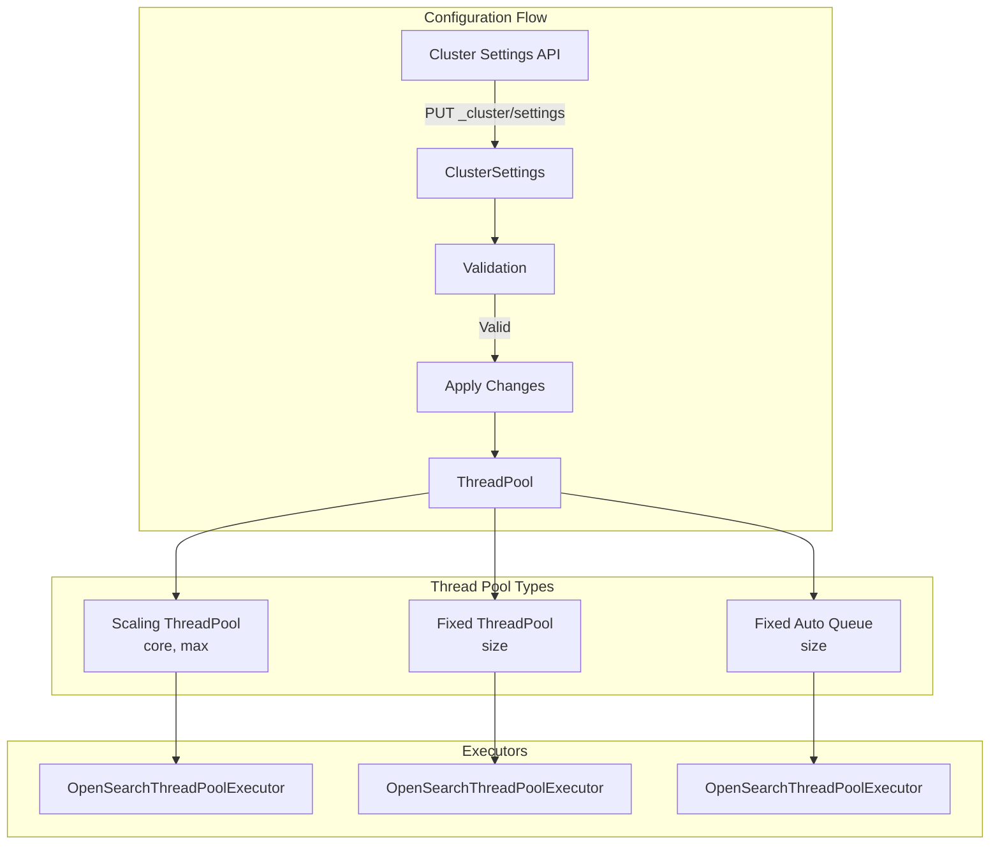
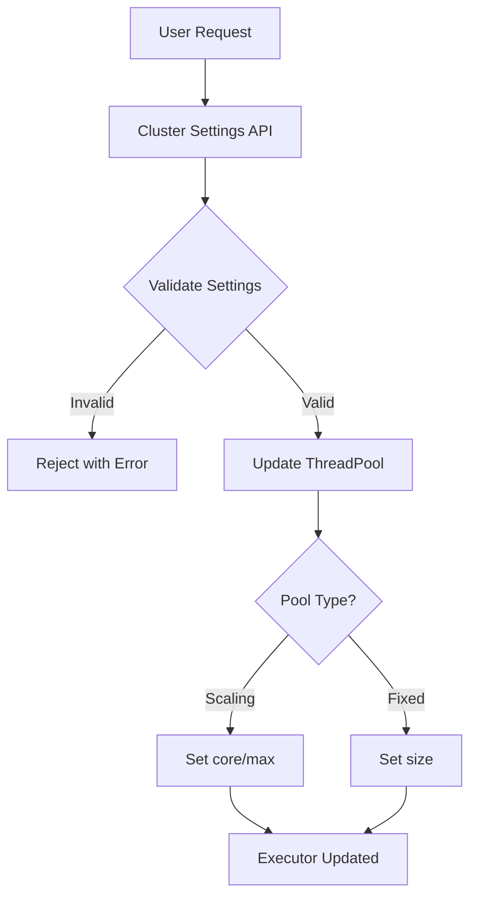

---
tags:
  - domain/core
  - component/server
  - search
---
# Dynamic Threadpool Resize

## Summary

Dynamic Threadpool Resize enables operators to modify thread pool sizes at runtime through the cluster settings API, eliminating the need for node restarts when tuning thread pool configurations. This feature supports both scaling and fixed thread pool types, allowing fine-grained control over thread allocation based on workload requirements.

## Details

### Architecture



### Data Flow



### Components

| Component | Description |
|-----------|-------------|
| `ThreadPool` | Main class managing all thread pools, now with dynamic resize capability |
| `ClusterSettings` | Handles cluster-wide settings including new thread pool settings |
| `OpenSearchThreadPoolExecutor` | Underlying executor that supports runtime size changes |
| `CLUSTER_THREAD_POOL_SIZE_SETTING` | New group setting for dynamic thread pool configuration |

### Configuration

| Setting | Description | Default | Pool Types |
|---------|-------------|---------|------------|
| `cluster.thread_pool.<name>.size` | Thread pool size for fixed pools | Pool-specific | Fixed, Fixed Auto Queue |
| `cluster.thread_pool.<name>.core` | Minimum thread count | Pool-specific | Scaling |
| `cluster.thread_pool.<name>.max` | Maximum thread count | Pool-specific | Scaling |

### Thread Pool Types and Defaults

**Scaling Thread Pools:**

| Pool Name | Default Core | Default Max |
|-----------|--------------|-------------|
| `generic` | 4 | 128-512 (based on processors) |
| `management` | 1 | 5 |
| `flush` | 1 | halfProc (max 5) |
| `refresh` | 1 | halfProc (max 10) |
| `warmer` | 1 | halfProc (max 5) |
| `snapshot` | 1 | halfProc (max 5) |
| `snapshot_deletion` | 1 | 64-256 (based on processors) |
| `fetch_shard_started` | 1 | 2 × processors |
| `fetch_shard_store` | 1 | 2 × processors |

**Fixed Thread Pools:**

| Pool Name | Default Size |
|-----------|--------------|
| `get` | processors |
| `write` | processors |
| `analyze` | 1 |
| `force_merge` | 1 |
| `system_read` | halfProc (max 5) |
| `system_write` | halfProc (max 5) |

### Usage Example

```json
// Increase snapshot thread pool for faster snapshot operations
PUT _cluster/settings
{
  "persistent": {
    "cluster.thread_pool.snapshot.core": "4",
    "cluster.thread_pool.snapshot.max": "10"
  }
}

// Increase write thread pool for high-throughput indexing
PUT _cluster/settings
{
  "transient": {
    "cluster.thread_pool.write.size": "16"
  }
}

// Reset to defaults by setting to null
PUT _cluster/settings
{
  "transient": {
    "cluster.thread_pool.write.size": null
  }
}
```

### Validation Rules

1. **Thread pool name validation**: Must be a valid core thread pool name
2. **Scaling pool validation**:
   - Only `core` and `max` settings allowed
   - Both values must be positive (≥ 1)
   - `core` must be ≤ `max`
3. **Fixed pool validation**:
   - Only `size` setting allowed
   - Value must be positive (≥ 1)

### Implementation Details

The resize operation handles the order of operations carefully to avoid `IllegalArgumentException` from the underlying `ThreadPoolExecutor`:

- When **decreasing** pool size: core is decreased first, then max
- When **increasing** pool size: max is increased first, then core

This ensures `core ≤ max` invariant is maintained during the transition.

## Limitations

- Only core thread pools can be resized; plugin-defined pools are not supported
- Queue sizes cannot be modified dynamically
- The `same` (direct executor) thread pool cannot be resized
- Changes apply to the current node; cluster settings propagate to all nodes
- No automatic rollback if resize causes issues

## Change History

- **v2.18.0** (2024-10-29): Initial implementation - dynamic thread pool resize capability


## References

### Documentation
- [CAT Thread Pool API](https://docs.opensearch.org/2.18/api-reference/cat/cat-thread-pool/): Monitor thread pool status
- [Nodes Info API](https://docs.opensearch.org/2.18/api-reference/nodes-apis/nodes-info/): View thread pool configuration
- [PR #16236](https://github.com/opensearch-project/OpenSearch/pull/16236): Original implementation

### Pull Requests
| Version | PR | Description | Related Issue |
|---------|-----|-------------|---------------|
| v2.18.0 | [#16236](https://github.com/opensearch-project/OpenSearch/pull/16236) | Add support to dynamically resize threadpools size |   |
