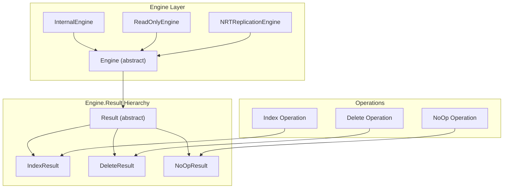

---
tags:
  - opensearch
---
# Engine API

## Summary

The Engine API provides the core abstraction for OpenSearch's storage engine layer. The `Engine` class and its inner classes (`Result`, `IndexResult`, `DeleteResult`, `NoOpResult`) define the interface for document operations including indexing, deletion, and no-op operations. This API enables custom storage engine implementations and extensions.

## Details

### Architecture



### Components

| Component | Description |
|-----------|-------------|
| `Engine` | Abstract base class for all storage engine implementations |
| `Engine.Result` | Base class for operation results containing version, sequence number, and timing |
| `Engine.IndexResult` | Result of an index operation, includes `created` flag |
| `Engine.DeleteResult` | Result of a delete operation, includes `found` flag |
| `Engine.NoOpResult` | Result of a no-op operation for replication |
| `Engine.Operation` | Base class for operations (Index, Delete, NoOp) |
| `Engine.prepareIndex()` | Instance method to prepare index operations (v3.4.0+) |
| `Engine.prepareDelete()` | Instance method to prepare delete operations (v3.4.0+) |

### Engine.Result Methods

| Method | Description | Visibility |
|--------|-------------|------------|
| `getVersion()` | Returns the document version | `public` |
| `getSeqNo()` | Returns the sequence number | `public` |
| `getTerm()` | Returns the primary term | `public` |
| `getResultType()` | Returns SUCCESS, FAILURE, or MAPPING_UPDATE_REQUIRED | `public` |
| `getTranslogLocation()` | Returns the translog location | `public` |
| `getFailure()` | Returns the exception if operation failed | `public` |
| `getTook()` | Returns operation time in nanoseconds | `public` |
| `setTranslogLocation()` | Sets the translog location | `public` |
| `setTook()` | Sets the operation time | `public` |
| `freeze()` | Freezes the result to prevent modifications | `public` |

### Usage Example

```java
// Custom Engine implementation
public class CustomEngine extends Engine {
    
    @Override
    public IndexResult index(Index index) throws IOException {
        long startTime = System.nanoTime();
        
        // Perform the indexing operation
        long version = /* computed version */;
        long term = /* primary term */;
        long seqNo = /* sequence number */;
        boolean created = /* true if new document */;
        
        IndexResult result = new IndexResult(version, term, seqNo, created);
        
        // Set translog location and timing
        Translog.Location location = /* write to translog */;
        result.setTranslogLocation(location);
        result.setTook(System.nanoTime() - startTime);
        result.freeze();
        
        return result;
    }
    
    @Override
    public DeleteResult delete(Delete delete) throws IOException {
        // Similar pattern for delete operations
        DeleteResult result = new DeleteResult(version, term, seqNo, found);
        result.setTranslogLocation(location);
        result.setTook(took);
        result.freeze();
        return result;
    }
}
```

### Result Types

```java
public enum Type {
    SUCCESS,              // Operation completed successfully
    FAILURE,              // Operation failed with exception
    MAPPING_UPDATE_REQUIRED  // Operation needs mapping update first
}
```

## Limitations

- `freeze()` can only be called once; subsequent modifications throw `IllegalStateException`
- Result objects are not thread-safe during construction
- Custom engines must properly manage the result lifecycle

## Change History

- **v3.4.0** (2025-12-09): Added `prepareIndex()` and `prepareDelete()` instance methods to Engine class; made `NoOpResult` constructors public; deprecated static methods on IndexShard
- **v3.3.0** (2025-09-12): Made `setTranslogLocation()`, `setTook()`, and `freeze()` methods public to enable custom Engine implementations


## References

### Documentation
- [Engine.java](https://github.com/opensearch-project/OpenSearch/blob/main/server/src/main/java/org/opensearch/index/engine/Engine.java): Source code

### Blog Posts
- [Introduction to OpenSearch Plugins](https://opensearch.org/blog/plugins-intro/): Blog post explaining Engine Plugin interface

### Pull Requests
| Version | PR | Description | Related Issue |
|---------|-----|-------------|---------------|
| v3.4.0 | [#19551](https://github.com/opensearch-project/OpenSearch/pull/19551) | Move prepareIndex and prepareDelete methods to Engine class | [#19550](https://github.com/opensearch-project/OpenSearch/issues/19550) |
| v3.4.0 | [#19950](https://github.com/opensearch-project/OpenSearch/pull/19950) | Make NoOpResult constructors public | [#19949](https://github.com/opensearch-project/OpenSearch/issues/19949) |
| v3.3.0 | [#19275](https://github.com/opensearch-project/OpenSearch/pull/19275) | Make all methods in Engine.Result public |   |

### Issues (Design / RFC)
- [Issue #19550](https://github.com/opensearch-project/OpenSearch/issues/19550): Feature request for custom document parsing
- [Issue #19949](https://github.com/opensearch-project/OpenSearch/issues/19949): Feature request for public NoOpResult constructors
- [Issue #19276](https://github.com/opensearch-project/OpenSearch/issues/19276): Feature request for public Engine.Result methods
