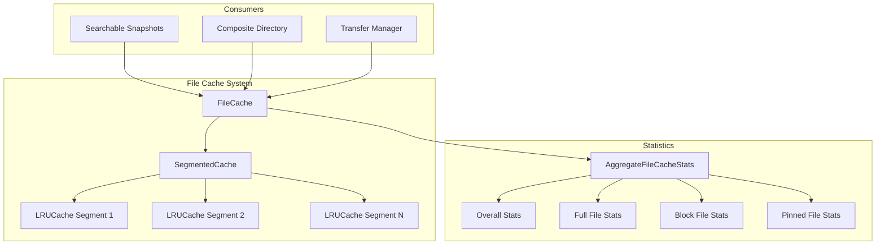
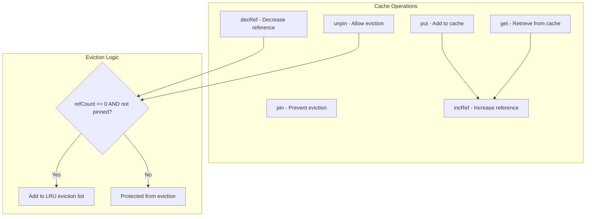
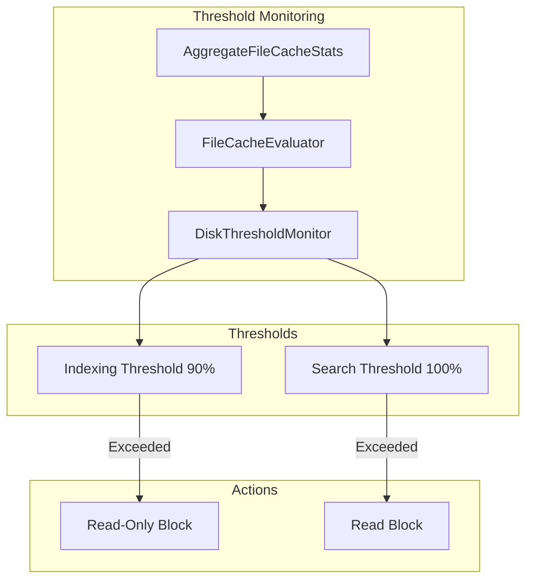

---
tags:
  - opensearch
---
# File Cache

## Summary

File Cache is a local caching layer in OpenSearch that stores file data from remote storage to improve read performance. It is used by both Searchable Snapshots (for warm/search nodes) and Writable Warm indices (via Composite Directory). The cache uses an LRU eviction policy with reference counting to manage memory efficiently, and supports file pinning to prevent critical files from being evicted.

## Details

### Architecture



### Data Flow



### Components

| Component | Description |
|-----------|-------------|
| `FileCache` | Main entry point for file caching operations |
| `SegmentedCache` | Divides cache into segments for concurrent access |
| `LRUCache` | LRU implementation with reference counting and pinning support |
| `RefCountedCache` | Interface defining cache operations with reference counting |
| `CachedFullFileIndexInput` | Cached representation of a full file |
| `FileCachedIndexInput` | Cached representation of a block-based file |
| `AggregateFileCacheStats` | Aggregated statistics across all cache types |
| `FileCacheStats` | Statistics for a specific cache type |
| `FileStatsCounter` | Tracks statistics separately for full files vs block files |

### Configuration

| Setting | Description | Default |
|---------|-------------|---------|
| `node.search.cache.size` | Size of the file cache | 80% of available disk |
| `cluster.filecache.remote_data_ratio` | Ratio of remote data to file cache size for allocation decisions | 5 |

### Usage Example

**Configuring a warm node with file cache:**

```yaml
# opensearch.yml
node.roles: [warm]
node.search.cache.size: 100gb
```

**Accessing file cache statistics via Node Stats API:**

```bash
GET _nodes/stats/file_cache
```

Response:
```json
{
  "nodes": {
    "node_id": {
      "aggregate_file_cache": {
        "timestamp": 1704067200000,
        "active": "50gb",
        "active_in_bytes": 53687091200,
        "total": "100gb",
        "total_in_bytes": 107374182400,
        "used": "75gb",
        "used_in_bytes": 80530636800,
        "pinned": "10gb",
        "pinned_in_bytes": 10737418240,
        "evictions": "25gb",
        "evictions_in_bytes": 26843545600,
        "active_percent": 67,
        "used_percent": 75,
        "hit_count": 50000,
        "miss_count": 5000,
        "over_all_stats": {
          "active": "50gb",
          "used": "75gb",
          "evictions": "25gb",
          "active_percent": 67,
          "hit_count": 50000
        },
        "full_file_stats": {
          "active": "20gb",
          "used": "30gb",
          "evictions": "5gb",
          "active_percent": 67,
          "hit_count": 20000
        },
        "block_file_stats": {
          "active": "30gb",
          "used": "45gb",
          "evictions": "20gb",
          "active_percent": 67,
          "hit_count": 30000
        },
        "pinned_file_stats": {
          "active": "10gb",
          "used": "10gb",
          "evictions": "0b",
          "active_percent": 100,
          "hit_count": 5000
        }
      }
    }
  }
}
```

**Clearing file cache:**

```bash
POST /my-index/_cache/clear?file=true
```

### Active Usage Threshold Monitoring (v3.3.0+)

Starting in v3.3.0, OpenSearch monitors file cache active usage and automatically applies index blocks when thresholds are exceeded:



**Threshold Settings:**

| Setting | Description | Default |
|---------|-------------|---------|
| `cluster.filecache.activeusage.threshold.enabled` | Enable/disable threshold monitoring | `true` |
| `cluster.filecache.activeusage.indexing.threshold` | Threshold for read-only block | `90%` |
| `cluster.filecache.activeusage.search.threshold` | Threshold for read block | `100%` |

**Configure thresholds:**

```bash
PUT _cluster/settings
{
  "persistent": {
    "cluster.filecache.activeusage.indexing.threshold": "85%",
    "cluster.filecache.activeusage.search.threshold": "95%"
  }
}
```

## Limitations

- File cache is only available on nodes with warm or search roles
- Cache capacity is a soft limit; reference-counted and pinned entries may cause temporary over-subscription
- Block-based caching loads 8MB chunks, which may not be optimal for all access patterns
- Pinned files cannot be evicted even under memory pressure
- Threshold monitoring is per-node; index blocks affect all shards on the node

## Change History

- **v3.3.0** (2025-10-06): Added file cache active usage threshold monitoring with automatic index blocking
- **v3.1.0** (2025-05-28): Added file pinning support and granular statistics (full file, block file, pinned file stats)
- **v2.16.0** (2024-08-06): Fixed fs info reporting negative available size when file cache space is occupied by other files
- **v2.7.0**: Initial implementation for Searchable Snapshots


## References

### Documentation
- [Searchable Snapshots Documentation](https://docs.opensearch.org/3.0/tuning-your-cluster/availability-and-recovery/snapshots/searchable_snapshot/)
- [Clear Cache API](https://docs.opensearch.org/3.0/api-reference/index-apis/clear-index-cache/)
- [Nodes Stats API](https://docs.opensearch.org/3.0/api-reference/nodes-apis/nodes-stats/)

### Pull Requests
| Version | PR | Description | Related Issue |
|---------|-----|-------------|---------------|
| v3.3.0 | [#19071](https://github.com/opensearch-project/OpenSearch/pull/19071) | Added file cache active usage guard rails to DiskThresholdMonitor |   |
| v3.1.0 | [#17617](https://github.com/opensearch-project/OpenSearch/pull/17617) | Added File Cache Pinning | [#13648](https://github.com/opensearch-project/OpenSearch/issues/13648) |
| v3.1.0 | [#17538](https://github.com/opensearch-project/OpenSearch/pull/17538) | Added File Cache Stats (block and full file level) | [#17479](https://github.com/opensearch-project/OpenSearch/issues/17479) |
| v2.16.0 | [#11573](https://github.com/opensearch-project/OpenSearch/pull/11573) | Fixed fs info reporting negative available size |   |
| v2.7.0 | Initial | File Cache introduced for Searchable Snapshots |   |

### Issues (Design / RFC)
- [Issue #17479](https://github.com/opensearch-project/OpenSearch/issues/17479): More refined stats in FileCache
- [Issue #13648](https://github.com/opensearch-project/OpenSearch/issues/13648): File Pinning support in FileCache
- [Issue #13149](https://github.com/opensearch-project/OpenSearch/issues/13149): META - Writable Warm Index
