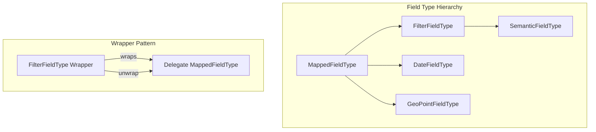
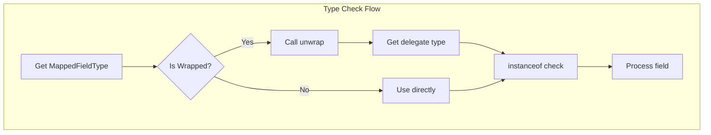

---
tags:
  - search
---

# FilterFieldType

## Summary

`FilterFieldType` is a wrapper class that allows developers to wrap an existing `MappedFieldType` while delegating all behavior by default. This enables creating custom field types that extend or modify the behavior of existing types without reimplementing all methods. The pattern is essential for features like `SemanticFieldType` in neural-search that need to wrap delegate field types.

## Details

### Architecture



### Data Flow



### Components

| Component | Description |
|-----------|-------------|
| `FilterFieldType` | Abstract wrapper class that delegates to an underlying `MappedFieldType` |
| `MappedFieldType.unwrap()` | Method that returns the underlying type (returns `this` for non-wrapped types) |
| `SemanticFieldType` | Example implementation in neural-search that wraps delegate types |

### Key Methods

| Method | Description |
|--------|-------------|
| `unwrap()` | Returns the underlying `MappedFieldType`, unwrapping any wrapper layers |
| `delegate()` | Returns the wrapped delegate field type (in `FilterFieldType`) |

### Configuration

No configuration required. The `unwrap()` method is automatically available on all `MappedFieldType` instances.

### Usage Example

**Creating a custom wrapped field type:**

```java
public class CustomFieldType extends FilterFieldType {
    
    public CustomFieldType(MappedFieldType delegate) {
        super(delegate);
    }
    
    @Override
    public Query termQuery(Object value, QueryShardContext context) {
        // Custom behavior before delegating
        preprocessValue(value);
        return super.termQuery(value, context);
    }
}
```

**Checking field types correctly:**

```java
public void processField(MappedFieldType fieldType) {
    // CORRECT: Always unwrap before instanceof check
    if (fieldType != null && fieldType.unwrap() instanceof DateFieldMapper.DateFieldType) {
        DateFieldMapper.DateFieldType dateType = (DateFieldMapper.DateFieldType) fieldType.unwrap();
        // Process date field
    }
    
    // INCORRECT: This will fail for wrapped types
    // if (fieldType instanceof DateFieldMapper.DateFieldType) { ... }
}
```

**Handling nested wrappers:**

```java
// unwrap() handles multiple wrapper layers
MappedFieldType original = wrappedType.unwrap();
// original is guaranteed to be the innermost non-wrapper type
```

## Limitations

- Plugin developers must remember to call `unwrap()` before `instanceof` checks
- Casting after `instanceof` should consider whether wrapper behavior is needed
- The wrapper pattern adds a small overhead for type resolution

## Change History

- **v3.0.0** (2025-04-21): Initial implementation of `FilterFieldType` and codebase-wide `instanceof` fixes

## Related Features
- [OpenSearch Dashboards](../opensearch-dashboards/opensearch-dashboards-ai-chat.md)

## References

### Documentation
- [Mappings and field types](https://docs.opensearch.org/3.0/field-types/): OpenSearch field types documentation
- [SemanticFieldType PR](https://github.com/opensearch-project/neural-search/pull/1225): Example usage in neural-search

### Pull Requests
| Version | PR | Description | Related Issue |
|---------|-----|-------------|---------------|
| v3.0.0 | [#17627](https://github.com/opensearch-project/OpenSearch/pull/17627) | Add FilterFieldType | [#17624](https://github.com/opensearch-project/OpenSearch/issues/17624) |
| v3.0.0 | [#17951](https://github.com/opensearch-project/OpenSearch/pull/17951) | Fix instanceof checks to use unwrap() | [#17802](https://github.com/opensearch-project/OpenSearch/issues/17802) |

### Issues (Design / RFC)
- [Issue #17624](https://github.com/opensearch-project/OpenSearch/issues/17624): FilterFieldType feature request
- [Issue #17802](https://github.com/opensearch-project/OpenSearch/issues/17802): Unwrap FieldType before instanceof check
