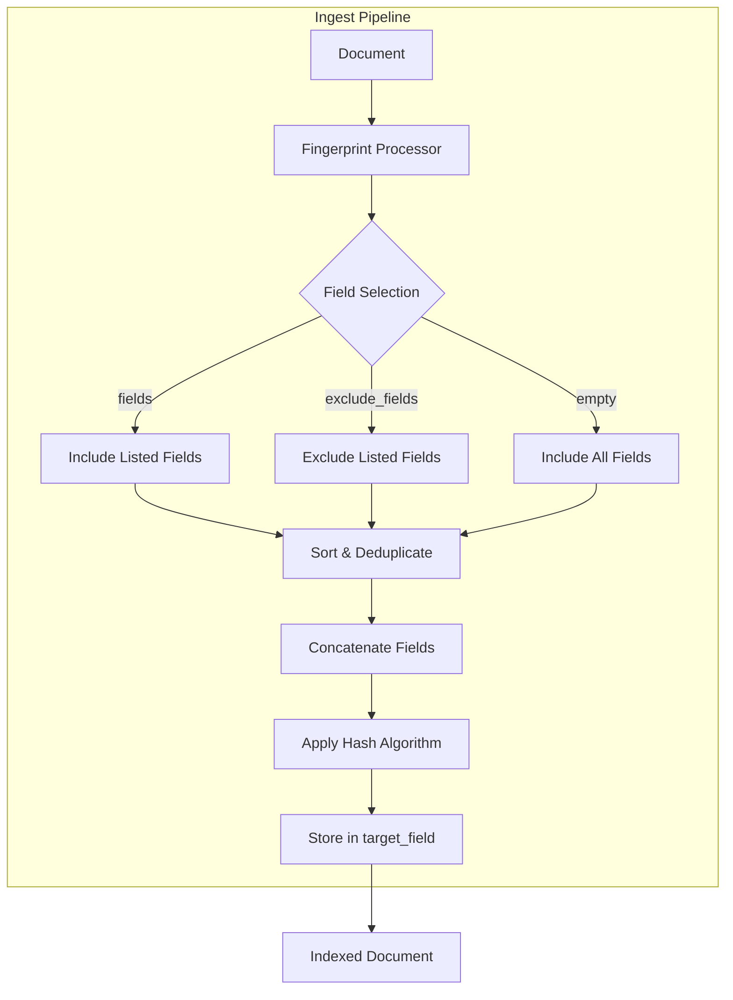

---
tags:
  - opensearch
---
# Fingerprint Ingest Processor

## Summary

The fingerprint ingest processor generates a cryptographic hash value for document fields during ingestion. This hash can be used to deduplicate documents within an index and collapse search results based on content similarity.

## Details

### Architecture



### Components

| Component | Description |
|-----------|-------------|
| `FingerprintProcessor` | Main processor class that generates hash values |
| `FingerprintProcessor.Factory` | Factory for creating processor instances from configuration |
| `HashMethod` | Enum defining supported hash algorithms |

### Configuration

| Parameter | Required | Default | Description |
|-----------|----------|---------|-------------|
| `fields` | Optional | - | List of fields to include in hash calculation |
| `exclude_fields` | Optional | - | Fields to exclude (mutually exclusive with `fields`) |
| `hash_method` | Optional | `SHA-1@2.16.0` | Hash algorithm to use |
| `target_field` | Optional | `fingerprint` | Field to store the hash value |
| `ignore_missing` | Optional | `false` | Exit quietly if required field is missing |

### Supported Hash Methods

| Method | Description |
|--------|-------------|
| `MD5@2.16.0` | MD5 hash (128-bit) |
| `SHA-1@2.16.0` | SHA-1 hash (160-bit, default) |
| `SHA-256@2.16.0` | SHA-256 hash (256-bit) |
| `SHA3-256@2.16.0` | SHA3-256 hash (256-bit) |

### Hash Generation Process

1. **Field Selection**: Select fields based on `fields` or `exclude_fields` configuration
2. **Deduplication & Sorting**: Remove duplicate field names and sort alphabetically
3. **Metadata Exclusion**: Automatically exclude metadata fields (`_index`, `_id`, `_routing`)
4. **Concatenation**: Build string in format `|field1|length:value1|field2|length:value2|`
5. **Hashing**: Apply selected hash algorithm
6. **Output**: Store Base64-encoded hash with method prefix in target field

### Usage Examples

**Basic usage with specific fields:**
```json
PUT /_ingest/pipeline/fingerprint_pipeline
{
  "description": "Generate fingerprint for documents",
  "processors": [
    {
      "fingerprint": {
        "fields": ["title", "content"],
        "target_field": "content_hash"
      }
    }
  ]
}
```

**Using SHA-256 with all fields:**
```json
{
  "processors": [
    {
      "fingerprint": {
        "hash_method": "SHA-256@2.16.0"
      }
    }
  ]
}
```

**Deduplication query using fingerprint:**
```json
GET my_index/_search
{
  "size": 0,
  "aggs": {
    "duplicates": {
      "terms": {
        "field": "fingerprint",
        "min_doc_count": 2
      }
    }
  }
}
```

**Collapsing search results:**
```json
GET my_index/_search
{
  "collapse": {
    "field": "fingerprint"
  }
}
```

## Limitations

- `fields` and `exclude_fields` are mutually exclusive
- Field names cannot be null or empty
- Metadata fields are always excluded from hash calculation
- Hash method version is fixed to ensure consistent hashing across cluster nodes

## Change History

- **v2.16.0** (2024-08-06): Initial implementation of fingerprint ingest processor

## References

### Documentation

- [Fingerprint Processor](https://docs.opensearch.org/latest/ingest-pipelines/processors/fingerprint/)

### Pull Requests

| Version | PR | Description |
|---------|-----|-------------|
| v2.16.0 | [#13724](https://github.com/opensearch-project/OpenSearch/pull/13724) | Add fingerprint ingest processor |

### Related Issues

- [#13612](https://github.com/opensearch-project/OpenSearch/issues/13612) - Feature request for fingerprint ingest processor
