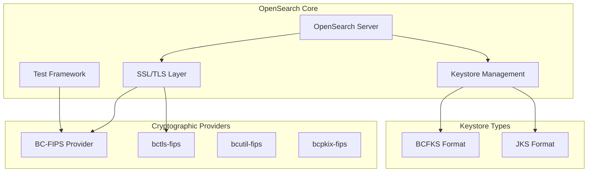
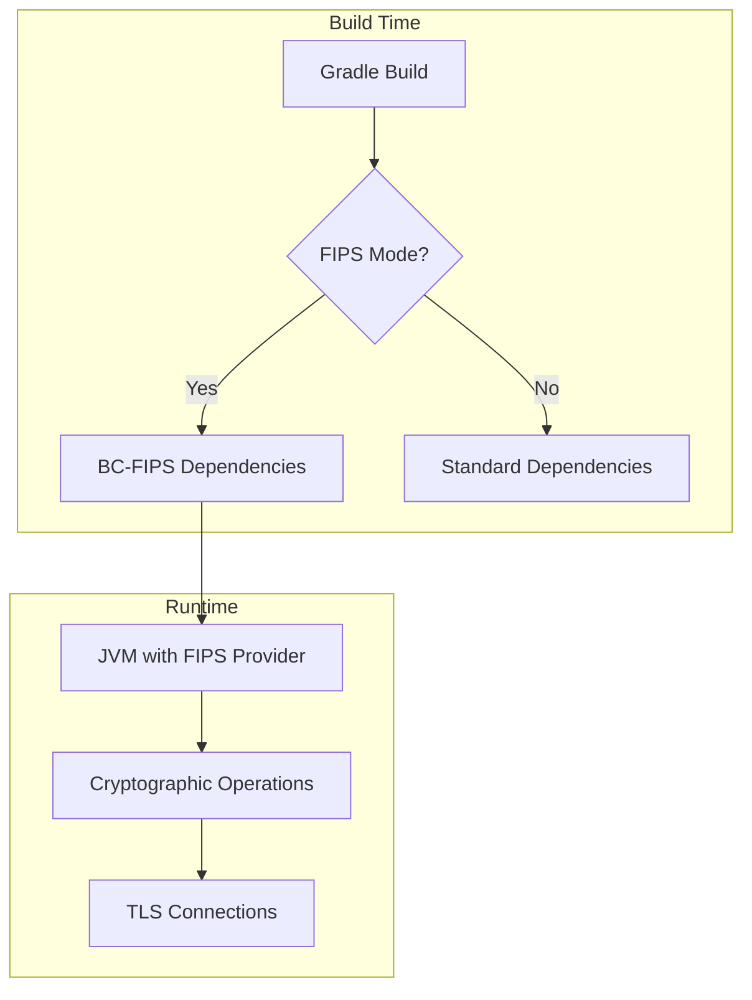

---
tags:
  - opensearch
---
# FIPS Compliance

## Summary

OpenSearch supports FIPS 140-3 (Federal Information Processing Standard) compliance, enabling deployment in government and regulated environments that require FIPS-validated cryptographic modules. This is achieved through the use of Bouncy Castle FIPS (BC-FIPS) libraries as the cryptographic provider, replacing standard Bouncy Castle libraries.

FIPS 140-3 is the current U.S. government security standard specifying requirements for cryptographic modules. Organizations in government, healthcare, finance, and other regulated industries often require FIPS-compliant software for handling sensitive data.

## Details

### Architecture



### Data Flow



### Components

| Component | Description |
|-----------|-------------|
| `bc-fips` | Core FIPS 140-3 validated cryptographic library |
| `bctls-fips` | TLS protocol implementation for FIPS mode |
| `bcutil-fips` | Utility classes for FIPS cryptographic operations |
| `bcpkix-fips` | PKIX/CMS/EAC/PKCS/OCSP/TSP support for FIPS |
| `fips.gradle` | Gradle configuration for FIPS build and test |
| `RestClientFipsAwareTestCase` | Test interface for FIPS-aware SSL handling |

### Configuration

| Setting | Description | Default |
|---------|-------------|---------|
| `-Pcrypto.standard=FIPS-140-3` | Gradle parameter to enable FIPS mode | Not set |
| `testFipsRuntimeOnly` | Gradle configuration for FIPS test dependencies | N/A |
| Keystore type | BCFKS for FIPS, JKS for standard | JKS |

### Usage Example

Building OpenSearch with FIPS compliance:

```bash
# Build with FIPS 140-3 compliance
./gradlew assemble -Pcrypto.standard=FIPS-140-3

# Run tests in FIPS mode
./gradlew test -Pcrypto.standard=FIPS-140-3
```

Creating FIPS-compliant keystores:

```bash
# Convert JKS to BCFKS format
keytool -importkeystore \
  -srckeystore keystore.jks \
  -srcstoretype JKS \
  -destkeystore keystore.bcfks \
  -deststoretype BCFKS \
  -providername BCFIPS \
  -providerclass org.bouncycastle.jcajce.provider.BouncyCastleFipsProvider \
  -providerpath bc-fips.jar
```

FIPS-aware test implementation:

```java
public class MyFipsTests extends MyTests implements RestClientFipsAwareTestCase {
    
    @Override
    public SSLContext getSslContext(boolean server, String keyStoreType, 
            SecureRandom secureRandom, String fileExtension) throws Exception {
        // Implementation using BCFKS keystore and BCFIPS provider
        KeyStore keyStore = KeyStore.getInstance(keyStoreType);
        // ... load keystore with .bcfks extension in FIPS mode
    }
}
```

## Limitations

- **Empty Passwords**: Empty keystore passwords are not allowed in FIPS mode
- **Legacy Keystores**: V1 and V2 keystore formats cannot be loaded in FIPS JVM due to PBE (Password-Based Encryption) unavailability
- **Algorithm Restrictions**: Some cryptographic algorithms available in standard mode are not FIPS-approved
- **TLS Protocols**: Only TLSv1.2 and TLSv1.3 are allowed in FIPS mode
- **Performance**: FIPS-validated implementations may have different performance characteristics

## Change History

- **v3.4.0** (2026-01): Test suite FIPS 140-3 compliance support with BC-FIPS provider


## References

### Documentation
- [Bouncy Castle FIPS](https://www.bouncycastle.org/fips-java/): BC-FIPS Java Documentation
- [NIST FIPS 140-3](https://csrc.nist.gov/publications/detail/fips/140/3/final): Security Requirements for Cryptographic Modules

### Pull Requests
| Version | PR | Description | Related Issue |
|---------|-----|-------------|---------------|
| v3.4.0 | [#18491](https://github.com/opensearch-project/OpenSearch/pull/18491) | Make test-suite runnable under FIPS compliance support | [#4254](https://github.com/opensearch-project/security/issues/4254) |
| v3.4.0 | [#18921](https://github.com/opensearch-project/OpenSearch/pull/18921) | Add build-tooling to run in FIPS environment | [#4254](https://github.com/opensearch-project/security/issues/4254) |

### Issues (Design / RFC)
- [RFC #4254](https://github.com/opensearch-project/security/issues/4254): FIPS-140 Compliance Roadmap for OpenSearch
- [Issue #17634](https://github.com/opensearch-project/OpenSearch/issues/17634): META - Replace Bouncycastle dependencies with FIPS counterparts
- [Issue #18324](https://github.com/opensearch-project/OpenSearch/issues/18324): Documentation for FIPS configuration
