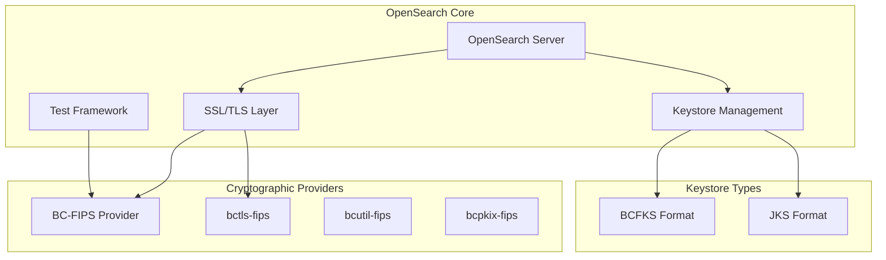
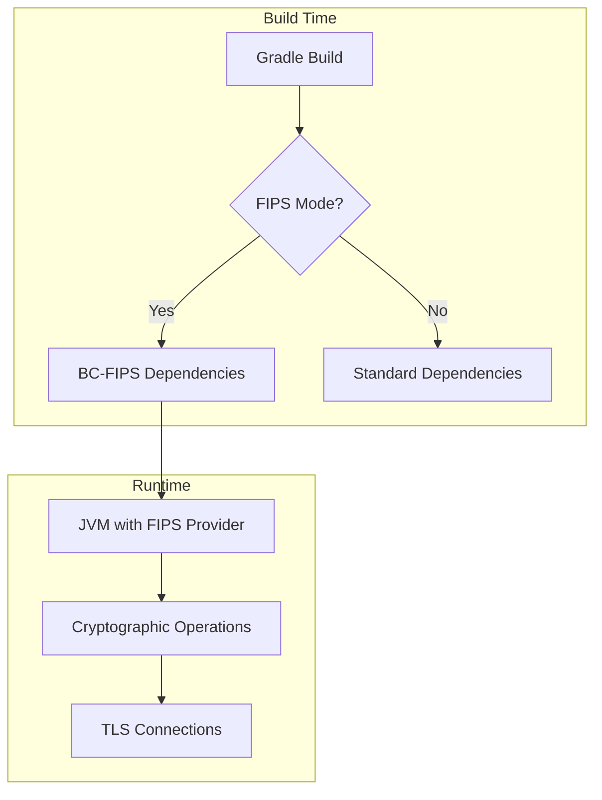

---
tags:
  - opensearch
---
# FIPS Compliance

## Summary

OpenSearch supports FIPS 140-3 (Federal Information Processing Standard) compliance, enabling deployment in government and regulated environments that require FIPS-validated cryptographic modules. This is achieved through the use of Bouncy Castle FIPS (BC-FIPS) libraries as the cryptographic provider, replacing standard Bouncy Castle libraries.

FIPS 140-3 is the current U.S. government security standard specifying requirements for cryptographic modules. Organizations in government, healthcare, finance, and other regulated industries often require FIPS-compliant software for handling sensitive data.

## Details

### Architecture


```mermaid
graph TB
    subgraph "OpenSearch Core"
        OS[OpenSearch Server]
        SSL[SSL/TLS Layer]
        KS[Keystore Management]
        TEST[Test Framework]
    end
    
    subgraph "Cryptographic Providers"
        BCFIPS[BC-FIPS Provider]
        BCTLS[bctls-fips]
        BCUTIL[bcutil-fips]
        BCPKIX[bcpkix-fips]
    end
    
    subgraph "Keystore Types"
        BCFKS[BCFKS Format]
        JKS[JKS Format]
    end
    
    OS --> SSL
    OS --> KS
    SSL --> BCFIPS
    SSL --> BCTLS
    KS --> BCFKS
    KS --> JKS
    TEST --> BCFIPS
```

### Data Flow


```mermaid
flowchart TB
    subgraph "Build Time"
        GRADLE[Gradle Build]
        FIPS_FLAG{FIPS Mode?}
        BCFIPS_DEPS[BC-FIPS Dependencies]
        STD_DEPS[Standard Dependencies]
    end
    
    subgraph "Runtime"
        JVM[JVM with FIPS Provider]
        CRYPTO[Cryptographic Operations]
        TLS[TLS Connections]
    end
    
    GRADLE --> FIPS_FLAG
    FIPS_FLAG -->|Yes| BCFIPS_DEPS
    FIPS_FLAG -->|No| STD_DEPS
    BCFIPS_DEPS --> JVM
    JVM --> CRYPTO
    CRYPTO --> TLS
```

### Components

| Component | Description |
|-----------|-------------|
| `bc-fips` | Core FIPS 140-3 validated cryptographic library |
| `bctls-fips` | TLS protocol implementation for FIPS mode |
| `bcutil-fips` | Utility classes for FIPS cryptographic operations |
| `bcpkix-fips` | PKIX/CMS/EAC/PKCS/OCSP/TSP support for FIPS |
| `fips.gradle` | Gradle configuration for FIPS build and test |
| `RestClientFipsAwareTestCase` | Test interface for FIPS-aware SSL handling |

### Configuration

| Setting | Description | Default |
|---------|-------------|---------|
| `-Pcrypto.standard=FIPS-140-3` | Gradle parameter to enable FIPS mode | Set by default in `gradle.properties` (v3.6.0+) |
| `OPENSEARCH_FIPS_MODE` | Environment variable to enable FIPS enforced mode at runtime (v3.6.0+) | Not set |
| `testFipsRuntimeOnly` | Gradle configuration for FIPS test dependencies | N/A |
| Keystore type | BCFKS for FIPS, JKS for standard | JKS |

### Usage Example

Building OpenSearch with FIPS compliance:

```bash
# Build with FIPS 140-3 compliance (default in v3.6.0+ via gradle.properties)
./gradlew assemble -Pcrypto.standard=FIPS-140-3

# Run tests in FIPS mode
./gradlew test -Pcrypto.standard=FIPS-140-3

# Build without FIPS (override default in v3.6.0+)
./gradlew assemble -Pcrypto.standard=any-supported
```

Enabling FIPS enforced mode at runtime (v3.6.0+):

```bash
# Explicitly enable FIPS enforced mode
OPENSEARCH_FIPS_MODE=true ./bin/opensearch
```

Creating FIPS-compliant keystores:

```bash
# Convert JKS to BCFKS format
keytool -importkeystore \
  -srckeystore keystore.jks \
  -srcstoretype JKS \
  -destkeystore keystore.bcfks \
  -deststoretype BCFKS \
  -providername BCFIPS \
  -providerclass org.bouncycastle.jcajce.provider.BouncyCastleFipsProvider \
  -providerpath bc-fips.jar
```

FIPS-aware test implementation:

```java
public class MyFipsTests extends MyTests implements RestClientFipsAwareTestCase {
    
    @Override
    public SSLContext getSslContext(boolean server, String keyStoreType, 
            SecureRandom secureRandom, String fileExtension) throws Exception {
        // Implementation using BCFKS keystore and BCFIPS provider
        KeyStore keyStore = KeyStore.getInstance(keyStoreType);
        // ... load keystore with .bcfks extension in FIPS mode
    }
}
```

## Limitations

- **Empty Passwords**: Empty keystore passwords are not allowed in FIPS mode
- **Legacy Keystores**: V1 and V2 keystore formats cannot be loaded in FIPS JVM due to PBE (Password-Based Encryption) unavailability
- **Algorithm Restrictions**: Some cryptographic algorithms available in standard mode are not FIPS-approved
- **TLS Protocols**: Only TLSv1.2 and TLSv1.3 are allowed in FIPS mode
- **Performance**: FIPS-validated implementations may have different performance characteristics

## Change History

- **v3.6.0** (2026-04): Ecosystem-wide FIPS build infrastructure — plugins (flow-framework, ml-commons, sql, performance-analyzer) now build with `-Pcrypto.standard=FIPS-140-3` by default via `gradle.properties`; BC-FIPS dependencies scoped as `compileOnly` to prevent jar hell; new `OPENSEARCH_FIPS_MODE` environment variable for explicit FIPS enforced mode activation; `Randomness` moved from `server` to `lib/common` to reduce FIPS demo installer size; Gradle Shadow Plugin v9 compatibility fixes across common, alerting, ml-commons
- **v3.4.0** (2026-01): Test suite FIPS 140-3 compliance support with BC-FIPS provider


## References

### Documentation
- [Bouncy Castle FIPS](https://www.bouncycastle.org/fips-java/): BC-FIPS Java Documentation
- [NIST FIPS 140-3](https://csrc.nist.gov/publications/detail/fips/140/3/final): Security Requirements for Cryptographic Modules

### Pull Requests
| Version | PR | Description | Related Issue |
|---------|-----|-------------|---------------|
| v3.6.0 | [#20625](https://github.com/opensearch-project/OpenSearch/pull/20625) | Use `OPENSEARCH_FIPS_MODE` env var for FIPS enforced mode | [opensearch-build#5979](https://github.com/opensearch-project/opensearch-build/issues/5979) |
| v3.6.0 | [#20570](https://github.com/opensearch-project/OpenSearch/pull/20570) | Move `Randomness` from server to lib/common | [#20520](https://github.com/opensearch-project/OpenSearch/issues/20520) |
| v3.6.0 | [ml-commons#4654](https://github.com/opensearch-project/ml-commons/pull/4654) | Fix ML build for Gradle Shadow v9 + FIPS build param | [opensearch-build#5979](https://github.com/opensearch-project/opensearch-build/issues/5979) |
| v3.6.0 | [ml-commons#4719](https://github.com/opensearch-project/ml-commons/pull/4719) | Enable FIPS flag by default via gradle.properties | - |
| v3.6.0 | [ml-commons#4659](https://github.com/opensearch-project/ml-commons/pull/4659) | Quote FIPS parameter in CI workflow files | - |
| v3.6.0 | [performance-analyzer#915](https://github.com/opensearch-project/performance-analyzer/pull/915) | FIPS build param awareness for BouncyCastle handling | [opensearch-build#5979](https://github.com/opensearch-project/opensearch-build/issues/5979) |
| v3.6.0 | [sql#5231](https://github.com/opensearch-project/sql/pull/5231) | Add gradle.properties for default FIPS build | - |
| v3.6.0 | [flow-framework#1344](https://github.com/opensearch-project/flow-framework/pull/1344) | Add gradle.properties for default FIPS build | - |
| v3.6.0 | [flow-framework#1346](https://github.com/opensearch-project/flow-framework/pull/1346) | Set bc-fips to compileOnly to avoid runtime conflicts | - |
| v3.6.0 | [common#904](https://github.com/opensearch-project/common-utils/pull/904) | Update shadow plugin usage for deprecated API | - |
| v3.6.0 | [alerting#2040](https://github.com/opensearch-project/alerting/pull/2040) | Upgrade Gradle wrapper 9.2.0 → 9.4.0 | - |
| v3.6.0 | [alerting#2022](https://github.com/opensearch-project/alerting/pull/2022) | Update shadow plugin usage for deprecated API | - |
| v3.4.0 | [#18491](https://github.com/opensearch-project/OpenSearch/pull/18491) | Make test-suite runnable under FIPS compliance support | [#4254](https://github.com/opensearch-project/security/issues/4254) |
| v3.4.0 | [#18921](https://github.com/opensearch-project/OpenSearch/pull/18921) | Add build-tooling to run in FIPS environment | [#4254](https://github.com/opensearch-project/security/issues/4254) |

### Issues (Design / RFC)
- [RFC #4254](https://github.com/opensearch-project/security/issues/4254): FIPS-140 Compliance Roadmap for OpenSearch
- [Issue #17634](https://github.com/opensearch-project/OpenSearch/issues/17634): META - Replace Bouncycastle dependencies with FIPS counterparts
- [Issue #18324](https://github.com/opensearch-project/OpenSearch/issues/18324): Documentation for FIPS configuration
