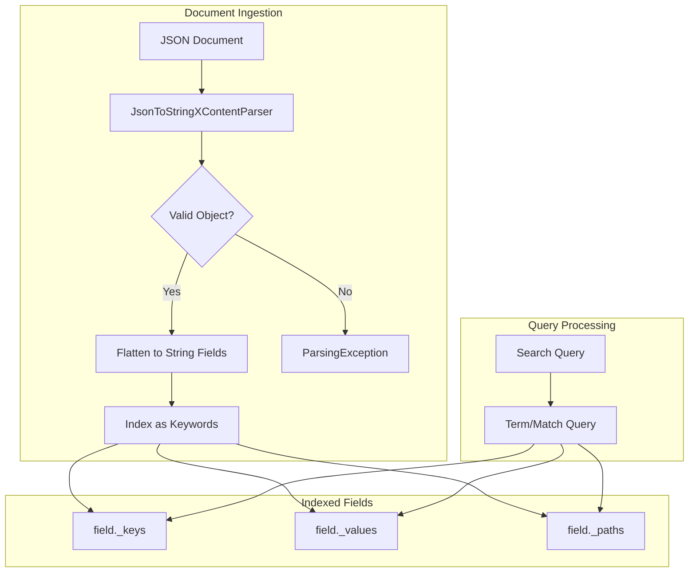
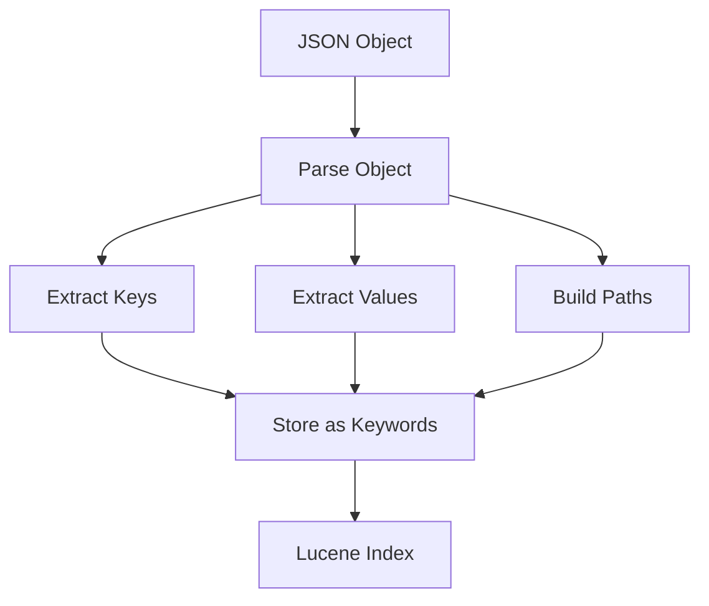

---
tags:
  - opensearch
---
# Flat Object Field Type

## Summary

The `flat_object` field type is a specialized object field type introduced in OpenSearch 2.7 that treats an entire JSON object as a string. Unlike regular object fields that dynamically map all subfields, `flat_object` stores the JSON structure without creating separate field mappings for each nested key. This prevents "mapping explosion" when ingesting documents with many dynamic or unknown fields, such as logs with varying structures.

## Details

### Architecture



### Data Flow



### Components

| Component | Description |
|-----------|-------------|
| `FlatObjectFieldMapper` | Main mapper class that handles flat_object field indexing |
| `JsonToStringXContentParser` | Parser that transforms JSON objects into string fields |
| `FlatObjectFieldType` | Field type definition with query support |

### Configuration

| Setting | Description | Default |
|---------|-------------|---------|
| `type` | Field type, must be `flat_object` | Required |

### Supported Queries

| Query Type | Description |
|------------|-------------|
| `term` | Exact match on leaf values |
| `terms` | Match any of multiple values |
| `terms_set` | Match a minimum number of terms |
| `prefix` | Prefix matching on values |
| `range` | Range queries on string values |
| `match` | Full-text match (analyzed as keyword) |
| `multi_match` | Match across multiple fields |
| `query_string` | Query string syntax |
| `simple_query_string` | Simplified query string |
| `exists` | Check if field exists |
| `wildcard` | Wildcard pattern matching |

### Usage Example

```json
// Create index with flat_object field
PUT /products
{
  "mappings": {
    "properties": {
      "metadata": {
        "type": "flat_object"
      }
    }
  }
}

// Index document with nested JSON
PUT /products/_doc/1
{
  "metadata": {
    "category": "electronics",
    "specs": {
      "weight": "1.5kg",
      "dimensions": {
        "width": "30cm",
        "height": "20cm"
      }
    },
    "tags": {
      "color": "black",
      "brand": "acme"
    }
  }
}

// Search by leaf value (finds document)
GET /products/_search
{
  "query": {
    "match": {
      "metadata": "black"
    }
  }
}

// Search with dot notation path
GET /products/_search
{
  "query": {
    "term": {
      "metadata.tags.color": "black"
    }
  }
}
```

### DocValues Retrieval (v3.0.0+)

Starting from v3.0.0, you can retrieve specific subfield values from DocValues using the `docvalue_fields` parameter:

```json
// Retrieve specific subfield value from DocValues
GET /products/_search
{
  "_source": false,
  "stored_fields": "_none_",
  "docvalue_fields": ["metadata.tags.color"]
}

// Response
{
  "hits": {
    "hits": [
      {
        "_index": "products",
        "_id": "1",
        "fields": {
          "metadata.tags.color": ["black"]
        }
      }
    ]
  }
}
```

This is more efficient than loading the entire `_source` when you only need specific field values.

## Limitations

- Only accepts JSON objects as values (not arrays, strings, or numbers directly)
- No type-specific parsing (all values stored as strings)
- No numerical operations (comparison, sorting by numeric value)
- No text analysis (values stored as keywords)
- No highlighting support
- No aggregations on subfields using dot notation
- No filtering by subfields
- Painless scripting not supported for retrieving subfield values
- Maximum field value length in dot notation is 2²⁴ − 1
- DocValues retrieval requires full dot-path notation (root field not supported)

## Change History

- **v3.0.0** (2025-02-11): Added ability to retrieve values from DocValues in flat_object subfields using `docvalue_fields` parameter with dot notation.
- **v2.18.0** (2024-10-22): Added IndexOrDocValuesQuery optimization for improved query performance. Delegated query generation to KeywordFieldType to reduce code duplication. Enabled wildcard query support. Fixed infinite loop bug when flat_object field receives invalid token types.
- **v2.7.0** (2023-04-18): Initial implementation of flat_object field type.


## References

### Documentation
- [Flat object documentation](https://docs.opensearch.org/latest/field-types/supported-field-types/flat-object/): Official documentation
- [Object field types](https://docs.opensearch.org/latest/field-types/supported-field-types/object-fields/): Overview of object field types

### Blog Posts
- [Use flat object in OpenSearch](https://opensearch.org/blog/flat-object/): Blog post

### Pull Requests
| Version | PR | Description | Related Issue |
|---------|-----|-------------|---------------|
| v3.0.0 | [#16802](https://github.com/opensearch-project/OpenSearch/pull/16802) | Added ability to retrieve value from DocValues in flat_object field | [#16742](https://github.com/opensearch-project/OpenSearch/issues/16742) |
| v2.18.0 | [#14383](https://github.com/opensearch-project/OpenSearch/pull/14383) | Use IndexOrDocValuesQuery to optimize query, delegate to KeywordFieldType | [#11635](https://github.com/opensearch-project/OpenSearch/issues/11635) |
| v2.18.0 | [#15985](https://github.com/opensearch-project/OpenSearch/pull/15985) | Fix infinite loop when parsing invalid token types | [#15982](https://github.com/opensearch-project/OpenSearch/issues/15982) |
| v2.7.0 | - | Initial implementation of flat_object field type |   |

### Issues (Design / RFC)
- [Issue #16742](https://github.com/opensearch-project/OpenSearch/issues/16742): Feature request for DocValues retrieval
- [Issue #11537](https://github.com/opensearch-project/OpenSearch/issues/11537): Feature request for IndexOrDocValuesQuery support
- [Issue #11635](https://github.com/opensearch-project/OpenSearch/issues/11635): Bug report for code duplication in query generation
- [Issue #15982](https://github.com/opensearch-project/OpenSearch/issues/15982): Bug report for infinite loop with invalid tokens
