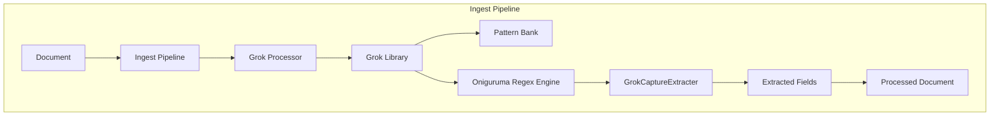
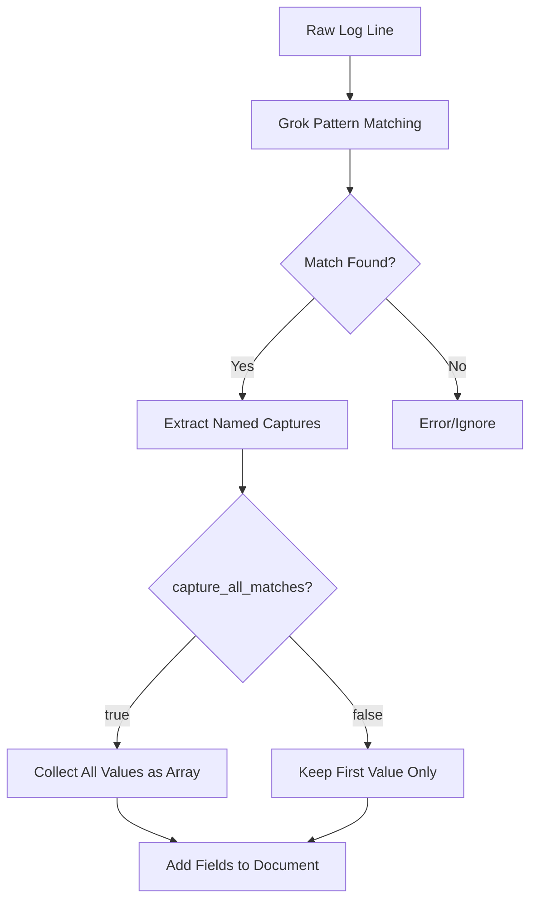

---
tags:
  - opensearch
---
# Grok Processor

## Summary

The Grok processor is an ingest processor that parses and structures unstructured data using pattern matching. It extracts fields from log messages, web server access logs, application logs, and other log data that follows a consistent format. The processor uses predefined patterns based on regular expressions to match parts of the input text and assign them to named fields.

## Details

### Architecture



### Data Flow



### Components

| Component | Description |
|-----------|-------------|
| `GrokProcessor` | Main processor class that handles pipeline integration |
| `Grok` | Core pattern matching engine using Oniguruma regex |
| `GrokCaptureExtracter` | Extracts matched values from regex regions |
| `GrokCaptureType` | Handles type conversion (string, int, long, float, double) |
| `GrokCaptureConfig` | Configuration for individual capture groups |

### Configuration

| Setting | Description | Default |
|---------|-------------|---------|
| `field` | The field containing the text to parse | Required |
| `patterns` | List of grok patterns to match against | Required |
| `pattern_definitions` | Custom pattern definitions | `{}` |
| `trace_match` | Add `_grok_match_index` to show which pattern matched | `false` |
| `ignore_missing` | Ignore if the field doesn't exist | `false` |
| `ignore_failure` | Continue even if processing fails | `false` |
| `capture_all_matches` | Capture all values for repeated field names as array | `false` |

### Usage Example

**Basic grok pattern:**

```json
PUT _ingest/pipeline/apache_logs
{
  "description": "Parse Apache access logs",
  "processors": [
    {
      "grok": {
        "field": "message",
        "patterns": ["%{IPORHOST:clientip} %{USER:ident} %{USER:auth} \\[%{HTTPDATE:timestamp}\\] \"%{WORD:method} %{URIPATHPARAM:request} HTTP/%{NUMBER:httpversion}\" %{NUMBER:response:int} %{NUMBER:bytes:int}"]
      }
    }
  ]
}
```

**With custom patterns:**

```json
PUT _ingest/pipeline/custom_logs
{
  "processors": [
    {
      "grok": {
        "field": "message",
        "patterns": ["Status: %{STATUS:status}"],
        "pattern_definitions": {
          "STATUS": "OK|ERROR|WARNING"
        }
      }
    }
  ]
}
```

**Capturing multiple values (v3.3.0+):**

```json
PUT _ingest/pipeline/multi_ip
{
  "processors": [
    {
      "grok": {
        "field": "message",
        "patterns": ["%{IP:ip}, %{IP:ip}, %{IP:ip}"],
        "capture_all_matches": true
      }
    }
  ]
}
```

## Limitations

- Pattern matching can be CPU-intensive for complex patterns or large inputs
- The `capture_all_matches` option applies globally to all fields in the pattern
- Grok patterns are evaluated sequentially; only the first matching pattern is used
- No built-in protection against catastrophic backtracking in regex patterns

## Change History

- **v3.3.0** (2025-09-12): Added `capture_all_matches` option to capture multiple values for repeated field names into an array


## References

### Documentation
- [Grok Processor Documentation](https://docs.opensearch.org/3.0/ingest-pipelines/processors/grok/): Official documentation
- [Oniguruma Regex Library](https://github.com/kkos/oniguruma): Underlying regex engine

### Pull Requests
| Version | PR | Description | Related Issue |
|---------|-----|-------------|---------------|
| v3.3.0 | [#18799](https://github.com/opensearch-project/OpenSearch/pull/18799) | Added `capture_all_matches` option for multi-value capture | [#18790](https://github.com/opensearch-project/OpenSearch/issues/18790) |

### Issues (Design / RFC)
- [Issue #18790](https://github.com/opensearch-project/OpenSearch/issues/18790): Feature request for multi-value capture
