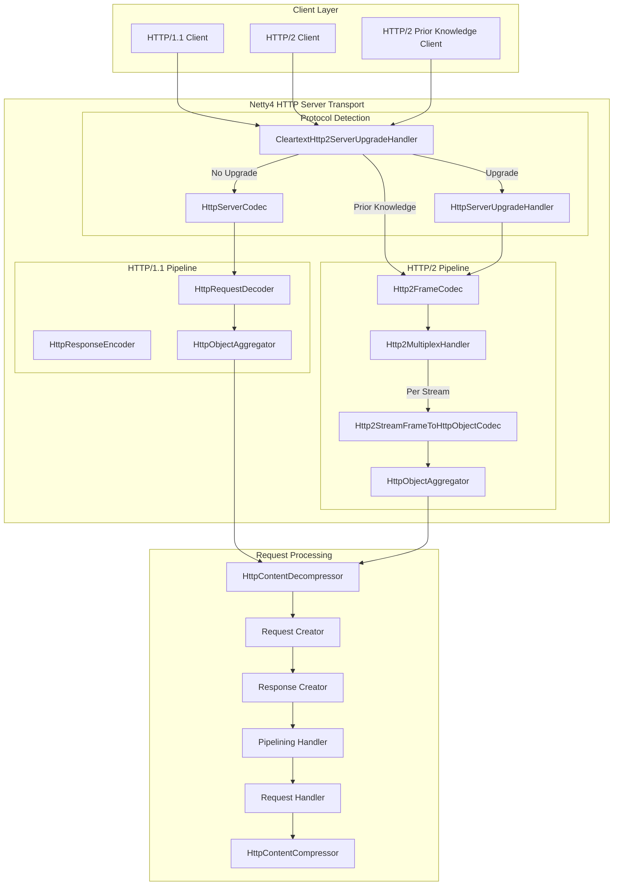
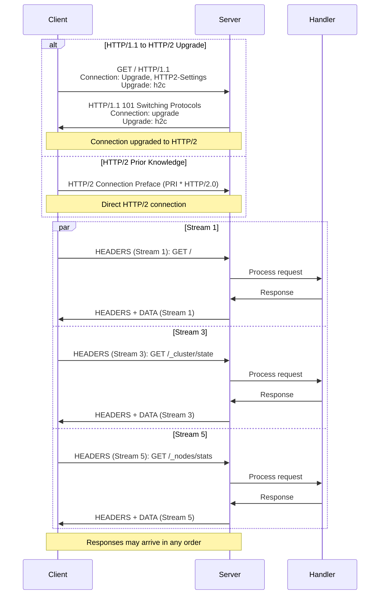

---
tags:
  - domain/core
  - component/server
  - search
---
# HTTP/2 Support

## Summary

HTTP/2 protocol support enables OpenSearch to handle multiple concurrent requests over a single TCP connection through stream multiplexing. This eliminates head-of-line blocking present in HTTP/1.1, reduces connection overhead, and improves throughput for clients making many concurrent requests to the cluster.

## Details

### Architecture



### Data Flow



### Components

| Component | Description |
|-----------|-------------|
| `CleartextHttp2ServerUpgradeHandler` | Detects and handles HTTP/2 upgrade requests and prior knowledge connections |
| `Http2FrameCodec` | Encodes/decodes HTTP/2 frames according to RFC 7540 |
| `Http2MultiplexHandler` | Creates separate child channels for each HTTP/2 stream |
| `Http2StreamFrameToHttpObjectCodec` | Converts HTTP/2 stream frames to standard HTTP objects |
| `HttpServerUpgradeHandler` | Handles HTTP/1.1 upgrade mechanism to HTTP/2 |
| `Http2ServerUpgradeCodec` | Codec for HTTP/2 upgrade negotiation |
| `Netty4HttpChannel` | Extended to support inbound pipeline reference for HTTP/2 streams |

### Configuration

HTTP/2 support is enabled by default with no additional configuration required. The existing HTTP settings apply:

| Setting | Description | Default |
|---------|-------------|---------|
| `http.max_initial_line_length` | Maximum length of HTTP request line | 4KB |
| `http.max_header_size` | Maximum size of HTTP headers | 8KB |
| `http.max_chunk_size` | Maximum chunk size for HTTP content | 8KB |
| `http.max_content_length` | Maximum content length for HTTP requests | 100MB |
| `http.compression` | Enable HTTP response compression | true |
| `http.compression_level` | Compression level (1-9) | 3 |
| `http.pipelining.max_events` | Maximum pipelined events | 10000 |

### Usage Example

```bash
# Standard HTTP/1.1 request (unchanged)
curl http://localhost:9200

# HTTP/1.1 to HTTP/2 upgrade
curl http://localhost:9200 --http2

# HTTP/2 prior knowledge (direct HTTP/2)
curl http://localhost:9200 --http2-prior-knowledge

# Multiple concurrent requests benefit from multiplexing
curl --http2-prior-knowledge \
  http://localhost:9200/_cluster/health \
  http://localhost:9200/_nodes/stats \
  http://localhost:9200/_cat/indices
```

### Benefits

- **Multiplexing**: Multiple requests/responses over single connection without head-of-line blocking
- **Reduced latency**: No need to establish multiple TCP connections
- **Header compression**: HTTP/2 uses HPACK compression for headers
- **Stream prioritization**: Clients can prioritize important requests
- **Backward compatible**: HTTP/1.1 clients continue to work unchanged

## Limitations

- Only h2c (HTTP/2 over cleartext) is supported; h2 (HTTP/2 over TLS) requires security plugin configuration
- Response ordering is not guaranteed (unlike HTTP/1.1 pipelining where responses match request order)
- Some older clients may not support HTTP/2 upgrade mechanism

## Change History

- **v3.0.0**: Initial implementation with h2c support, HTTP/1.1 upgrade, and prior knowledge connections


## References

### Documentation
- [Network settings documentation](https://docs.opensearch.org/3.0/install-and-configure/configuring-opensearch/network-settings/): OpenSearch network configuration
- [RFC 7540](https://tools.ietf.org/html/rfc7540): HTTP/2 specification

### Pull Requests
| Version | PR | Description | Related Issue |
|---------|-----|-------------|---------------|
| v3.0.0 | [#3847](https://github.com/opensearch-project/OpenSearch/pull/3847) | Initial HTTP/2 server-side support | [#3651](https://github.com/opensearch-project/OpenSearch/issues/3651) |

### Issues (Design / RFC)
- [Issue #3651](https://github.com/opensearch-project/OpenSearch/issues/3651): Original feature request for HTTP/2 support
