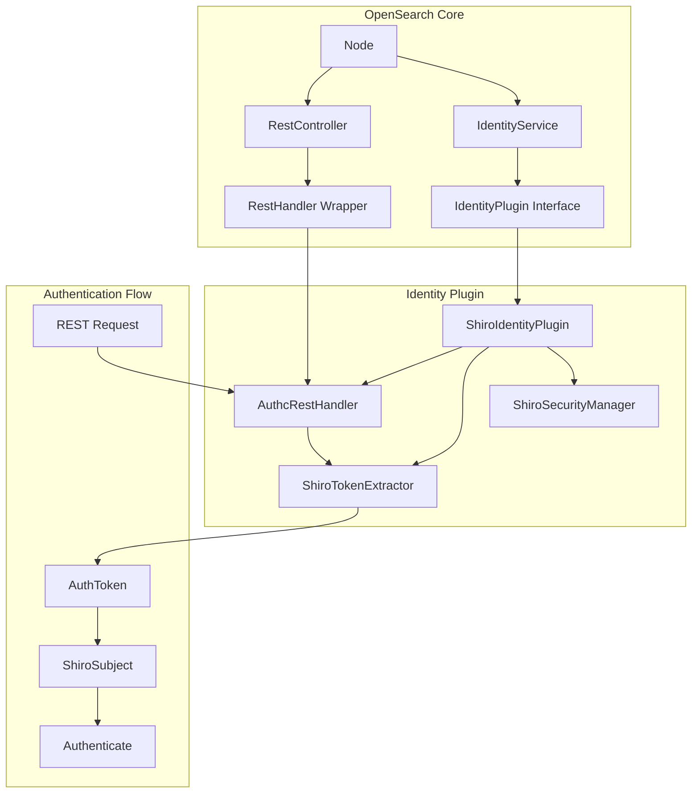
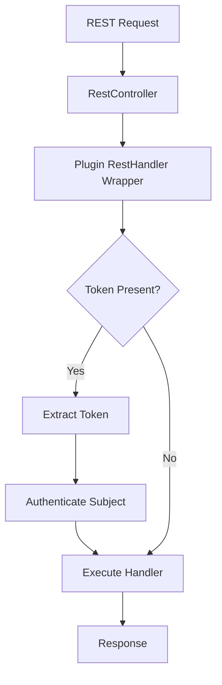

---
tags:
  - domain/core
  - component/server
  - security
---
# Identity Feature Flag Removal

## Summary

The Identity Feature Flag Removal is a code cleanup change that removes the experimental `opensearch.experimental.feature.identity.enabled` feature flag from OpenSearch. This change makes the Identity plugin architecture always available without requiring explicit enablement, simplifying the codebase and enabling plugins to adopt the new authentication mechanism.

## Details

### Architecture



### Data Flow



### Components

| Component | Description |
|-----------|-------------|
| `IdentityService` | Core service that manages identity plugins and provides current subject |
| `IdentityPlugin` | Interface for identity provider plugins |
| `ShiroIdentityPlugin` | Apache Shiro-based identity plugin implementation |
| `ShiroTokenExtractor` | Extracts authentication tokens from REST request headers |
| `AuthcRestHandler` | REST handler wrapper that performs authentication |
| `ShiroSubject` | Subject implementation backed by Apache Shiro |
| `ShiroTokenManager` | Manages authentication tokens |

### Configuration

The feature flag has been removed. No configuration is required to enable identity functionality.

| Setting | Status | Description |
|---------|--------|-------------|
| `opensearch.experimental.feature.identity.enabled` | **Removed** | Previously gated identity functionality |

### Usage Example

Identity plugins implement authentication via the `ActionPlugin.getRestHandlerWrapper` extension point:

```java
public class CustomIdentityPlugin extends Plugin implements IdentityPlugin, ActionPlugin {
    
    @Override
    public Subject getCurrentSubject() {
        return new CustomSubject();
    }
    
    @Override
    public TokenManager getTokenManager() {
        return new CustomTokenManager();
    }
    
    @Override
    public UnaryOperator<RestHandler> getRestHandlerWrapper(ThreadContext threadContext) {
        return handler -> new RestHandler.Wrapper(handler) {
            @Override
            public void handleRequest(RestRequest request, RestChannel channel, NodeClient client) 
                    throws Exception {
                // Custom authentication logic
                AuthToken token = extractToken(request);
                if (token != null) {
                    authenticate(token);
                }
                super.handleRequest(request, channel, client);
            }
        };
    }
}
```

## Limitations

- The `IdentityService` is marked as `@InternalApi` and may change in future versions
- Only one identity plugin can be active at a time
- The identity-shiro plugin only supports Basic authentication via the Authorization header

## Change History

- **v2.18.0** (2024-10-22): Removed Identity feature flag, moved authentication logic to identity plugins


## References

### Documentation
- [Experimental feature flags documentation](https://docs.opensearch.org/2.18/install-and-configure/configuring-opensearch/experimental/)

### Blog Posts
- [Blog: Introducing identity and access control for OpenSearch](https://opensearch.org/blog/introducing-identity/)

### Pull Requests
| Version | PR | Description | Related Issue |
|---------|-----|-------------|---------------|
| v2.18.0 | [#15430](https://github.com/opensearch-project/OpenSearch/pull/15430) | Remove identity-related feature flagged code from the RestController | [#238](https://github.com/opensearch-project/opensearch-plugins/issues/238) |
| v2.18.0 | [#16024](https://github.com/opensearch-project/OpenSearch/pull/16024) | Remove Identity FeatureFlag | [#4439](https://github.com/opensearch-project/OpenSearch/issues/4439) |

### Issues (Design / RFC)
- [Issue #4439](https://github.com/opensearch-project/security/issues/4439): Remove Identity feature flag
- [Issue #238](https://github.com/opensearch-project/opensearch-plugins/issues/238): Plugin adoption of new system index mechanism
