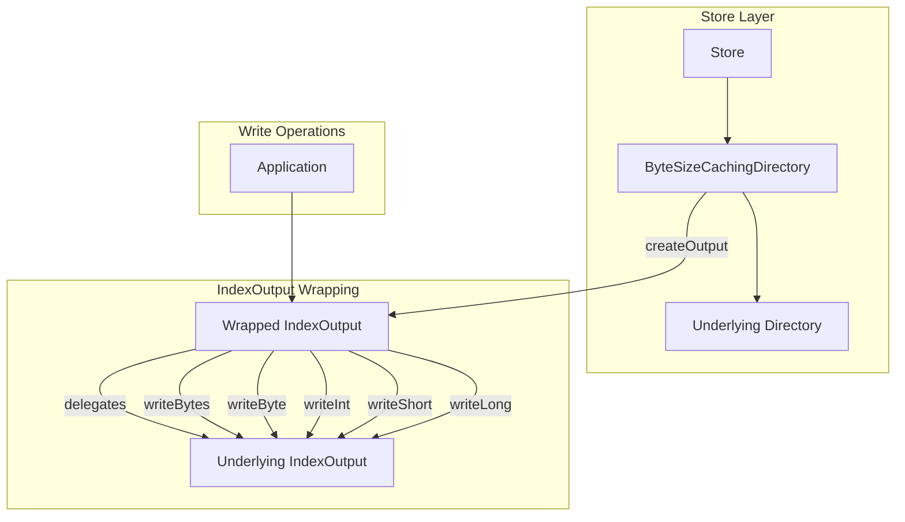
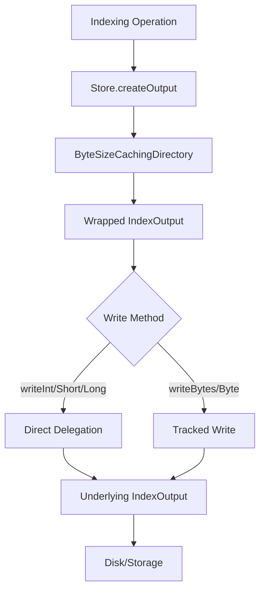

---
tags:
  - indexing
  - performance
---

# Index Output Optimization

## Summary

OpenSearch uses `ByteSizeCachingDirectory` to wrap the underlying Lucene directory and cache byte size calculations for efficient storage management. This feature ensures that primitive write methods (`writeInt`, `writeShort`, `writeLong`) in the wrapped `IndexOutput` are properly delegated to the underlying output stream, enabling optimized bulk writes instead of byte-by-byte operations.

## Details

### Architecture



### Data Flow



### Components

| Component | Description |
|-----------|-------------|
| `ByteSizeCachingDirectory` | Directory wrapper that caches byte size calculations and tracks modifications |
| `FilterIndexOutput` | Anonymous inner class that wraps `IndexOutput` to track writes and delegate operations |
| `SingleObjectCache` | Cache for storing computed directory size with refresh logic |

### How It Works

1. **Directory Wrapping**: `Store` wraps the underlying directory with `ByteSizeCachingDirectory` to track storage size
2. **Output Wrapping**: When `createOutput()` or `createTempOutput()` is called, the returned `IndexOutput` is wrapped
3. **Write Tracking**: The wrapper tracks open outputs and modification counts for cache invalidation
4. **Method Delegation**: Write methods delegate to the underlying `IndexOutput`:
   - `writeBytes()` and `writeByte()` - tracked for size caching
   - `writeInt()`, `writeShort()`, `writeLong()` - direct delegation for performance

### Configuration

This is an internal optimization with no user-configurable settings. The behavior is automatically applied to all index operations.

### Usage Example

The optimization is transparent to users. Any indexing operation benefits automatically:

```json
PUT /my-index/_doc/1
{
  "numeric_field": 12345,
  "timestamp": 1704067200000
}
```

Numeric fields and timestamps use primitive writes internally, which now benefit from optimized delegation.

## Limitations

- Internal optimization only - no user-facing configuration
- Performance improvement varies based on workload (more benefit for numeric-heavy indices)
- Only affects primitive write methods; byte array writes were already optimized

## Change History

- **v3.3.0** (2025-09-28): Added delegation for `writeInt`, `writeShort`, `writeLong` methods to improve BKD merge performance

## Related Features
- [OpenSearch Dashboards](../opensearch-dashboards/opensearch-dashboards-ai-chat.md)

## References

### Documentation
- [Lucene PR #321](https://github.com/apache/lucene/pull/321): Lucene optimization for primitive writes
- [ByteSizeCachingDirectory.java](https://github.com/opensearch-project/OpenSearch/blob/main/server/src/main/java/org/opensearch/index/store/ByteSizeCachingDirectory.java): Source code

### Pull Requests
| Version | PR | Description | Related Issue |
|---------|-----|-------------|---------------|
| v3.3.0 | [#19432](https://github.com/opensearch-project/OpenSearch/pull/19432) | Delegate primitive write methods with ByteSizeCachingDirectory wrapped IndexOutput | [#19420](https://github.com/opensearch-project/OpenSearch/issues/19420) |

### Issues (Design / RFC)
- [Issue #19420](https://github.com/opensearch-project/OpenSearch/issues/19420): Original bug report
