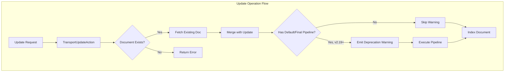

---
tags:
  - opensearch
---
# Ingest Pipeline Update Operation Behavior

## Summary

This document describes the behavior of ingest pipelines during document update operations in OpenSearch. The Update API has historically executed default and final ingest pipelines when updating existing documents, but this behavior is inconsistent with the Bulk API and can produce unexpected results. Starting in v2.19.0, this behavior is deprecated and will be removed in v3.0.0.

## Details

### Architecture



### Pipeline Execution by Operation Type

| Operation | Default Pipeline | Final Pipeline | System Pipeline |
|-----------|-----------------|----------------|-----------------|
| Index | ✅ Executes | ✅ Executes | ✅ Executes |
| Single Update | ⚠️ Deprecated | ⚠️ Deprecated | ✅ Executes |
| Bulk Index | ✅ Executes | ✅ Executes | ✅ Executes |
| Bulk Update | ❌ Does not execute | ❌ Does not execute | ✅ Executes |
| Bulk Update (doc_as_upsert=true) | ✅ Executes | ✅ Executes | ✅ Executes |

### Configuration

| Setting | Description | Default |
|---------|-------------|---------|
| `index.default_pipeline` | Pipeline to run on all index operations | `_none` |
| `index.final_pipeline` | Pipeline that always runs after default pipeline | `_none` |

### Usage Example

#### Creating an Index with Pipeline

```json
PUT /my-index
{
  "settings": {
    "index.default_pipeline": "my-pipeline"
  }
}
```

#### Update Operation (Triggers Deprecation Warning in v2.19.0+)

```json
POST /my-index/_update/1
{
  "doc": {
    "field": "new_value"
  }
}
```

Response headers will include:
```
Warning: 299 OpenSearch "the index [my-index] has a default ingest pipeline or a final ingest pipeline, the support of the ingest pipelines for update operation causes unexpected result and will be removed in 3.0.0"
```

#### Alternative: Use Index Operation

```json
PUT /my-index/_doc/1
{
  "field": "new_value",
  "other_field": "preserved_value"
}
```

#### Alternative: Use Bulk with doc_as_upsert

```json
POST /_bulk
{"update": {"_index": "my-index", "_id": "1"}}
{"doc": {"field": "new_value"}, "doc_as_upsert": true}
```

## Limitations

- Update operations cannot explicitly specify a pipeline parameter
- The deprecation warning cannot be suppressed in v2.19.0
- System ingest pipelines (v3.1.0+) always execute on updates, regardless of this deprecation

## Change History

- **v3.0.0** (planned): Remove ingest pipeline execution for update operations entirely
- **v2.19.0** (2024-12-02): Deprecated ingest pipeline execution for update operations with warning

## References

### Documentation
- [Update Document API](https://docs.opensearch.org/latest/api-reference/document-apis/update-document/): Official API documentation
- [Ingest Pipelines](https://docs.opensearch.org/latest/ingest-pipelines/): Ingest pipeline overview
- [Blog: Making ingestion smarter](https://opensearch.org/blog/making-ingestion-smarter-system-ingest-pipelines-in-opensearch/): Discusses update operation behavior with system pipelines

### Pull Requests
| Version | PR | Description | Related Issue |
|---------|-----|-------------|---------------|
| v2.19.0 | [#16712](https://github.com/opensearch-project/OpenSearch/pull/16712) | Deprecate performing update operation with default pipeline or final pipeline | [#16663](https://github.com/opensearch-project/OpenSearch/issues/16663) |

### Issues
- [#16663](https://github.com/opensearch-project/OpenSearch/issues/16663): Bug report - Ingest pipeline bulk update issue
