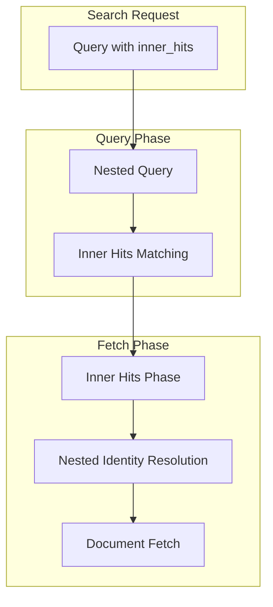

---
tags:
  - opensearch
---
# Inner Hits

## Summary

Inner hits allow retrieval of nested documents or child documents that matched a nested or parent-child query. When searching with nested objects or parent-join relationships, the matching inner documents are hidden by default. The `inner_hits` parameter exposes these matching documents in the search response.

## Details

### Architecture



### Components

| Component | Description |
|-----------|-------------|
| `InnerHitsContext` | Manages inner hit sub-contexts during search |
| `InnerHitSubContext` | Base class for inner hit execution contexts |
| `NestedInnerHitSubContext` | Specialized context for nested document inner hits |
| `FetchPhase` | Executes inner hits retrieval during document fetch |
| `DocumentMapper` | Resolves nested object mappers for inner hit documents |

### Usage Example

```json
GET /my-index/_search
{
  "query": {
    "nested": {
      "path": "comments",
      "query": {
        "match": { "comments.text": "opensearch" }
      },
      "inner_hits": {
        "size": 3,
        "_source": ["comments.text", "comments.author"]
      }
    }
  }
}
```

### Inner Hits Options

| Option | Description | Default |
|--------|-------------|---------|
| `name` | Name for the inner hit definition | Auto-generated |
| `size` | Maximum number of inner hits to return | 3 |
| `from` | Offset for inner hits pagination | 0 |
| `sort` | Sort order for inner hits | By score |
| `_source` | Source filtering for inner hits | All fields |
| `highlight` | Highlighting configuration | None |

## Limitations

- Inner hits add overhead to query execution, especially with many nested documents
- Each inner hit requires additional document fetches
- Large `size` values can significantly impact performance

## Change History

- **v2.19.0** (2025-01-22): Performance optimization using BitSet caching and direct ObjectMapper lookup for nested inner hits

## References

### Documentation
- [Inner Hits](https://docs.opensearch.org/latest/search-plugins/searching-data/inner-hits/)
- [Nested Query](https://docs.opensearch.org/latest/query-dsl/joining/nested/)
- [Nested Field Type](https://docs.opensearch.org/latest/field-types/supported-field-types/nested/)

### Pull Requests
| Version | PR | Description |
|---------|-----|-------------|
| v2.19.0 | [#16937](https://github.com/opensearch-project/OpenSearch/pull/16937) | Optimize innerhits query performance |
