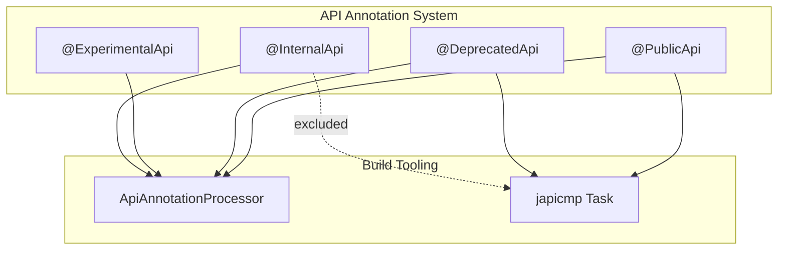

---
tags:
  - opensearch
---
# @InternalApi Annotation

## Summary

The `@InternalApi` annotation marks APIs that have no compatibility guarantees and should not be used outside of OpenSearch core components. It is part of OpenSearch's API annotation system that helps maintain clear boundaries between public and internal APIs.

## Details

### Architecture



### Annotation Definition

The `@InternalApi` annotation can be applied to various Java elements:

```java
@Documented
@Target({
    ElementType.TYPE,
    ElementType.PACKAGE,
    ElementType.METHOD,
    ElementType.CONSTRUCTOR,
    ElementType.PARAMETER,
    ElementType.FIELD,
    ElementType.ANNOTATION_TYPE,
    ElementType.MODULE
})
@PublicApi(since = "2.10.0")
public @interface InternalApi {
}
```

### Components

| Component | Description |
|-----------|-------------|
| `@InternalApi` | Annotation marking internal APIs with no compatibility guarantees |
| `ApiAnnotationProcessor` | Compile-time processor that validates API annotation usage |
| japicmp task | Build task that detects breaking changes, excludes `@InternalApi` classes |

### Usage

#### Marking Internal Classes

```java
@InternalApi
public class InternalImplementation {
    // This class should not be used outside OpenSearch core
}
```

#### Internal Constructors on Public Classes

For classes that are part of the public API but should not be instantiated externally:

```java
@PublicApi(since = "1.0.0")
public class PublicButNotInstantiable {
    @InternalApi
    public PublicButNotInstantiable(InternalDependency dep) {
        // Constructor is internal - don't instantiate outside core
    }
    
    public void publicMethod() {
        // This method is part of the public API
    }
}
```

### API Annotation Processor Rules

The `ApiAnnotationProcessor` enforces the following rules:

1. Public APIs (`@PublicApi`, `@DeprecatedApi`, `@ExperimentalApi`) should only expose other public APIs
2. `@InternalApi` elements should not be part of public API signatures (with exceptions)
3. Constructor arguments have relaxed semantics - can be not annotated or `@InternalApi`

### Build Integration

The japicmp task configuration:

```groovy
tasks.register("japicmp", me.champeau.gradle.japicmp.JapicmpTask) {
    failOnModification = true
    ignoreMissingClasses = true
    annotationIncludes = ['@org.opensearch.common.annotation.PublicApi', '@org.opensearch.common.annotation.DeprecatedApi']
    annotationExcludes = ['@org.opensearch.common.annotation.InternalApi']
}
```

## Limitations

- Runtime enforcement is not provided - the annotation is for documentation and build-time checks only
- External code can still access and instantiate `@InternalApi` classes at runtime
- Breaking changes to `@InternalApi` classes are not reported but may still affect plugins

## Change History

- **v2.16.0** (2024-08-06): Enhanced to allow `@InternalApi` on constructors of public classes; added to japicmp exclusions
- **v2.10.0**: Initial introduction of `@InternalApi` annotation

## References

### Documentation

- [OpenSearch API Annotations](https://github.com/opensearch-project/OpenSearch/tree/main/libs/common/src/main/java/org/opensearch/common/annotation)

### Pull Requests

| Version | PR | Description |
|---------|-----|-------------|
| v2.16.0 | [#14575](https://github.com/opensearch-project/OpenSearch/pull/14575) | Allow @InternalApi annotation on classes not meant to be constructed outside of the OpenSearch core |
| v2.16.0 | [#14597](https://github.com/opensearch-project/OpenSearch/pull/14597) | Add @InternalApi annotation to japicmp exclusions |

### Related Issues

- [#13308](https://github.com/opensearch-project/OpenSearch/issues/13308) - Feature Request: Allow annotation of InternalApi on classes not meant to be consumed outside of OpenSearch
