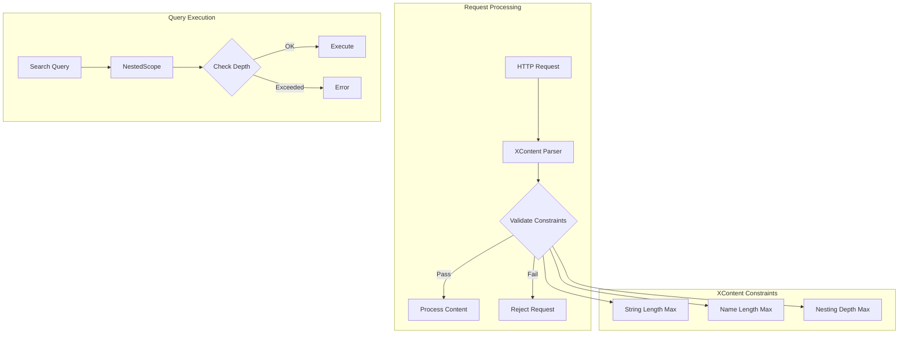

---
tags:
  - domain/core
  - component/server
  - indexing
  - search
---
# Jackson & Query Limits

## Summary

OpenSearch enforces configurable limits on JSON content parsing and nested query depth to ensure stability and prevent resource exhaustion. These limits protect against malicious or malformed input that could cause memory issues or stack overflows.

## Details

### Architecture



### Components

| Component | Description |
|-----------|-------------|
| `XContentConstraints` | Interface defining limits for JSON/CBOR/SMILE/YAML parsing |
| `JsonXContent` | JSON parser with constraint enforcement |
| `CborXContent` | CBOR parser with constraint enforcement |
| `SmileXContent` | SMILE parser with constraint enforcement |
| `YamlXContent` | YAML parser with constraint enforcement |
| `NestedScope` | Tracks and enforces nested query depth during query execution |

### Configuration

#### XContent Parsing Limits (System Properties)

| Setting | Description | Default |
|---------|-------------|---------|
| `opensearch.xcontent.string.length.max` | Maximum string value length | 50,000,000 (~50 MB) |
| `opensearch.xcontent.name.length.max` | Maximum field name length | 50,000 |
| `opensearch.xcontent.depth.max` | Maximum JSON nesting depth | 1,000 |

#### Query Depth Limits (Index Settings)

| Setting | Description | Default | Dynamic |
|---------|-------------|---------|---------|
| `index.query.max_nested_depth` | Maximum nested query depth | 20 | Yes |

### Usage Example

#### Setting XContent Limits

Configure via JVM system properties at startup:

```bash
./bin/opensearch \
  -Dopensearch.xcontent.string.length.max=100000000 \
  -Dopensearch.xcontent.name.length.max=100000 \
  -Dopensearch.xcontent.depth.max=2000
```

#### Configuring Nested Query Depth

Create index with custom limit:

```json
PUT /my-index
{
  "settings": {
    "index.query.max_nested_depth": 50
  }
}
```

Update existing index:

```json
PUT /my-index/_settings
{
  "index.query.max_nested_depth": 30
}
```

#### Example Nested Query

```json
GET /my-index/_search
{
  "query": {
    "nested": {
      "path": "level1",
      "query": {
        "nested": {
          "path": "level1.level2",
          "query": {
            "match": { "level1.level2.field": "value" }
          }
        }
      }
    }
  }
}
```

If nesting exceeds `index.query.max_nested_depth`, an `IllegalArgumentException` is thrown.

## Limitations

- XContent limits are JVM-wide and cannot be configured per-index or per-request
- Changing XContent limits requires cluster restart
- Nested query depth limit only applies to nested queries, not general JSON document depth
- No API to query current effective limits at runtime

## Change History

- **v3.0.0** (2025-05-06): Initial implementation - Jackson 2.16.x XContent constraints and nested query depth limit


## References

### Documentation
- [Breaking Changes](https://docs.opensearch.org/3.0/breaking-changes/): OpenSearch 3.0 breaking changes documentation

### Pull Requests
| Version | PR | Description | Related Issue |
|---------|-----|-------------|---------------|
| v3.0.0 | [#11811](https://github.com/opensearch-project/OpenSearch/pull/11811) | Jackson default maximums for XContent parsing | [#11278](https://github.com/opensearch-project/OpenSearch/issues/11278) |
| v3.0.0 | [#11670](https://github.com/opensearch-project/OpenSearch/pull/11670) | Nested query depth limit setting | [#3268](https://github.com/opensearch-project/OpenSearch/issues/3268) |

### Issues (Design / RFC)
- [Issue #11278](https://github.com/opensearch-project/OpenSearch/issues/11278): Jackson default maximums feature request
- [Issue #3268](https://github.com/opensearch-project/OpenSearch/issues/3268): Nested query depth limit feature request
