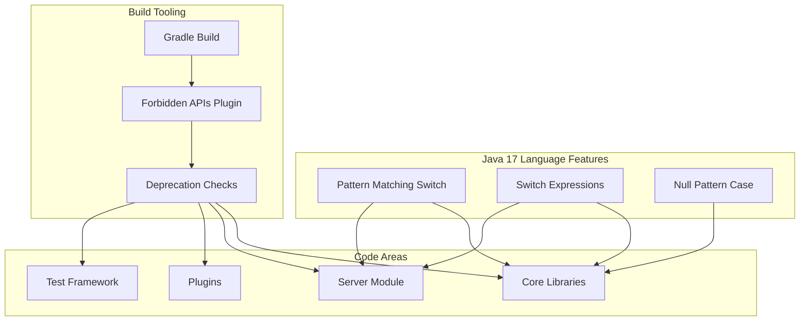

---
tags:
  - domain/core
  - component/server
  - search
---
# Java 17 Modernization

## Summary

Java 17 Modernization is an ongoing effort to update OpenSearch codebase to leverage modern Java language features introduced in Java 17. This includes adopting pattern matching switch expressions, replacing deprecated APIs with their modern equivalents, and ensuring proper enforcement of Java deprecation warnings through build tooling updates.

## Details

### Architecture



### Components

| Component | Description |
|-----------|-------------|
| Pattern Matching Switch | Java 17 feature allowing type patterns in switch cases |
| Switch Expressions | Expression form of switch returning values with `yield` |
| Forbidden APIs Plugin | Gradle plugin enforcing API usage rules and deprecation warnings |
| Deprecation Enforcement | Build-time checks for deprecated Java API usage |

### Key Language Features Used

#### Pattern Matching for Switch

Pattern matching allows combining type checking and casting in a single operation:

```java
// Type pattern with binding variable
case TermQuery tq -> mightMatchNestedDocs(tq.getTerm().field());

// Guarded pattern (when clause)
case TermInSetQuery tisq -> tisq.getTermsCount() > 0 && mightMatchNestedDocs(tisq.getField());

// Null handling
case null, default -> true;

// Block with yield for complex logic
case BooleanQuery bq -> {
    boolean hasRequired = bq.clauses().stream().anyMatch(BooleanClause::isRequired);
    yield hasRequired ? checkRequired(bq) : checkShould(bq);
}
```

#### Ignored Pattern Variables

When the matched value is not needed, use `ignored` as the variable name:

```java
case MatchAllDocsQuery ignored -> true;
case Float ignored -> sortValue;  // sort by _score
```

### Configuration

| Setting | Description | Default |
|---------|-------------|---------|
| `targetCompatibility` | Java version for forbidden APIs checks | Runtime Java version |
| `bundledSignatures` | Built-in API signature sets | `jdk-unsafe`, `jdk-deprecated`, `jdk-non-portable`, `jdk-system-out` |
| `signaturesWithSeverityWarn` | APIs that generate warnings instead of errors | Security Manager APIs |

### Deprecated APIs and Replacements

| Deprecated API | Replacement | Since |
|----------------|-------------|-------|
| `new URL(String)` | `URI.create(String).toURL()` | Java 20 |
| `X509Certificate.getSubjectDN()` | `X509Certificate.getSubjectX500Principal()` | Java 16 |
| `X509Certificate.getIssuerDN()` | `X509Certificate.getIssuerX500Principal()` | Java 16 |
| `Thread.getId()` | `Thread.threadId()` | Java 19 |
| `new Locale(String, String, String)` | `new Locale.Builder().setLanguage().setRegion().setVariant().build()` | Java 19 |
| `Runtime.exec(String)` | `Runtime.exec(String[])` | Java 18 |
| `AccessController.doPrivileged()` | Direct calls (Security Manager removal) | Java 17 |

### Usage Example

```java
// Exception handling with pattern matching
public static RestStatus status(Throwable t) {
    return switch (t) {
        case OpenSearchException ose -> ose.status();
        case IllegalArgumentException ignored -> RestStatus.BAD_REQUEST;
        case InputCoercionException ignored -> RestStatus.BAD_REQUEST;
        case JsonParseException ignored -> RestStatus.BAD_REQUEST;
        case NotXContentException ignored -> RestStatus.BAD_REQUEST;
        case OpenSearchRejectedExecutionException ignored -> RestStatus.TOO_MANY_REQUESTS;
        case null, default -> RestStatus.INTERNAL_SERVER_ERROR;
    };
}

// Value conversion with pattern matching
public static ValueSource wrap(Object value, ScriptService scriptService) {
    return switch (value) {
        case Map<?, ?> mapValue -> {
            @SuppressWarnings("unchecked")
            Map<Object, Object> castedMap = (Map<Object, Object>) mapValue;
            Map<ValueSource, ValueSource> valueTypeMap = new HashMap<>(castedMap.size());
            for (Map.Entry<Object, Object> entry : castedMap.entrySet()) {
                valueTypeMap.put(wrap(entry.getKey(), scriptService), wrap(entry.getValue(), scriptService));
            }
            yield new MapValue(valueTypeMap);
        }
        case List<?> listValue -> {
            // ... list handling
        }
        case byte[] byteArray -> new ByteValue(byteArray);
        case String stringValue -> handleString(stringValue, scriptService);
        case null -> new ObjectValue(null);
        case Number number -> new ObjectValue(number);
        case Boolean bool -> new ObjectValue(bool);
        default -> throw new IllegalArgumentException("unexpected value type [" + value.getClass() + "]");
    };
}
```

## Limitations

- Requires Java 17 or later runtime
- Pattern matching switch is a language feature, not a runtime feature - compiled code requires Java 17+ bytecode
- Some deprecated APIs (Security Manager related) are set to warn rather than error due to pervasive usage

## Change History

- **v3.3.0** (2025-09): Initial Java 17 modernization with pattern matching switch refactoring and forbidden APIs update


## References

### Documentation
- [Forbidden APIs Plugin](https://github.com/policeman-tools/forbidden-apis): Build plugin documentation
- [JEP 406](https://openjdk.org/jeps/406): Pattern Matching for switch (Preview)
- [JEP 441](https://openjdk.org/jeps/441): Pattern Matching for switch (Final)

### Pull Requests
| Version | PR | Description | Related Issue |
|---------|-----|-------------|---------------|
| v3.3.0 | [#18965](https://github.com/opensearch-project/OpenSearch/pull/18965) | Refactor if-else chains to pattern matching switch | [#17874](https://github.com/opensearch-project/OpenSearch/issues/17874) |
| v3.3.0 | [#19163](https://github.com/opensearch-project/OpenSearch/pull/19163) | Remove Java version cap on forbidden APIs |   |

### Issues (Design / RFC)
- [Issue #17874](https://github.com/opensearch-project/OpenSearch/issues/17874): Original feature request
