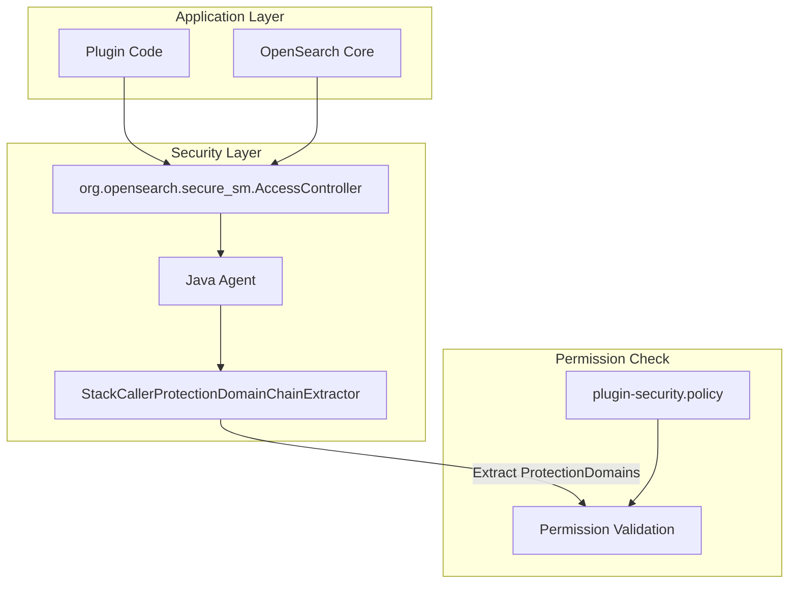
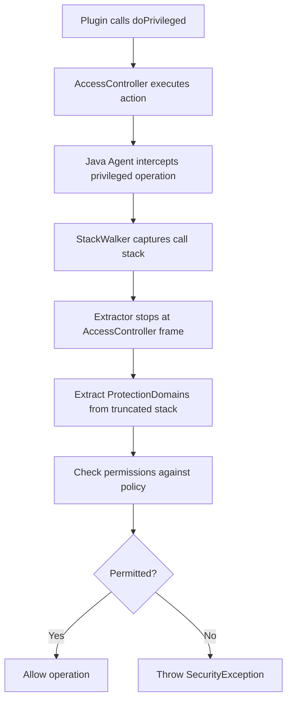

---
tags:
  - ml
  - security
---

# Java Agent AccessController

## Summary

OpenSearch provides `org.opensearch.secure_sm.AccessController`, a replacement for Java's deprecated `java.security.AccessController`. This utility class enables code to run in a privileged context, allowing the Java agent to properly truncate stack walking during permission checks. Plugin developers should use this class instead of the JDK's `AccessController`, which is scheduled for removal in JDK 24.

## Details

### Background

OpenSearch 3.0 replaced the Java Security Manager (JSM) with a custom Java agent for security enforcement. The Java agent uses stack walking to determine which code is requesting privileged operations and checks permissions based on `plugin-security.policy` files.

The JDK's `AccessController.doPrivileged` served as a marker to stop stack walking—only frames before the `doPrivileged` call were checked for permissions. With `AccessController` being removed from the JDK, OpenSearch needed its own equivalent.

### Architecture



### Data Flow



### Components

| Component | Location | Description |
|-----------|----------|-------------|
| `AccessController` | `libs/agent-sm/agent-policy` | Main utility class with `doPrivileged` methods |
| `CheckedRunnable<E>` | Inner interface | Functional interface for void actions with checked exceptions |
| `CheckedSupplier<R, E>` | Inner interface | Functional interface for suppliers with checked exceptions |
| `StackCallerProtectionDomainChainExtractor` | `libs/agent-sm/agent` | Extracts ProtectionDomains, stops at AccessController frames |

### API Reference

| Method Signature | Description |
|------------------|-------------|
| `static void doPrivileged(Runnable action)` | Execute void action in privileged context |
| `static <T> T doPrivileged(Supplier<T> action)` | Execute action with return value |
| `static <T extends Exception> void doPrivilegedChecked(CheckedRunnable<T> action) throws T` | Execute void action that may throw checked exception |
| `static <R, T extends Exception> R doPrivilegedChecked(CheckedSupplier<R, T> action) throws T` | Execute action with return value that may throw checked exception |

### Configuration

No additional configuration required. The AccessController is automatically recognized by the Java agent's stack walking logic.

### Usage Examples

#### Basic Privileged Action

```java
import org.opensearch.secure_sm.AccessController;

// Void action
AccessController.doPrivileged(() -> {
    System.setProperty("my.property", "value");
});

// Action with return value
String value = AccessController.doPrivileged(() -> {
    return System.getProperty("my.property");
});
```

#### Privileged Action with Checked Exception

```java
import org.opensearch.secure_sm.AccessController;
import java.nio.file.Files;
import java.nio.file.Path;

// Void action with checked exception
AccessController.doPrivilegedChecked(() -> {
    Files.createDirectory(Path.of("/tmp/mydir"));
});

// Action with return value and checked exception
byte[] content = AccessController.doPrivilegedChecked(() -> {
    return Files.readAllBytes(Path.of("/tmp/myfile"));
});
```

#### Migration from JDK AccessController

```java
// Before (JDK - deprecated)
import java.security.AccessController;
import java.security.PrivilegedAction;

CityResponse response = AccessController.doPrivileged(
    (PrivilegedAction<CityResponse>) () -> {
        return cache.putIfAbsent(ipAddress, CityResponse.class, ip -> {
            return lazyLoader.get().city(ip);
        });
    }
);

// After (OpenSearch)
import org.opensearch.secure_sm.AccessController;

CityResponse response = AccessController.doPrivileged(() -> 
    cache.putIfAbsent(ipAddress, CityResponse.class, ip -> {
        return lazyLoader.get().city(ip);
    })
);
```

## Limitations

- Does not replace `AccessControlContext` or related JSM classes
- Only works with OpenSearch's Java agent security model
- Complex permission inheritance patterns may need alternative approaches
- The Java agent intercepts specific operations (file I/O, network), not all JSM permission types

## Change History

- **v3.4.0** (2026-01-11): Fix JRT protocol URL filtering in protection domain extraction to allow MCP server connections
- **v3.2.0** (2026-01-11): Initial implementation with `doPrivileged` and `doPrivilegedChecked` methods

## Related Features
- [OpenSearch Dashboards](../opensearch-dashboards/opensearch-dashboards-ai-chat.md)

## References

### Documentation
- [JEP 411](https://openjdk.org/jeps/411): Deprecate the Security Manager for Removal
- [JEP 486](https://openjdk.org/jeps/486): Permanently Disable the Security Manager

### Blog Posts
- [Blog: Finding a replacement for JSM in OpenSearch 3.0](https://opensearch.org/blog/finding-a-replacement-for-jsm-in-opensearch-3-0/): Detailed explanation of JSM replacement strategy

### Pull Requests
| Version | PR | Description | Related Issue |
|---------|-----|-------------|---------------|
| v3.4.0 | [#19683](https://github.com/opensearch-project/OpenSearch/pull/19683) | Allow JRT protocol URLs in protection domain extraction | [#4209](https://github.com/opensearch-project/OpenSearch/issues/4209) |
| v3.2.0 | [#18346](https://github.com/opensearch-project/OpenSearch/pull/18346) | Create equivalents of JSM's AccessController in the java agent | [#18339](https://github.com/opensearch-project/OpenSearch/issues/18339) |

### Issues (Design / RFC)
- [Issue #18339](https://github.com/opensearch-project/OpenSearch/issues/18339): Feature request for AccessController replacement
- [Issue #1687](https://github.com/opensearch-project/OpenSearch/issues/1687): Original JSM replacement discussion
- [Issue #4209](https://github.com/opensearch-project/ml-commons/issues/4209): Bug report - Failed to get tools from external MCP server
