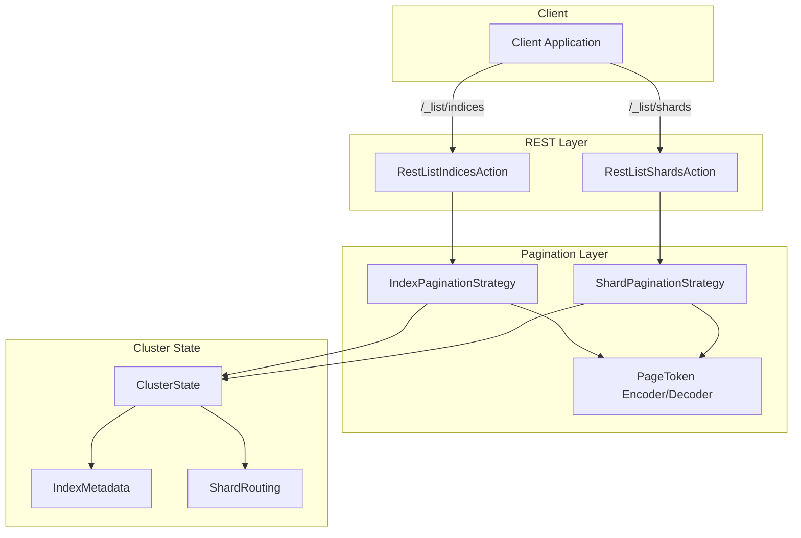
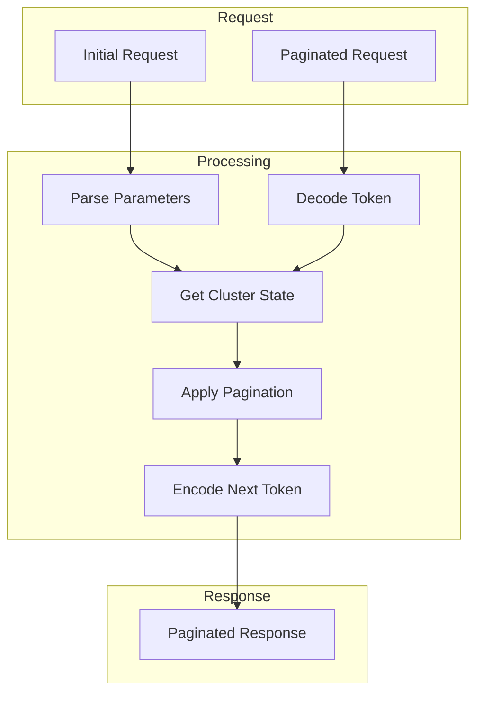

---
tags:
  - opensearch
---
# List APIs (Paginated)

## Summary

List APIs provide paginated alternatives to OpenSearch's cat APIs for retrieving cluster metadata. As clusters grow to contain thousands of indices and shards, traditional cat API responses become too large, causing client timeouts and cluster stress. List APIs solve this by returning results in manageable pages using token-based pagination, allowing efficient iteration through large datasets without overwhelming the cluster or client.

## Details

### Architecture



### Data Flow



### Components

| Component | Description |
|-----------|-------------|
| `RestListIndicesAction` | REST handler for `/_list/indices` endpoint |
| `RestListShardsAction` | REST handler for `/_list/shards` endpoint |
| `IndexPaginationStrategy` | Pagination logic using index creation timestamps as sort keys |
| `ShardPaginationStrategy` | Pagination logic for shards, maintaining shard ID integrity across pages |
| `PageToken` | Encapsulates pagination state (last sort value, position) |
| `RequestLimitSettings` | Dynamic cluster settings for cat API response limits |

### Configuration

| Setting | Description | Default |
|---------|-------------|---------|
| `cat.indices.response.limit.number_of_indices` | Max indices for `_cat/indices` before returning 429 | -1 (unlimited) |
| `cat.shards.response.limit.number_of_shards` | Max shards for `_cat/shards` before returning 429 | -1 (unlimited) |
| `cat.segments.response.limit.number_of_indices` | Max indices for `_cat/segments` before returning 429 | -1 (unlimited) |

### API Reference

#### List Indices API

**Endpoints:**
- `GET /_list/indices`
- `GET /_list/indices/{indices}`

**Query Parameters:**

| Parameter | Type | Default | Description |
|-----------|------|---------|-------------|
| `next_token` | String | null | Token for fetching next page (Base64 encoded) |
| `size` | Integer | 5000 | Maximum indices per page |
| `sort` | String | asc | Sort order by creation time: `asc` or `desc` |

#### List Shards API

**Endpoints:**
- `GET /_list/shards`
- `GET /_list/shards/{indices}`

**Query Parameters:**

| Parameter | Type | Default | Description |
|-----------|------|---------|-------------|
| `next_token` | String | null | Token for fetching next page (Base64 encoded) |
| `size` | Integer | 2000 | Maximum shards per page (minimum enforced) |
| `sort` | String | asc | Sort order by index creation time: `asc` or `desc` |

### Usage Example

**Paginated index listing:**
```bash
# First page
curl "localhost:9200/_list/indices?format=json&size=100"

# Response
{
  "next_token": "eyJsYXN0X3NvcnRfdmFsdWUiOjE2OTcwMDAwMDAwMDB9",
  "indices": [
    {"index": "logs-2024-01", "health": "green", "status": "open", "pri": "5", "rep": "1"},
    {"index": "logs-2024-02", "health": "green", "status": "open", "pri": "5", "rep": "1"}
  ]
}

# Subsequent pages
curl "localhost:9200/_list/indices?format=json&next_token=eyJsYXN0X3NvcnRfdmFsdWUiOjE2OTcwMDAwMDAwMDB9"
```

**Paginated shard listing:**
```bash
curl "localhost:9200/_list/shards?format=json&size=500"

# Response
{
  "next_token": "MCQw",
  "shards": [
    {"index": "logs-2024-01", "shard": "0", "prirep": "p", "state": "STARTED", "docs": "1000", "store": "10mb", "ip": "10.0.0.1", "node": "node-1"},
    {"index": "logs-2024-01", "shard": "0", "prirep": "r", "state": "STARTED", "docs": "1000", "store": "10mb", "ip": "10.0.0.2", "node": "node-2"}
  ]
}
```

**Plain text format (backward compatible):**
```bash
curl "localhost:9200/_list/shards"

# Response
logs-2024-01 0 p STARTED 1000 10mb 10.0.0.1 node-1
logs-2024-01 0 r STARTED 1000 10mb 10.0.0.2 node-2
next_token MCQw
```

**Configure cat API limits:**
```bash
curl -X PUT "localhost:9200/_cluster/settings" -H 'Content-Type: application/json' -d'
{
  "persistent": {
    "cat.indices.response.limit.number_of_indices": 1000,
    "cat.shards.response.limit.number_of_shards": 10000
  }
}'
```

## Limitations

- Pagination uses index creation timestamps as sort keys; indices created during pagination may appear in unexpected positions
- For `_list/shards`, all shards of a single shard ID must fit in one page (page size must exceed max replica count)
- `next_token` is opaque and should not be modified by clients
- Cat API limits return HTTP 429 when exceeded; clients must handle this response
- Sorting is limited to index creation time; custom sort fields are not supported

## Change History

- **v2.19.0** (2024-12-10): Fixed `_list/shards` API failing with `index_closed_exception` when closed indices are present
- **v2.18.0** (2024-10-22): Initial implementation with `_list/indices`, `_list/shards` APIs and cat API response limits


## References

### Documentation
- [List API Documentation](https://docs.opensearch.org/2.18/api-reference/list/): Official docs
- [List indices Documentation](https://docs.opensearch.org/2.18/api-reference/list/list-indices/): List indices API
- [List shards Documentation](https://docs.opensearch.org/2.18/api-reference/list/list-shards/): List shards API

### Pull Requests
| Version | PR | Description | Related Issue |
|---------|-----|-------------|---------------|
| v2.19.0 | [#16606](https://github.com/opensearch-project/OpenSearch/pull/16606) | Fix _list/shards API failing when closed indices are present | [#16626](https://github.com/opensearch-project/OpenSearch/issues/16626) |
| v2.18.0 | [#14718](https://github.com/opensearch-project/OpenSearch/pull/14718) | Implementing pagination for `_cat/indices` API | [#14258](https://github.com/opensearch-project/OpenSearch/issues/14258) |
| v2.18.0 | [#14641](https://github.com/opensearch-project/OpenSearch/pull/14641) | Implementing pagination for `_cat/shards` | [#14257](https://github.com/opensearch-project/OpenSearch/issues/14257) |
| v2.18.0 | [#15986](https://github.com/opensearch-project/OpenSearch/pull/15986) | Add changes to block calls in cat shards, indices and segments based on dynamic limit settings | [#15954](https://github.com/opensearch-project/OpenSearch/issues/15954) |

### Issues (Design / RFC)
- [Issue #14258](https://github.com/opensearch-project/OpenSearch/issues/14258): Paginate `_cat/indices` API
- [Issue #14257](https://github.com/opensearch-project/OpenSearch/issues/14257): Paginate `_cat/shards` API
- [Issue #15954](https://github.com/opensearch-project/OpenSearch/issues/15954): Blocking non-paginated calls
