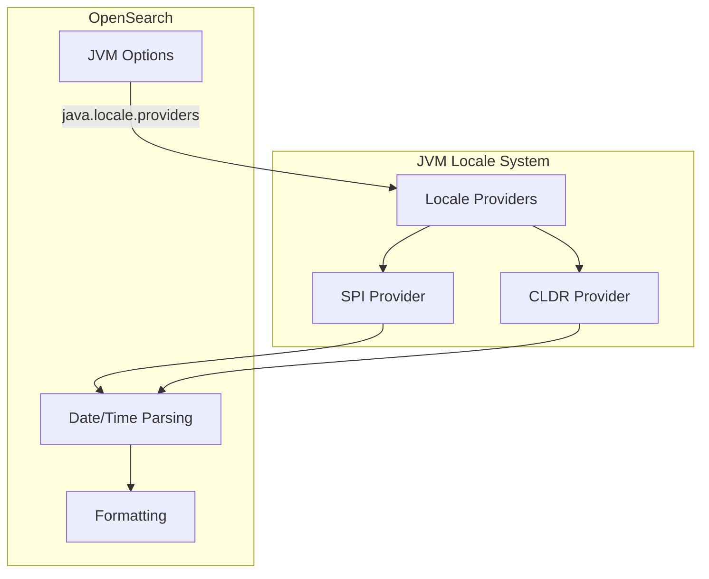

---
tags:
  - indexing
---

# Locale Provider

## Summary

OpenSearch uses the Java locale provider system to handle internationalization and localization of date/time formatting, number formatting, and other locale-sensitive operations. The locale provider determines the source of locale data used throughout the application.

## Details

### Architecture



### Locale Provider Types

| Provider | Description | Status |
|----------|-------------|--------|
| SPI | Service Provider Interface for custom locale data | Active |
| CLDR | Unicode Common Locale Data Repository | Default (JDK 9+) |
| COMPAT | JDK 8 compatibility locale data | Deprecated |

### Configuration

OpenSearch sets the locale provider via JVM system property:

```
-Djava.locale.providers=SPI,CLDR
```

This configuration is applied in:
- `distribution/tools/launchers/src/main/java/org/opensearch/tools/launchers/SystemJvmOptions.java`
- `buildSrc/src/main/java/org/opensearch/gradle/OpenSearchTestBasePlugin.java`
- `gradle/ide.gradle`

### CLDR vs COMPAT Differences

CLDR locale data follows Unicode standards and may differ from legacy COMPAT data:

| Locale | Element | COMPAT | CLDR |
|--------|---------|--------|------|
| de (German) | Short weekday | `Mi` | `Mi.` |
| de (German) | Short month | `Dez` | `Dez.` |

### Usage Example

When using locale-specific date formats in OpenSearch:

```json
PUT /my-index
{
  "mappings": {
    "properties": {
      "date_field": {
        "type": "date",
        "format": "E, d MMM yyyy HH:mm:ss Z",
        "locale": "de"
      }
    }
  }
}
```

With CLDR provider, German dates should include periods:

```json
POST /my-index/_doc
{
  "date_field": "Mi., 06 Dez. 2000 02:55:00 -0800"
}
```

## Limitations

- Locale data differences between CLDR and COMPAT may affect date parsing
- Custom date formats using locale-specific names require testing when upgrading

## Change History

- **v3.0.0** (2025-05-06): Changed locale provider from COMPAT to CLDR to address JDK 21+ deprecation warnings

## Related Features
- [OpenSearch Dashboards](../opensearch-dashboards/opensearch-dashboards-ai-chat.md)

## References

### Documentation
- [CLDR Supported Locales (JDK 11)](https://www.oracle.com/java/technologies/javase/jdk11-suported-locales.html): Oracle documentation
- [JDK-8305402](https://bugs.openjdk.org/browse/JDK-8305402): COMPAT locale provider removal notice

### Blog Posts
- [Blog: How to start contributing to OpenSearch](https://opensearch.org/blog/how-to-start-contributing-to-opensearch-a-beginners-guide-based-on-my-journey/): Contributor journey

### Pull Requests
| Version | PR | Description | Related Issue |
|---------|-----|-------------|---------------|
| v3.0.0 | [#14345](https://github.com/opensearch-project/OpenSearch/pull/14345) | Changed locale provider from COMPAT to CLDR | [#11550](https://github.com/opensearch-project/OpenSearch/issues/11550) |

### Issues (Design / RFC)
- [Issue #11550](https://github.com/opensearch-project/OpenSearch/issues/11550): Original feature request
