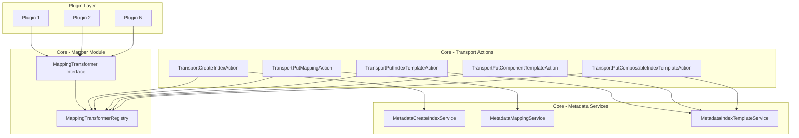
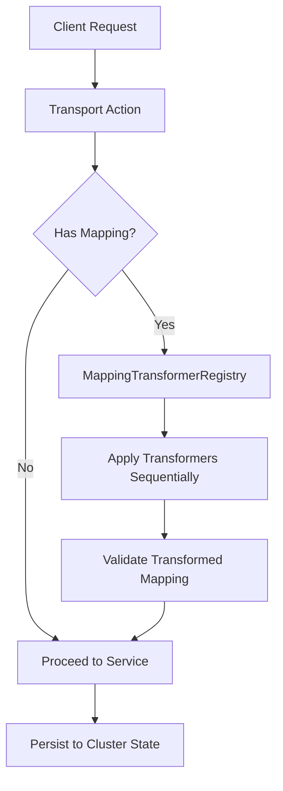

---
tags:
  - domain/core
  - component/server
  - indexing
  - ml
  - neural-search
  - search
---
# Mapping Transformer

## Summary

Mapping Transformer is an extensibility feature in OpenSearch that allows plugins to intercept and transform index mappings during index creation, mapping updates, and index template operations. This enables plugins to automatically generate or modify field mappings based on custom logic, simplifying complex configuration workflows.

The primary use case is the neural-search plugin's semantic field feature, which uses mapping transformers to automatically generate knn_vector or rank_feature fields based on model IDs defined in semantic fields.

## Details

### Architecture



### Data Flow



### Components

| Component | Package | Description |
|-----------|---------|-------------|
| `MappingTransformer` | `org.opensearch.index.mapper` | Interface for implementing custom mapping transformation logic |
| `MappingTransformerRegistry` | `org.opensearch.index.mapper` | Collects transformers from all MapperPlugins and applies them sequentially |
| `MappingTransformer.TransformContext` | `org.opensearch.index.mapper` | Context object for transformation (reserved for future use) |
| `MapperPlugin.getMappingTransformers()` | `org.opensearch.plugins` | Extension point for plugins to register transformers |

### Configuration

This feature does not have any cluster or index settings. Transformers are registered programmatically by plugins.

### Usage Example

#### Implementing a MappingTransformer

```java
public class SemanticFieldTransformer implements MappingTransformer {
    
    private final ModelService modelService;
    
    public SemanticFieldTransformer(ModelService modelService) {
        this.modelService = modelService;
    }
    
    @Override
    public void transform(
        final Map<String, Object> mapping,
        final TransformContext context,
        @NonNull final ActionListener<Void> listener
    ) {
        try {
            Map<String, Object> properties = (Map<String, Object>) mapping.get("properties");
            if (properties == null) {
                listener.onResponse(null);
                return;
            }
            
            // Find semantic fields and generate corresponding vector fields
            for (Map.Entry<String, Object> entry : new HashMap<>(properties).entrySet()) {
                Map<String, Object> fieldConfig = (Map<String, Object>) entry.getValue();
                if ("semantic".equals(fieldConfig.get("type"))) {
                    String modelId = (String) fieldConfig.get("model_id");
                    int dimension = modelService.getModelDimension(modelId);
                    
                    // Add generated knn_vector field
                    properties.put(entry.getKey() + "_embedding", Map.of(
                        "type", "knn_vector",
                        "dimension", dimension
                    ));
                }
            }
            
            listener.onResponse(null);
        } catch (Exception e) {
            listener.onFailure(e);
        }
    }
}
```

#### Registering in a Plugin

```java
public class NeuralSearchPlugin extends Plugin implements MapperPlugin {
    
    private final SemanticFieldTransformer transformer;
    
    public NeuralSearchPlugin() {
        this.transformer = new SemanticFieldTransformer(new ModelService());
    }
    
    @Override
    public List<MappingTransformer> getMappingTransformers() {
        return List.of(transformer);
    }
}
```

#### Example Transformation

Original mapping:
```json
{
  "properties": {
    "title": { "type": "text" },
    "content": { 
      "type": "semantic",
      "model_id": "my-embedding-model"
    }
  }
}
```

Transformed mapping (after semantic field transformer):
```json
{
  "properties": {
    "title": { "type": "text" },
    "content": { 
      "type": "semantic",
      "model_id": "my-embedding-model"
    },
    "content_embedding": {
      "type": "knn_vector",
      "dimension": 768
    }
  }
}
```

## Limitations

- Transformers are executed sequentially, which may impact performance if many transformers are registered
- No ordering guarantee between transformers from different plugins
- The `TransformContext` is currently empty; index settings and action type information are not yet available
- Transformers modify mappings in place; there's no transaction or rollback mechanism
- Async transformer execution requires careful error handling to avoid request timeouts

## Change History

- **v3.0.0** (2025-05-06): Initial implementation - introduced MappingTransformer interface, MappingTransformerRegistry, and integration with index/template transport actions

## Related Features
- [OpenSearch Dashboards](../opensearch-dashboards/opensearch-dashboards-ai-chat.md)

## References

### Pull Requests
| Version | PR | Description | Related Issue |
|---------|-----|-------------|---------------|
| v3.0.0 | [#17635](https://github.com/opensearch-project/OpenSearch/pull/17635) | Initial implementation of mapping transformer | [#17500](https://github.com/opensearch-project/OpenSearch/issues/17500) |

### Issues (Design / RFC)
- [Issue #17500](https://github.com/opensearch-project/OpenSearch/issues/17500): RFC - Introduce Mapping Transformer
- [Issue #803](https://github.com/opensearch-project/neural-search/issues/803): Proposal to support semantic field in neural search
- [Issue #1211](https://github.com/opensearch-project/neural-search/issues/1211): HLD of the semantic field
- [Issue #1212](https://github.com/opensearch-project/neural-search/issues/1212): LLD of the semantic field
