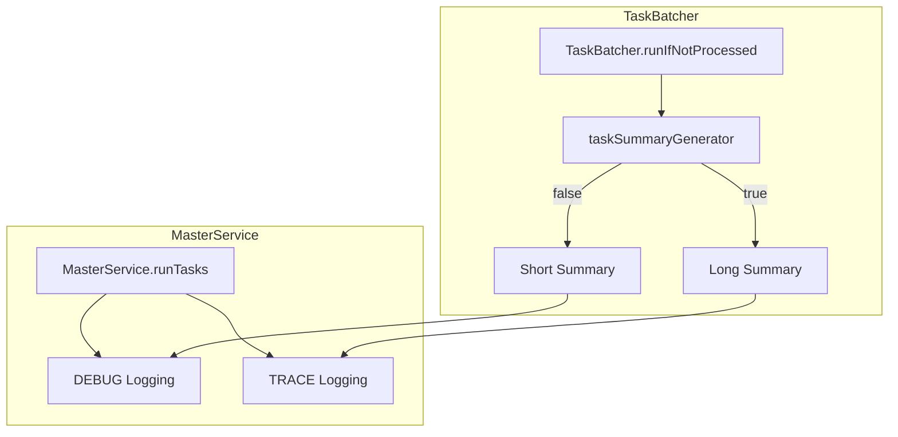

---
tags:
  - opensearch
---
# MasterService Logging Optimization

## Summary

OpenSearch provides optimized logging mechanisms in the MasterService and TaskBatcher components to balance debugging capabilities with cluster performance. The logging system uses lazy evaluation to defer expensive summary computation, ensuring that detailed task information is only generated when explicitly needed.

## Details

### Architecture



### Components

| Component | Description |
|-----------|-------------|
| `TaskBatcher` | Batches cluster state update tasks and manages task execution |
| `MasterService` | Coordinates cluster state updates on the cluster manager node |
| `taskSummaryGenerator` | Function that lazily generates short or long task summaries |

### Configuration

Logging levels are configured via Log4j settings:

| Log Level | Summary Type | Use Case |
|-----------|--------------|----------|
| DEBUG | Short summary | Production debugging with minimal overhead |
| TRACE | Long summary | Detailed debugging during development/troubleshooting |

### Log Output Examples

**DEBUG Level (Short Summary)**:
```
executing cluster state update for [Tasks batched with key: org.opensearch.cluster.routing.allocation.AllocationService and count: 1500]
```

**TRACE Level (Long Summary)**:
```
executing cluster state update for [shard-started[ShardRouting{...}], shard-started[ShardRouting{...}], ...]
```

### Implementation Details

The optimization uses a `Function<Boolean, String>` to defer summary computation:

```java
Function<Boolean, String> taskSummaryGenerator = (longSummaryRequired) -> {
    if (longSummaryRequired == null || !longSummaryRequired) {
        return buildShortSummary(updateTask.batchingKey, toExecute.size());
    }
    // Expensive computation only when needed
    final Map<String, List<BatchedTask>> processTasksBySource = new HashMap<>();
    for (final BatchedTask task : toExecute) {
        processTasksBySource.computeIfAbsent(task.source, s -> new ArrayList<>()).add(task);
    }
    return processTasksBySource.entrySet().stream()
        .map(entry -> {
            String tasks = updateTask.describeTasks(entry.getValue());
            return tasks.isEmpty() ? entry.getKey() : entry.getKey() + "[" + tasks + "]";
        })
        .reduce((s1, s2) -> s1 + ", " + s2).orElse("");
};
```

## Limitations

- Short summary provides less detail for debugging cluster state issues
- TRACE level logging may still cause performance impact in high-throughput scenarios
- Summary format change may affect log parsing tools that depend on previous format

## Change History

- **v2.16.0** (2024-07-22): Introduced short/long summary separation to reduce DEBUG logging overhead ([#14795](https://github.com/opensearch-project/OpenSearch/pull/14795))

## References

### Documentation

- OpenSearch Logging Configuration: https://opensearch.org/docs/latest/install-and-configure/configuring-opensearch/logs/

### Pull Requests

| Version | PR | Description |
|---------|-----|-------------|
| v2.16.0 | [#14795](https://github.com/opensearch-project/OpenSearch/pull/14795) | Reduce logging in DEBUG for MasterService:run |

### Related Issues

| Issue | Description |
|-------|-------------|
| [#12249](https://github.com/opensearch-project/OpenSearch/issues/12249) | [BUG] Reduce TaskBatcher excessive logging in DEBUG mode |
