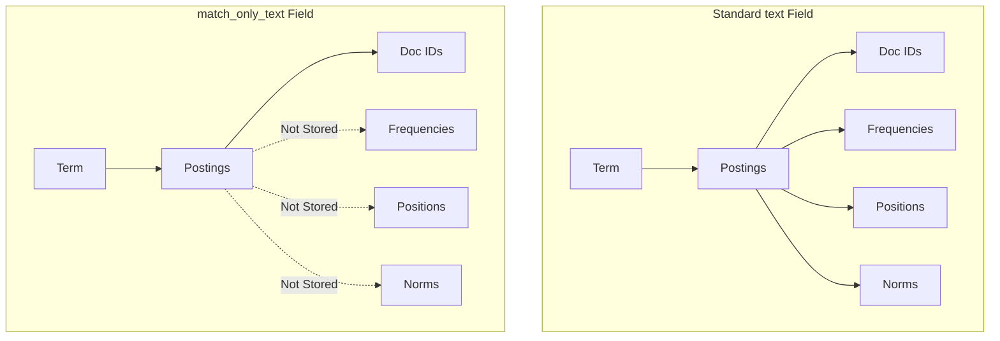

---
tags:
  - opensearch
---
# Match Only Text Field

## Summary

The `match_only_text` field type is a space-optimized variant of the standard `text` field, designed for full-text search scenarios where scoring and positional information are not critical. It reduces storage requirements by omitting positions, frequencies, and norms while still supporting most query types.

## Details

### Architecture



### Key Characteristics

| Feature | text | match_only_text |
|---------|------|-----------------|
| Positions stored | Yes | No |
| Frequencies stored | Yes | No |
| Norms stored | Yes | No |
| Scoring | TF-IDF/BM25 | Constant (1.0) |
| Phrase queries | Native | Via _source verification |
| Interval/span queries | Yes | No |
| Storage | Higher | ~25% less |

### Configuration

```json
PUT /my-index
{
  "mappings": {
    "properties": {
      "log_message": {
        "type": "match_only_text",
        "analyzer": "standard",
        "search_analyzer": "standard"
      }
    }
  }
}
```

### Phrase Query Handling

Since positional data is not stored, phrase queries are handled differently:

1. Phrase query is converted to a conjunction of term queries
2. Matching documents are identified
3. Each match is verified against the original `_source` field using a Lucene MemoryIndex
4. Only documents where terms appear in the correct order are returned

### Use Cases

- **Log analytics**: Finding specific error messages where relevance ranking is not needed
- **Large text datasets**: Reducing storage costs when exact-match or boolean queries are sufficient
- **High-volume indexing**: Faster indexing due to reduced data written per document

### Storage Estimation

Use the Index Stats API to estimate potential savings:

```
GET /<index_name>/_stats/segments?level=shards&include_segment_file_sizes&pretty
```

Check the `pos` (positions), `doc` (frequencies), and `nvm` (norms) components to estimate savings.

## Limitations

- No support for interval queries
- No support for span queries
- Phrase query performance is slower than standard `text` fields
- All matching documents receive a constant score of 1.0
- Cannot be used when relevance ranking is required

## Change History

- **v2.19.0** (2025-01-30): Query performance improvements - always use constant_score for term queries; added wildcard highlighting support
- **v2.12.0** (2024-02-20): Initial introduction of match_only_text field type

## References

### Documentation
- [String field types](https://docs.opensearch.org/latest/field-types/supported-field-types/string/)

### Blog Posts
- [Optimize storage and performance with the MatchOnlyText field](https://opensearch.org/blog/optimize-storage-and-performance-using-matchonlytext-field/)

### Pull Requests
| Version | PR | Description |
|---------|-----|-------------|
| v2.19.0 | [#16964](https://github.com/opensearch-project/OpenSearch/pull/16964) | Always use constant_score query for match_only_text |
| v2.19.0 | [#17101](https://github.com/opensearch-project/OpenSearch/pull/17101) | Add highlighting for wildcard search on match_only_text field |
