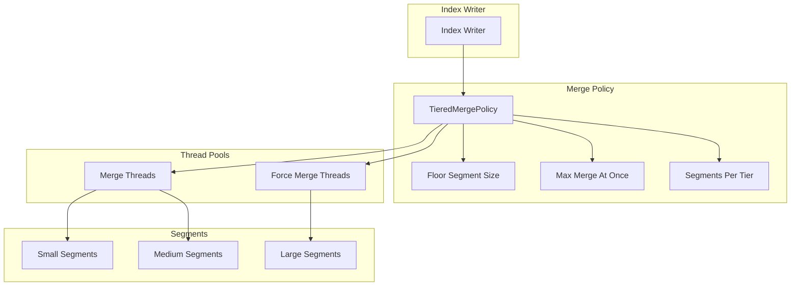
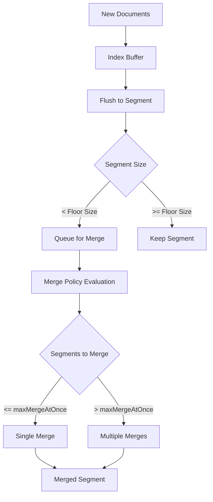

---
tags:
  - domain/core
  - component/server
  - indexing
  - performance
  - search
---
# Merge & Segment Settings

## Summary

OpenSearch uses Apache Lucene's TieredMergePolicy to manage segment merging during indexing. Segment merging is crucial for maintaining query performance by consolidating smaller segments into larger ones. This feature covers the configurable settings that control merge behavior, including floor segment size, maximum segments per merge, and force merge thread allocation.

## Details

### Architecture



### Data Flow



### Components

| Component | Description |
|-----------|-------------|
| `TieredMergePolicy` | Default merge policy that organizes segments into tiers based on size |
| `TieredMergePolicyProvider` | OpenSearch wrapper that manages merge policy configuration |
| `IndexSettings` | Manages index-level settings including merge policy parameters |
| `IndicesService` | Manages cluster-level settings and propagates changes to indexes |
| `ThreadPool.FORCE_MERGE` | Dedicated thread pool for force merge operations |

### Configuration

| Setting | Description | Default |
|---------|-------------|---------|
| `index.merge.policy.floor_segment` | Segments smaller than this are merged more aggressively | 16MB |
| `index.merge.policy.max_merge_at_once` | Maximum number of segments merged at once | 30 |
| `index.merge.policy.max_merged_segment` | Maximum size of a merged segment | 5GB |
| `index.merge.policy.segments_per_tier` | Target number of segments per tier | 10 |
| `index.merge.policy.expunge_deletes_allowed` | Percentage of deleted docs allowed before merge | 10% |
| `cluster.default.index.max_merge_at_once` | Cluster-level default for max merge at once | 30 |

### Usage Example

```yaml
# Index creation with custom merge settings
PUT /my-index
{
  "settings": {
    "index": {
      "merge": {
        "policy": {
          "floor_segment": "32mb",
          "max_merge_at_once": 20,
          "max_merged_segment": "10gb"
        }
      }
    }
  }
}
```

```json
// Cluster-level merge settings
PUT _cluster/settings
{
  "persistent": {
    "cluster.default.index.max_merge_at_once": 25
  }
}
```

```bash
# Force merge an index to reduce segments
POST /my-index/_forcemerge?max_num_segments=1
```

## Limitations

- Merge settings cannot be changed on closed indexes without reopening
- Force merge is resource-intensive and should be used during low-traffic periods
- Very large `max_merge_at_once` values may cause memory pressure
- Force merge thread pool size is fixed at node startup

## Change History

- **v3.0.0** (2025-05-06): Floor segment size increased to 16MB, maxMergeAtOnce increased to 30, force merge threads scaled to 1/8th of cores, new cluster-level setting added

## Related Features
- [OpenSearch Dashboards](../opensearch-dashboards/opensearch-dashboards-ai-chat.md)

## References

### Documentation
- [Lucene TieredMergePolicy](https://lucene.apache.org/core/10_0_0/core/org/apache/lucene/index/TieredMergePolicy.html): Lucene documentation
- [Index Settings Documentation](https://docs.opensearch.org/3.0/install-and-configure/configuring-opensearch/index-settings/): Official docs
- [Force Merge API](https://docs.opensearch.org/3.0/api-reference/index-apis/force-merge/): Force merge documentation

### Pull Requests
| Version | PR | Description | Related Issue |
|---------|-----|-------------|---------------|
| v3.0.0 | [#17255](https://github.com/opensearch-project/OpenSearch/pull/17255) | Increase force merge threads to 1/8th of cores |   |
| v3.0.0 | [#17699](https://github.com/opensearch-project/OpenSearch/pull/17699) | Increase floor segment size to 16MB | [#16935](https://github.com/opensearch-project/OpenSearch/issues/16935) |
| v3.0.0 | [#17774](https://github.com/opensearch-project/OpenSearch/pull/17774) | Increase default maxMergeAtOnce to 30 | [#17051](https://github.com/opensearch-project/OpenSearch/issues/17051) |

### Issues (Design / RFC)
- [Issue #17051](https://github.com/opensearch-project/OpenSearch/issues/17051): Increase maxMergeAtOnce parameter in OpenSearch 3.0
- [Issue #16935](https://github.com/opensearch-project/OpenSearch/issues/16935): OpenSearch 3.0 Core Release Tracker
