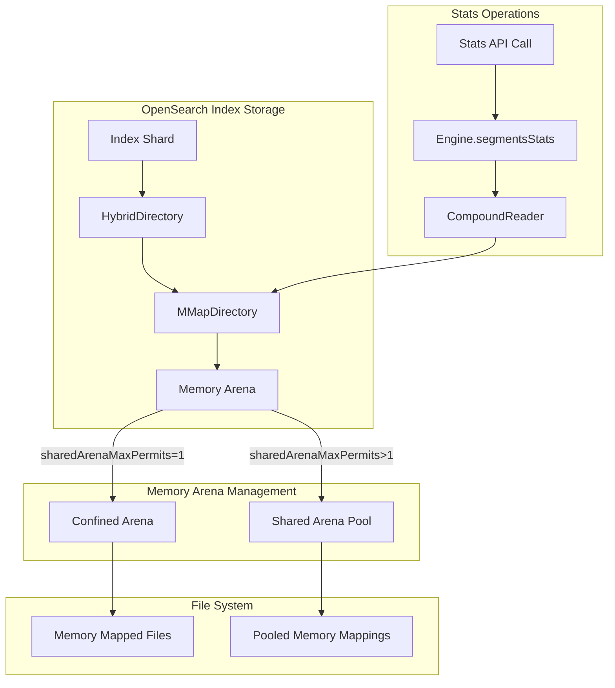
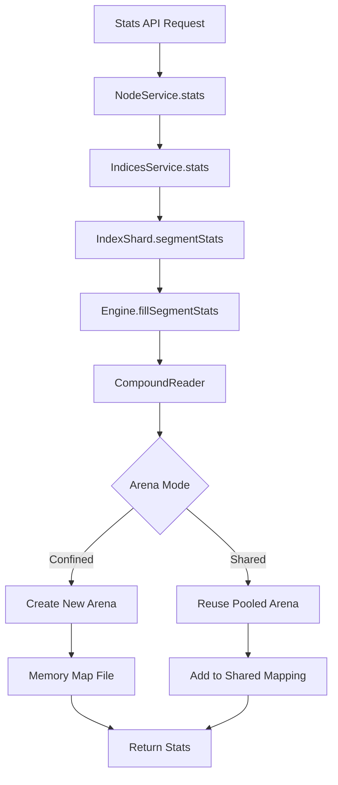

---
tags:
  - domain/core
  - component/server
  - indexing
  - performance
---
# Netty Arena Settings

## Summary

OpenSearch configures Lucene's MMapDirectory shared Arena pooling behavior through JVM options to optimize memory-mapped file handling. By default, OpenSearch sets `sharedArenaMaxPermits=1` to disable shared Arena pooling, which prevents memory-mapped segment bloat and virtual address space exhaustion issues that can occur in high-throughput environments with frequent stats calls.

## Details

### Architecture



### Data Flow



### Components

| Component | Description |
|-----------|-------------|
| `MMapDirectory` | Lucene's memory-mapped file directory implementation |
| `MemorySegmentIndexInputProvider` | Handles memory segment creation for file access |
| `HybridDirectory` | OpenSearch's directory wrapper combining NIO and MMap |
| `CompoundReader` | Reads compound files (`.cfs`) containing multiple index segments |
| `Arena` | Java memory management construct for memory-mapped regions |

### Configuration

| Setting | Description | Default | Location |
|---------|-------------|---------|----------|
| `org.apache.lucene.store.MMapDirectory.sharedArenaMaxPermits` | Maximum permits for shared Arena pooling. Value of 1 disables pooling. | `1` | `jvm.options` |

### Usage Example

The setting is configured in `config/jvm.options`:

```properties
# For cases with high memory-mapped file counts, a lower value can improve stability and
# prevent issues like "leaked" maps or performance degradation. A value of 1 effectively
# disables the shared Arena pooling and uses a confined Arena for each MMapDirectory
-Dorg.apache.lucene.store.MMapDirectory.sharedArenaMaxPermits=1
```

To override for specific use cases (not recommended):

```properties
# Enable shared Arena pooling with up to 256 permits (Lucene default)
-Dorg.apache.lucene.store.MMapDirectory.sharedArenaMaxPermits=256
```

### Monitoring

Check current memory mappings:

```bash
# Count memory-mapped index files
cat /proc/$(pgrep -f opensearch)/maps | grep "indices" | wc -l

# Check for duplicate mappings (indicates potential issue)
cat /proc/$(pgrep -f opensearch)/maps | grep "indices" | awk '{print $6}' | sort | uniq -c | sort -rn | head -10
```

## Limitations

- Disabling shared Arena pooling may slightly increase overhead for Arena creation/destruction
- The setting is a JVM-level configuration and requires a restart to change
- Does not address the root cause in Lucene's CompoundReader behavior with `IOContext.DEFAULT`

## Change History

- **v3.3.0** (2025-10-02): Initial implementation - Set `sharedArenaMaxPermits=1` as default to mitigate memory-mapped segment bloat

## Related Features
- [OpenSearch Dashboards](../opensearch-dashboards/opensearch-dashboards-ai-chat.md)

## References

### Documentation
- [Lucene MMapDirectory JavaDoc](https://lucene.apache.org/core/10_0_0/core/org/apache/lucene/store/MMapDirectory.html): Official API documentation

### Blog Posts
- [Blog: Use Lucene's MMapDirectory on 64bit](https://blog.thetaphi.de/2012/07/use-lucenes-mmapdirectory-on-64bit.html): Background on memory mapping behavior

### Pull Requests
| Version | PR | Description | Related Issue |
|---------|-----|-------------|---------------|
| v3.3.0 | [#19503](https://github.com/opensearch-project/OpenSearch/pull/19503) | Setting number of sharedArenaMaxPermits to 1 |   |

### Issues (Design / RFC)
- [Issue #19482](https://github.com/opensearch-project/OpenSearch/issues/19482): BUG - Frequent stats calls causing memory mapped segments to bloat up
