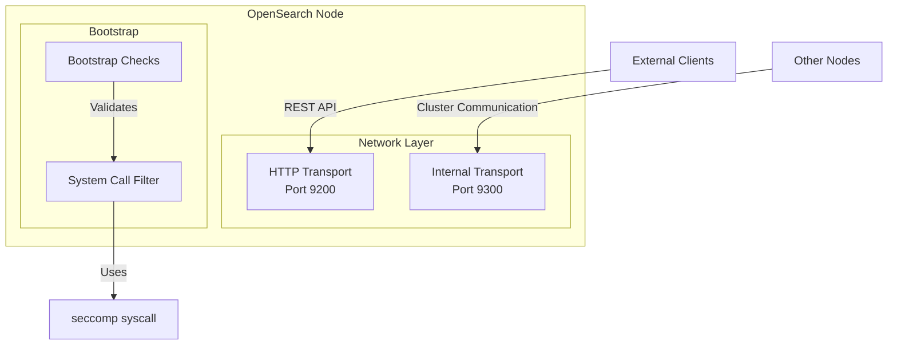
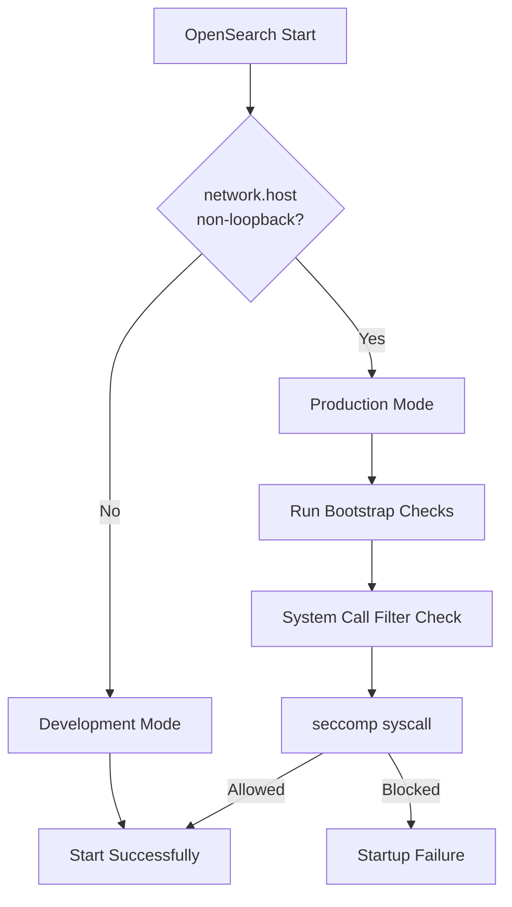

---
tags:
  - opensearch
---
# Network Configuration

## Summary

OpenSearch network configuration controls how nodes bind to network interfaces and communicate with clients and other nodes. The `network.host` setting is particularly important for production deployments, as setting it to a non-loopback address (like `0.0.0.0`) triggers production-mode bootstrap checks that verify system security settings.

## Details

### Architecture



### Data Flow



### Components

| Component | Description |
|-----------|-------------|
| `network.host` | Main setting to bind OpenSearch to network interfaces |
| `network.bind_host` | Address for incoming connections |
| `network.publish_host` | Address published to other cluster nodes |
| Bootstrap Checks | Production-mode validations run at startup |
| System Call Filter | Security mechanism using Linux seccomp |

### Configuration

| Setting | Description | Default |
|---------|-------------|---------|
| `network.host` | Binds to specified address. Use `0.0.0.0` for all interfaces | `_local_` |
| `network.bind_host` | Address for incoming connections | Value of `network.host` |
| `network.publish_host` | Address published to other nodes | Value of `network.host` |
| `http.port` | HTTP port or range | `9200-9300` |
| `transport.port` | Transport port or range | `9300-9400` |

### Usage Example

```yaml
# opensearch.yml - Production configuration
network.host: 0.0.0.0
http.port: 9200
transport.port: 9300

# Discovery settings (required for production)
discovery.seed_hosts: ["node1.example.com", "node2.example.com"]
cluster.initial_cluster_manager_nodes: ["node1", "node2"]
```

### Systemd Configuration

For systemd-based installations, the service file must allow necessary system calls:

```ini
# /lib/systemd/system/opensearch.service (excerpt)
SystemCallFilter=seccomp mincore
SystemCallFilter=madvise mlock mlock2 munlock get_mempolicy sched_getaffinity sched_setaffinity fcntl
SystemCallFilter=@system-service
```

## Limitations

- Setting `network.host` to a non-loopback address requires proper discovery configuration
- System call filters require kernel support for seccomp
- Systemd service hardening may conflict with OpenSearch security requirements

## Change History

- **v3.1.0** (2026-01-10): Fixed systemd service file to allow seccomp system call, enabling proper startup with `network.host: 0.0.0.0`


## References

### Documentation
- [Network Settings Documentation](https://docs.opensearch.org/3.0/install-and-configure/configuring-opensearch/network-settings/): Official network configuration guide
- [Compatible Operating Systems](https://docs.opensearch.org/3.0/install-and-configure/os-comp/): Supported Linux distributions

### Pull Requests
| Version | PR | Description | Related Issue |
|---------|-----|-------------|---------------|
| v3.1.0 | [#18309](https://github.com/opensearch-project/OpenSearch/pull/18309) | Add seccomp in systemd config | [#18273](https://github.com/opensearch-project/OpenSearch/issues/18273) |

### Issues (Design / RFC)
- [Issue #18273](https://github.com/opensearch-project/OpenSearch/issues/18273): Bug report - fails to start on Debian with network.host: 0.0.0.0
