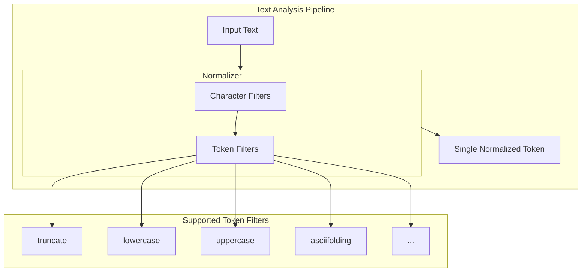

---
tags:
  - search
---

# Normalizer Enhancements

## Summary

OpenSearch normalizers provide a way to apply character-level transformations to keyword fields, producing a single normalized token. This feature tracks enhancements to the normalizer functionality, including support for additional token filters that can be used within normalizers.

## Details

### Architecture



### How Normalizers Work

Unlike analyzers that can produce multiple tokens, normalizers:
- Output exactly one token
- Do not use a tokenizer
- Only accept filters that implement `NormalizingTokenFilterFactory` or `NormalizingCharFilterFactory`
- Perform character-level operations only

### Components

| Component | Description |
|-----------|-------------|
| `NormalizingTokenFilterFactory` | Interface that token filters must implement to be usable in normalizers |
| `NormalizingCharFilterFactory` | Interface for character filters compatible with normalizers |
| `TruncateTokenFilterFactory` | Token filter that truncates tokens to a specified length |

### Supported Filters

#### Token Filters (common-analysis module)

| Filter | Description |
|--------|-------------|
| `arabic_normalization` | Arabic text normalization |
| `asciifolding` | Converts non-ASCII characters to ASCII equivalents |
| `bengali_normalization` | Bengali text normalization |
| `cjk_width` | Normalizes CJK width differences |
| `decimal_digit` | Converts decimal digits |
| `elision` | Removes elisions |
| `german_normalization` | German text normalization |
| `hindi_normalization` | Hindi text normalization |
| `indic_normalization` | Indic text normalization |
| `lowercase` | Converts to lowercase |
| `persian_normalization` | Persian text normalization |
| `scandinavian_folding` | Scandinavian character folding |
| `scandinavian_normalization` | Scandinavian text normalization |
| `serbian_normalization` | Serbian text normalization |
| `sorani_normalization` | Sorani text normalization |
| `trim` | Removes leading/trailing whitespace |
| `truncate` | Truncates tokens to specified length (added in v3.4.0) |
| `uppercase` | Converts to uppercase |

### Configuration

| Setting | Description | Default |
|---------|-------------|---------|
| `type` | Must be `custom` for custom normalizers | Required |
| `char_filter` | Array of character filters to apply | `[]` |
| `filter` | Array of token filters to apply | `[]` |

### Usage Example

```json
PUT /my_index
{
  "settings": {
    "analysis": {
      "filter": {
        "truncate_filter": {
          "type": "truncate",
          "length": 20
        }
      },
      "normalizer": {
        "my_normalizer": {
          "type": "custom",
          "char_filter": [],
          "filter": ["lowercase", "asciifolding", "truncate_filter"]
        }
      }
    }
  },
  "mappings": {
    "properties": {
      "code": {
        "type": "keyword",
        "normalizer": "my_normalizer"
      }
    }
  }
}
```

Test the normalizer:

```json
GET /my_index/_analyze
{
  "normalizer": "my_normalizer",
  "text": "Naïve APPROACH with LONG TEXT"
}
```

Result: `naive approach with l` (lowercased, ASCII-folded, truncated to 20 chars)

## Limitations

- Normalizers can only use filters that implement the normalizing interfaces
- Cannot perform operations that change token count (e.g., synonyms, stemming)
- The truncate filter requires a positive `length` parameter

## Change History

- **v3.4.0** (2025-11-17): Added `truncate` token filter support in normalizers

## Related Features
- [OpenSearch Dashboards](../opensearch-dashboards/opensearch-dashboards-ai-chat.md)

## References

### Documentation
- [Normalizers Documentation](https://docs.opensearch.org/3.0/analyzers/normalizers/)
- [Truncate Token Filter Documentation](https://docs.opensearch.org/3.0/analyzers/token-filters/truncate/)
- [Normalizer Mapping Parameter](https://docs.opensearch.org/3.0/field-types/mapping-parameters/normalizer/)

### Pull Requests
| Version | PR | Description | Related Issue |
|---------|-----|-------------|---------------|
| v3.4.0 | [#19779](https://github.com/opensearch-project/OpenSearch/pull/19779) | Add truncate filter support in normalizers | [#19778](https://github.com/opensearch-project/OpenSearch/issues/19778) |

### Issues (Design / RFC)
- [Issue #19778](https://github.com/opensearch-project/OpenSearch/issues/19778): Feature request for truncate filter in normalizers
