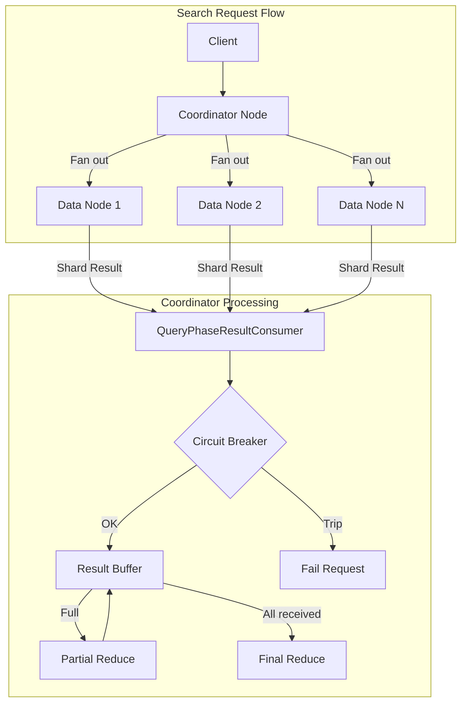
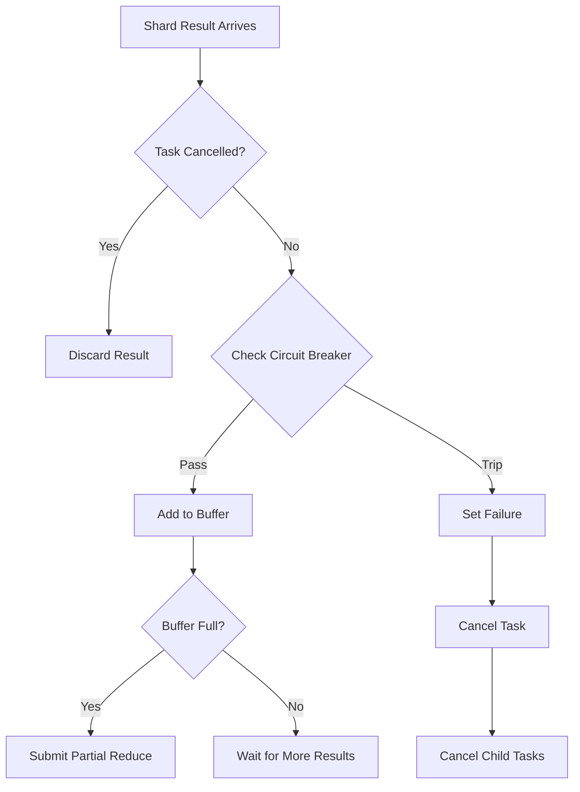

---
tags:
  - opensearch
---
# OOM Prevention

## Summary

OOM Prevention is a memory protection mechanism that prevents coordinator nodes from running out of memory during search operations. When searching across indexes with many shards, the coordinator node buffers shard-level query results before performing batched reduce operations. Without proper memory management, this buffering can cause OutOfMemoryError (OOM) conditions. This feature integrates circuit breaker checks into the query result consumption process to detect and prevent memory exhaustion before it occurs.

## Details

### Architecture



### Data Flow



### Components

| Component | Description |
|-----------|-------------|
| `QueryPhaseResultConsumer` | Manages buffering and incremental reduction of shard query results |
| `PendingMerges` | Inner class that handles result buffering and circuit breaker integration |
| `SearchPhaseController` | Factory for creating `QueryPhaseResultConsumer` instances |
| `TransportSearchAction` | Coordinates search execution and passes task cancellation status |
| `AbstractSearchAsyncAction` | Base class for async search actions with result handling |

### Configuration

| Setting | Description | Default |
|---------|-------------|---------|
| `indices.breaker.request.limit` | Memory limit for request circuit breaker | 60% of JVM heap |
| `indices.breaker.request.overhead` | Multiplier for request estimations | 1.0 |
| `search.default_batched_reduce_size` | Number of shard results to buffer before partial reduce | 512 |

### Usage Example

The OOM prevention is automatic and requires no configuration. When memory limits are exceeded:

```json
GET /my-index-*/_search
{
  "size": 100,
  "aggs": {
    "large_agg": {
      "terms": {
        "field": "category",
        "size": 10000
      }
    }
  }
}
```

Response when circuit breaker trips:

```json
{
  "error": {
    "root_cause": [
      {
        "type": "circuit_breaking_exception",
        "reason": "[request] Data too large, data for [<reduce_aggs>] would be [1234567890/1.1gb], which is larger than the limit of [1073741824/1gb]",
        "bytes_wanted": 1234567890,
        "bytes_limit": 1073741824,
        "durability": "TRANSIENT"
      }
    ],
    "type": "search_phase_execution_exception",
    "reason": "all shards failed"
  },
  "status": 503
}
```

### Tuning Recommendations

To reduce memory pressure during large searches:

1. **Reduce `batched_reduce_size`**: Lower values reduce peak memory but increase reduce operations
   ```
   GET /my-index/_search?batched_reduce_size=64
   ```

2. **Increase circuit breaker limit** (if sufficient heap available):
   ```yaml
   indices.breaker.request.limit: 70%
   ```

3. **Optimize aggregations**: Use smaller `size` values or filter data before aggregating

## Limitations

- Circuit breaker checks add minimal overhead per shard result
- Very memory-intensive queries may still fail; this is by design to protect cluster stability
- The `batched_reduce_size` parameter affects both memory usage and reduce performance

## Change History

- **v3.3.0**: Initial implementation - Added circuit breaker checks for shard result buffering with automatic task cancellation


## References

### Documentation
- [Circuit Breaker Settings](https://docs.opensearch.org/3.0/install-and-configure/configuring-opensearch/circuit-breaker/): Official documentation

### Pull Requests
| Version | PR | Description | Related Issue |
|---------|-----|-------------|---------------|
| v3.3.0 | [#19066](https://github.com/opensearch-project/OpenSearch/pull/19066) | Add circuit breaking logic for shard level results | [#18999](https://github.com/opensearch-project/OpenSearch/issues/18999) |

### Issues (Design / RFC)
- [Issue #18999](https://github.com/opensearch-project/OpenSearch/issues/18999): Original bug report
