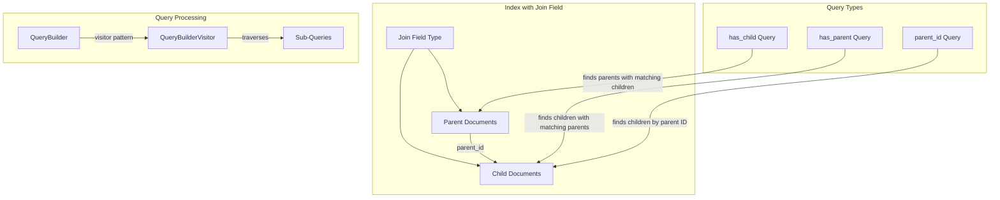

---
tags:
  - indexing
  - ml
  - search
---

# Parent-Child Query

## Summary

Parent-child queries in OpenSearch allow you to model hierarchical relationships between documents within the same index using a join field type. The `has_child` query returns parent documents whose child documents match a specific query, while the `has_parent` query returns child documents whose parent documents match a specific query. These queries are essential for modeling one-to-many relationships without denormalization.

## Details

### Architecture



### Components

| Component | Description |
|-----------|-------------|
| `HasChildQueryBuilder` | Builds queries to find parent documents with matching children |
| `HasParentQueryBuilder` | Builds queries to find child documents with matching parents |
| `ParentIdQueryBuilder` | Builds queries to find children by parent document ID |
| `JoinFieldMapper` | Maps the join field type that establishes parent-child relationships |
| `QueryBuilderVisitor` | Visitor pattern interface for traversing query trees |

### Query Parameters

#### has_child Query

| Parameter | Description | Required |
|-----------|-------------|----------|
| `type` | The child type to search | Yes |
| `query` | Query to run on child documents | Yes |
| `score_mode` | How to aggregate child scores (none, avg, max, min, sum) | No |
| `min_children` | Minimum number of matching children required | No |
| `max_children` | Maximum number of matching children allowed | No |
| `inner_hits` | Return matching child documents | No |

#### has_parent Query

| Parameter | Description | Required |
|-----------|-------------|----------|
| `parent_type` | The parent type to search | Yes |
| `query` | Query to run on parent documents | Yes |
| `score` | Whether to use parent score (true/false) | No |
| `inner_hits` | Return matching parent documents | No |

### Usage Examples

#### Setting up a Join Field

```json
PUT /my_index
{
  "mappings": {
    "properties": {
      "my_join_field": {
        "type": "join",
        "relations": {
          "brand": "product"
        }
      },
      "name": { "type": "text" }
    }
  }
}
```

#### Indexing Parent and Child Documents

```json
// Index parent document
PUT /my_index/_doc/1
{
  "name": "Brand A",
  "my_join_field": "brand"
}

// Index child document
PUT /my_index/_doc/2?routing=1
{
  "name": "Product 1",
  "my_join_field": {
    "name": "product",
    "parent": "1"
  }
}
```

#### has_child Query Example

```json
GET /my_index/_search
{
  "query": {
    "has_child": {
      "type": "product",
      "query": {
        "match": {
          "name": "Product 1"
        }
      }
    }
  }
}
```

#### has_parent Query Example

```json
GET /my_index/_search
{
  "query": {
    "has_parent": {
      "parent_type": "brand",
      "query": {
        "match": {
          "name": "Brand A"
        }
      }
    }
  }
}
```

#### Neural Search with Parent-Child Query (v3.2.0+)

```json
GET /my_index/_search
{
  "query": {
    "has_child": {
      "type": "product",
      "query": {
        "neural": {
          "embedding_field": {
            "query_text": "search query",
            "model_id": "model_123"
          }
        }
      }
    }
  }
}
```

## Limitations

- Parent and child documents must be indexed on the same shard (use routing)
- Join queries are expensive compared to regular queries
- Only one join field per index is allowed
- Parent-child relationships cannot span multiple indices
- The `search.allow_expensive_queries` setting can disable join queries

## Change History

- **v3.2.0** (2026-01-10): Fixed QueryBuilderVisitor pattern for HasParentQuery and HasChildQuery to properly traverse sub-queries

## Related Features
- [OpenSearch Dashboards](../opensearch-dashboards/opensearch-dashboards-ai-chat.md)

## References

### Documentation
- [Has Child Query Documentation](https://docs.opensearch.org/3.0/query-dsl/joining/has-child/): Official has_child query docs
- [Has Parent Query Documentation](https://docs.opensearch.org/3.0/query-dsl/joining/has-parent/): Official has_parent query docs
- [Joining Queries Overview](https://docs.opensearch.org/3.0/query-dsl/joining/index/): Overview of all joining queries
- [Join Field Type](https://docs.opensearch.org/3.0/field-types/supported-field-types/join/): Join field mapping documentation
- [Inner Hits](https://docs.opensearch.org/3.0/search-plugins/searching-data/inner-hits/): Retrieving nested/child documents

### Pull Requests
| Version | PR | Description | Related Issue |
|---------|-----|-------------|---------------|
| v3.2.0 | [#18621](https://github.com/opensearch-project/OpenSearch/pull/18621) | Fix visitor pattern for HasParentQuery and HasChildQuery |   |
| v2.16.0 | [#14739](https://github.com/opensearch-project/OpenSearch/pull/14739) | Fix visitor pattern for NestedQueryBuilder | [#813](https://github.com/opensearch-project/neural-search/issues/813) |
| - | [#10110](https://github.com/opensearch-project/OpenSearch/pull/10110) | Original visitor pattern implementation |   |
