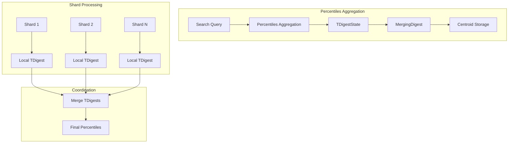
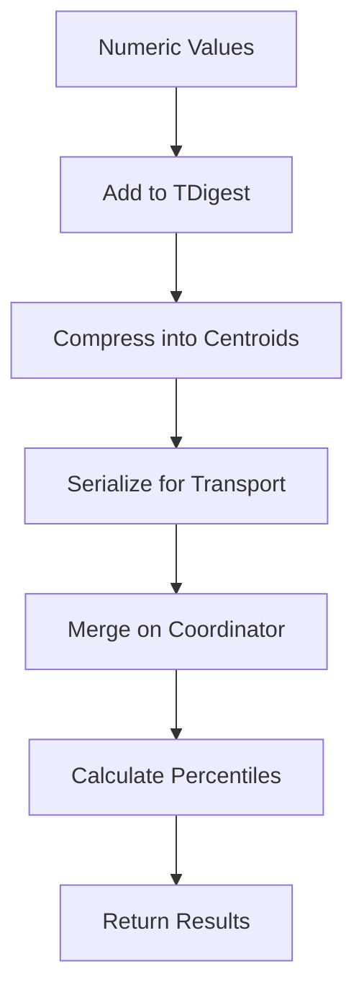

---
tags:
  - opensearch
---
# Percentiles Aggregation

## Summary

The percentiles aggregation is a multi-value metric aggregation that calculates approximate percentile values from numeric field data. It uses the t-digest algorithm to efficiently compute percentiles with configurable accuracy, making it useful for analyzing data distributions, identifying outliers, and understanding latency characteristics.

## Details

### Architecture



### Data Flow



### Components

| Component | Description |
|-----------|-------------|
| `TDigestState` | OpenSearch wrapper around t-digest library with custom serialization |
| `MergingDigest` | Underlying t-digest implementation (v3.1.0+) |
| `InternalTDigestPercentiles` | Internal aggregation result representation |
| `PercentilesAggregationBuilder` | Builder for constructing percentiles aggregations |

### Configuration

| Setting | Description | Default |
|---------|-------------|---------|
| `field` | Numeric field to calculate percentiles for | Required |
| `percents` | Array of percentile values to calculate | `[1, 5, 25, 50, 75, 95, 99]` |
| `tdigest.compression` | Accuracy vs memory tradeoff (higher = more accurate) | `100` |
| `keyed` | Return results as a map with percentile keys | `true` |
| `missing` | Value to use for documents missing the field | None |

### Usage Example

Basic percentiles query:

```json
GET my-index/_search
{
  "size": 0,
  "aggs": {
    "latency_percentiles": {
      "percentiles": {
        "field": "response_time",
        "percents": [50, 90, 95, 99, 99.9]
      }
    }
  }
}
```

Response:

```json
{
  "aggregations": {
    "latency_percentiles": {
      "values": {
        "50.0": 120.5,
        "90.0": 450.2,
        "95.0": 680.1,
        "99.0": 1250.8,
        "99.9": 2100.3
      }
    }
  }
}
```

With custom compression:

```json
GET my-index/_search
{
  "size": 0,
  "aggs": {
    "precise_percentiles": {
      "percentiles": {
        "field": "response_time",
        "tdigest": {
          "compression": 200
        }
      }
    }
  }
}
```

### How t-digest Works

The t-digest algorithm maintains a compact summary of a data distribution using "centroids" - weighted mean values that represent clusters of nearby data points. Key characteristics:

1. **Accuracy at extremes**: More accurate at the tails (e.g., 99th percentile) than in the middle
2. **Mergeable**: Digests from different shards can be combined without loss of accuracy
3. **Memory efficient**: Uses O(compression) space regardless of data size
4. **Streaming**: Can process data in a single pass

## Limitations

- Percentile values are approximate, not exact
- Accuracy depends on the `compression` parameter
- Higher compression values use more memory
- The `MergingDigest` implementation (v3.1.0+) does not support weighted additions

## Change History

- **v3.1.0** (2025-05-28): Switched from AVLTreeDigest to MergingDigest for significant performance improvements (up to 30x faster for low-cardinality fields)


## References

### Documentation
- [Percentile Aggregation Documentation](https://docs.opensearch.org/3.0/aggregations/metric/percentile/): Official documentation
- [Percentile Ranks Documentation](https://docs.opensearch.org/3.0/aggregations/metric/percentile-ranks/): Related aggregation
- [t-digest Paper](https://github.com/tdunning/t-digest): Algorithm details and implementation

### Pull Requests
| Version | PR | Description | Related Issue |
|---------|-----|-------------|---------------|
| v3.1.0 | [#18124](https://github.com/opensearch-project/OpenSearch/pull/18124) | Switch to MergingDigest for ~2-30x performance improvement | [#18122](https://github.com/opensearch-project/OpenSearch/issues/18122) |

### Issues (Design / RFC)
- [Issue #18122](https://github.com/opensearch-project/OpenSearch/issues/18122): Performance improvement request
