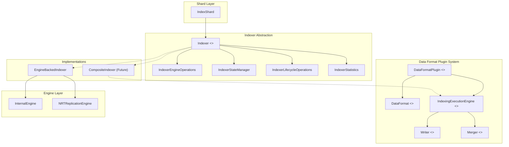

---
tags:
  - opensearch
---
# Pluggable Engine Architecture

## Summary

The Pluggable Engine Architecture introduces an abstraction layer between `IndexShard` and the underlying storage engine in OpenSearch. By defining an `Indexer` interface, this architecture decouples shard-level coordination from any single engine implementation, enabling future support for composite engines that combine multiple storage formats (e.g., Lucene + Parquet + columnar) within a single index. This is a foundational change toward making OpenSearch's engine layer extensible via plugins.

## Details

### Architecture

### Components

| Component | Description |
|-----------|-------------|
| `Indexer` | Core interface abstracting all indexing operations: CRUD, lifecycle, state, and statistics |
| `EngineBackedIndexer` | Default implementation wrapping the existing `Engine` class |
| `DataFormat` | Interface declaring a storage format's name, priority, and field type capabilities |
| `DataFormatPlugin` | Plugin interface for registering custom data formats |
| `IndexingExecutionEngine` | Format-specific engine for writing, merging, and refreshing data |
| `Writer` | Interface for writing documents to a specific format |
| `Merger` | Interface for merging writer file sets |
| `CatalogSnapshot` | Point-in-time view of all segments and files across formats |
| `FieldTypeCapabilities` | Declares per-field capabilities: `FULL_TEXT_SEARCH`, `COLUMNAR_STORAGE`, `VECTOR_SEARCH`, `POINT_RANGE`, `STORED_FIELDS`, `BLOOM_FILTER` |

### Indexer Interface Responsibilities

The `Indexer` interface composes four sub-interfaces:

- `IndexerEngineOperations` — Document CRUD: `index()`, `delete()`, `noOp()`, `prepareIndex()`, `prepareDelete()`
- `IndexerStateManager` — Sequence numbers, checkpoints, timestamps, history operations
- `IndexerLifecycleOperations` — `flush()`, `refresh()`, `forceMerge()`, throttling, settings changes
- `IndexerStatistics` — Doc stats, segment stats, merge stats, commit stats, completion stats

### Planned Migration Path

| Phase | Description |
|-------|-------------|
| Phase 1 | Introduce `Indexer` interface, migrate `IndexShard` to use it via `EngineBackedIndexer` |
| Phase 2 | Deprecate direct `Engine` access, introduce `SearcherInterface` |
| Phase 3 | Introduce `CompositeIndexer` for multi-engine shards, `DataFormatRegistry` at plugin bootstrap |

## Limitations

- All interfaces are annotated `@ExperimentalApi` and subject to change
- Search operations still require direct `Engine` access (pending `SearcherInterface`)
- `CompositeIndexer` and `DataFormatRegistry` are not yet implemented
- Only `EngineBackedIndexer` is available as a concrete implementation

## Change History

- **v3.6.0**: Initial introduction of `Indexer` interface, `EngineBackedIndexer`, data format abstractions (`DataFormat`, `DataFormatPlugin`, `IndexingExecutionEngine`, `Writer`, `Merger`, `DocumentInput`, `FieldTypeCapabilities`), and `CatalogSnapshot`. Migrated `IndexShard` and `RemoteStoreRefreshListener` to use `Indexer` instead of direct `Engine` reference.

## References

### Documentation
- RFC: `https://github.com/opensearch-project/OpenSearch/issues/20644` — OpenSearch Engine: Pluggable Component Bundling

### Pull Requests
| Version | PR | Description |
|---------|-----|-------------|
| v3.6.0 | `https://github.com/opensearch-project/OpenSearch/pull/20675` | Add indexer interface for shard interaction with underlying engines |
