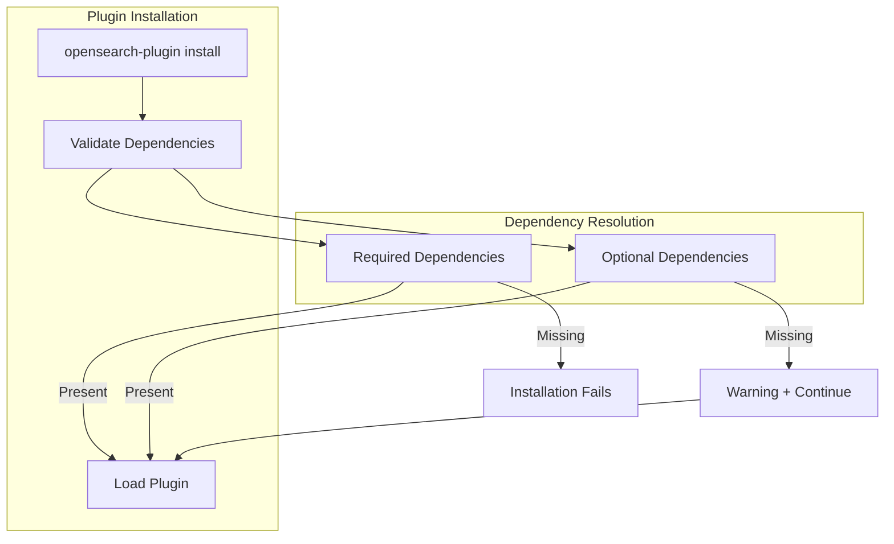

---
tags:
  - opensearch
---
# Plugin System

## Summary

OpenSearch's plugin system allows extending core functionality through installable plugins. Plugins can depend on and extend other plugins through the Service Provider Interface (SPI). The system supports both required and optional plugin dependencies.

## Details

### Architecture



### Plugin Configuration

Plugins declare their metadata and dependencies in the build configuration:

```groovy
opensearchplugin {
    name 'my-plugin'
    description 'My OpenSearch Plugin'
    classname 'org.opensearch.example.MyPlugin'
    extendedPlugins = [
        'required-plugin',           // Required dependency
        'optional-plugin;optional=true'  // Optional dependency
    ]
}
```

### Components

| Component | Description |
|-----------|-------------|
| `PluginInfo` | Stores plugin metadata including name, version, dependencies |
| `PluginsService` | Manages plugin lifecycle: discovery, loading, initialization |
| `ExtensiblePlugin` | Interface for plugins that can be extended by other plugins |

### Configuration Options

| Setting | Description | Default |
|---------|-------------|---------|
| `extendedPlugins` | List of plugins this plugin extends | `[]` |
| `;optional=true` suffix | Marks an extended plugin as optional | Required (no suffix) |

### Plugin Dependency Types

| Type | Syntax | Behavior if Missing |
|------|--------|---------------------|
| Required | `'plugin-name'` | Installation fails with error |
| Optional | `'plugin-name;optional=true'` | Warning logged, installation continues |

### Usage Example

A plugin extending the Security plugin optionally:

```groovy
// build.gradle
opensearchplugin {
    name 'opensearch-my-plugin'
    description 'Plugin with optional Security integration'
    classname 'org.opensearch.myplugin.MyPlugin'
    extendedPlugins = ['opensearch-security;optional=true']
}
```

```java
// MyPlugin.java
public class MyPlugin extends Plugin {
    
    @Override
    public void onIndexModule(IndexModule indexModule) {
        // Check if Security plugin is available
        if (securityPluginAvailable()) {
            // Use Security SPI for resource sharing
            registerWithSecurity();
        }
        // Core functionality works regardless
    }
}
```

## Limitations

- Optional dependencies require the plugin to handle missing dependency cases gracefully
- Features depending on optional plugins will not function when those plugins are absent
- Plugin developers must test both scenarios (with and without optional dependencies)

## Change History

- **v2.19.0** (2025-01-28): Added support for optional extended plugins via `;optional=true` syntax

## References

### Documentation
- [Installing plugins](https://docs.opensearch.org/latest/install-and-configure/plugins/)

### Pull Requests
| Version | PR | Description |
|---------|-----|-------------|
| v2.19.0 | [#16909](https://github.com/opensearch-project/OpenSearch/pull/16909) | Allow extended plugins to be optional |
