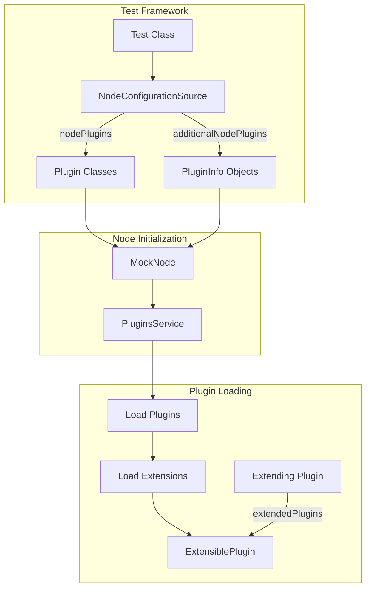
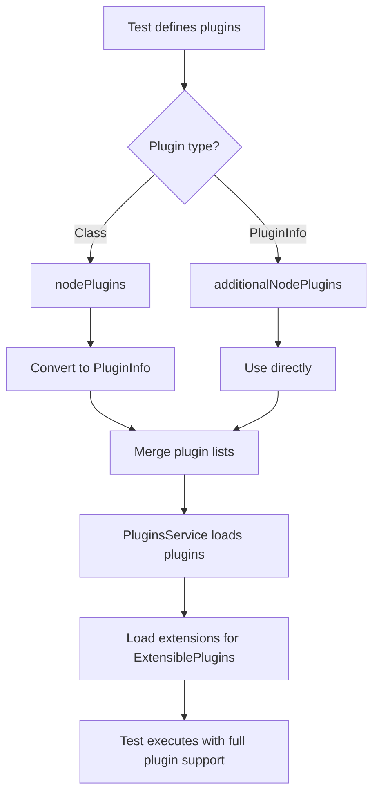

---
tags:
  - opensearch
---
# Plugin Testing Framework

## Summary

The Plugin Testing Framework enables comprehensive testing of OpenSearch plugins, including support for ExtensiblePlugins and their extensions within the integration test framework. This feature allows plugin developers to test plugin extension mechanisms that were previously untestable in the classpath plugin pattern used by `internalClusterTest`.

## Details

### Architecture



### Data Flow



### Components

| Component | Description |
|-----------|-------------|
| `PluginInfo` | Metadata class containing plugin name, version, classname, and `extendedPlugins` list |
| `ExtensiblePlugin` | Interface for plugins that can be extended by other plugins |
| `ExtensionLoader` | Loads extensions for an ExtensiblePlugin using Java ServiceLoader |
| `PluginsService` | Core service managing plugin lifecycle and extension loading |
| `MockNode` | Test node supporting both `Class<Plugin>` and `PluginInfo` configurations |
| `OpenSearchIntegTestCase` | Base class for integration tests with `additionalNodePlugins()` support |
| `InternalTestCluster` | Test cluster combining `nodePlugins()` and `additionalNodePlugins()` |

### Configuration

| Setting | Description | Default |
|---------|-------------|---------|
| `extendedPlugins` | List of plugin names this plugin extends | Empty list |

### Usage Example

```java
// 1. Define extension interface
public interface MyExtension {
    void doSomething();
}

// 2. Define extensible plugin
public class MyExtensiblePlugin extends Plugin implements ExtensiblePlugin {
    private List<MyExtension> extensions = new ArrayList<>();
    
    @Override
    public void loadExtensions(ExtensionLoader loader) {
        for (MyExtension ext : loader.loadExtensions(MyExtension.class)) {
            extensions.add(ext);
        }
    }
}

// 3. Define extending plugin
public class MyExtendingPlugin extends Plugin implements MyExtension {
    @Override
    public void doSomething() {
        // Extension implementation
    }
}

// 4. Create service file: META-INF/services/com.example.MyExtension
// Contents: com.example.MyExtendingPlugin

// 5. Write integration test
public class MyPluginIT extends OpenSearchIntegTestCase {
    @Override
    protected Collection<PluginInfo> additionalNodePlugins() {
        return List.of(
            new PluginInfo(
                MyExtensiblePlugin.class.getName(),
                "My extensible plugin",
                "1.0.0",
                Version.CURRENT,
                "17",
                MyExtensiblePlugin.class.getName(),
                null,
                Collections.emptyList(),
                false
            ),
            new PluginInfo(
                MyExtendingPlugin.class.getName(),
                "My extending plugin", 
                "1.0.0",
                Version.CURRENT,
                "17",
                MyExtendingPlugin.class.getName(),
                null,
                List.of(MyExtensiblePlugin.class.getName()),
                false
            )
        );
    }
    
    public void testExtensionLoaded() {
        // Test that extensions work correctly
    }
}
```

## Limitations

- Extensions are discovered via Java ServiceLoader, requiring `META-INF/services` files
- Only works within OpenSearch's test framework (`OpenSearchIntegTestCase`, `OpenSearchSingleNodeTestCase`)
- Plugin classes must be on the test classpath

## Change History

- **v3.1.0** (2025-05-08): Initial implementation - Enable testing for ExtensiblePlugins using classpath plugins


## References

### Documentation
- [PR #16908](https://github.com/opensearch-project/OpenSearch/pull/16908): Main implementation

### Blog Posts
- [Introduction to OpenSearch Plugins](https://opensearch.org/blog/plugins-intro/): Plugin architecture overview
- [Backwards Compatibility Testing](https://opensearch.org/blog/bwc-testing-for-opensearch/): BWC testing framework

### Pull Requests
| Version | PR | Description | Related Issue |
|---------|-----|-------------|---------------|
| v3.1.0 | [#16908](https://github.com/opensearch-project/OpenSearch/pull/16908) | Enable testing for ExtensiblePlugins using classpath plugins |   |
