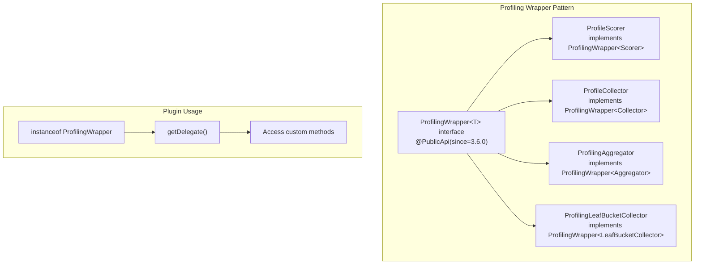

---
tags:
  - opensearch
---
# ProfileScorer Improvements

## Summary

OpenSearch's search profiling framework wraps scorers, collectors, and aggregators in timing-instrumented decorators. The `ProfilingWrapper<T>` interface provides a unified, public API for plugins to detect and unwrap these profiling decorators without reflection, enabling access to custom methods on wrapped components.

## Details

### Architecture



### Components

| Component | Description |
|-----------|-------------|
| `ProfilingWrapper<T>` | Public generic interface in `o.o.search.profile` package. Annotated `@PublicApi(since = "3.6.0")`. Defines `T getDelegate()` method. |
| `ProfileScorer` | Package-private scorer wrapper in `o.o.search.profile.query`. Implements `ProfilingWrapper<Scorer>`. |
| `ProfileCollector` | Package-private collector wrapper in `o.o.search.profile.query`. Implements `ProfilingWrapper<Collector>`. Already had `getDelegate()` method. |
| `ProfilingAggregator` | Public aggregator wrapper in `o.o.search.profile.aggregation`. Implements `ProfilingWrapper<Aggregator>`. Retains legacy `unwrapAggregator()`. |
| `ProfilingLeafBucketCollector` | Public leaf collector wrapper in `o.o.search.profile.aggregation`. Implements `ProfilingWrapper<LeafBucketCollector>`. |

### Usage Example

Unwrapping a profiled scorer in a plugin:

```java
// In a plugin's LeafCollector.setScorer() or similar
if (scorer instanceof ProfilingWrapper) {
    @SuppressWarnings("unchecked")
    Scorer delegate = ((ProfilingWrapper<Scorer>) scorer).getDelegate();
    if (delegate instanceof HybridBulkScorer) {
        ((HybridBulkScorer) delegate).docIdStream();
    }
}
```

Iterative unwrapping through nested profiling layers:

```java
Scorable current = scorable;
while (current instanceof ProfilingWrapper) {
    current = ((ProfilingWrapper<Scorer>) current).getDelegate();
}
// current is now the original unwrapped scorer
```

## Limitations

- Calling mutation methods on the unwrapped delegate bypasses profiling instrumentation for those calls. Timing metrics will be incomplete, but functional correctness is preserved.
- `ProfileScorer` remains a package-private `final class`. The `ProfilingWrapper` interface is the intended public access point — do not attempt to reference `ProfileScorer` directly from plugin code.

## Change History

- **v3.6.0**: Introduced `ProfilingWrapper<T>` interface (`@PublicApi`). Refactored `ProfileScorer`, `ProfileCollector`, `ProfilingAggregator`, and `ProfilingLeafBucketCollector` to implement it. Added `getDelegate()` as the unified unwrap method. Initial `getWrappedScorer()` on `ProfileScorer` was renamed to `getDelegate()`.

## References

### Documentation
- OpenSearch profiling documentation: https://opensearch.org/docs/latest/api-reference/profile/

### Pull Requests
| Version | PR | Description |
|---------|-----|-------------|
| v3.6.0 | https://github.com/opensearch-project/OpenSearch/pull/20549 | Add `getWrappedScorer()` method to `ProfileScorer` |
| v3.6.0 | https://github.com/opensearch-project/OpenSearch/pull/20607 | Introduce `ProfilingWrapper<T>` interface, refactor all profiling decorators |

### Issues
| Issue | Description |
|-------|-------------|
| https://github.com/opensearch-project/OpenSearch/issues/20548 | Feature request: Add `getWrappedScorer()` to `ProfileScorer` |
