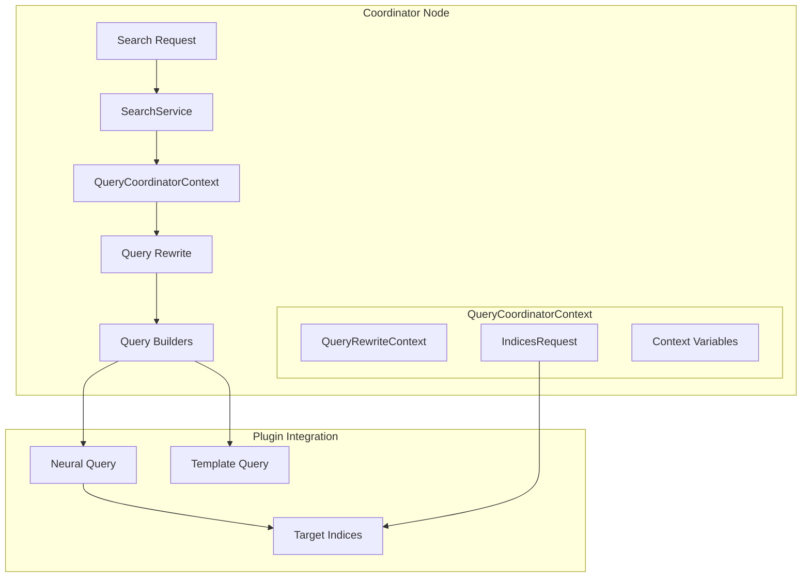
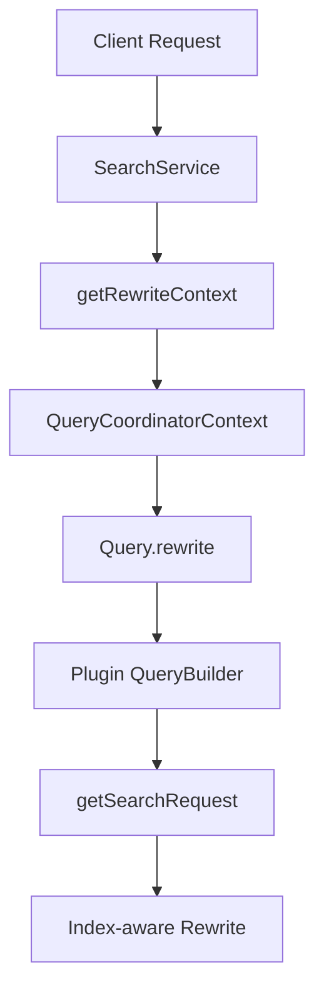

---
tags:
  - domain/core
  - component/server
  - indexing
  - neural-search
  - search
---
# Query Coordinator Context

## Summary

`QueryCoordinatorContext` is a specialized query rewrite context that provides coordinator-level information during query rewriting in OpenSearch. It enables plugins to access search request details, target indices, and pipeline context variables when rewriting queries on the coordinator node, which is essential for features that need index-aware query transformation.

## Details

### Architecture



### Data Flow



### Components

| Component | Description |
|-----------|-------------|
| `QueryCoordinatorContext` | Wrapper around `QueryRewriteContext` that provides coordinator-level context |
| `IndicesRequest` | Interface providing access to target indices |
| `PipelinedRequest` | Specialized request with pipeline processing context |
| `SearchService` | Creates `QueryCoordinatorContext` for query rewriting |

### Key Methods

| Method | Return Type | Description |
|--------|-------------|-------------|
| `getSearchRequest()` | `IndicesRequest` | Returns the search request with target indices |
| `getContextVariables()` | `Map<String, Object>` | Returns pipeline context variables (empty for non-pipelined requests) |
| `convertToCoordinatorContext()` | `QueryCoordinatorContext` | Returns self (for interface compatibility) |

### Configuration

This feature is internal infrastructure and does not require configuration. It is automatically used when:

- Search queries are executed
- Explain API is called
- Validate Query API is called

### Usage Example

```java
// In a custom QueryBuilder's doRewrite method
@Override
protected QueryBuilder doRewrite(QueryRewriteContext queryRewriteContext) {
    QueryCoordinatorContext coordinatorContext = queryRewriteContext.convertToCoordinatorContext();
    
    if (coordinatorContext != null) {
        // Access target indices
        IndicesRequest request = coordinatorContext.getSearchRequest();
        String[] targetIndices = request.indices();
        
        // Access pipeline context variables (if available)
        Map<String, Object> contextVars = coordinatorContext.getContextVariables();
        
        // Perform index-aware query rewriting
        // e.g., look up index mapping to determine field types
    }
    
    return this;
}
```

### Integration with Neural Search

The primary use case is enabling the neural-search plugin's semantic field feature:

```java
// Neural query can now access index mapping during rewrite
public class NeuralQueryBuilder extends AbstractQueryBuilder<NeuralQueryBuilder> {
    @Override
    protected QueryBuilder doRewrite(QueryRewriteContext context) {
        QueryCoordinatorContext coordContext = context.convertToCoordinatorContext();
        if (coordContext != null) {
            // Get target indices to look up semantic field configuration
            String[] indices = coordContext.getSearchRequest().indices();
            // Determine model_id from index mapping
            // Rewrite to appropriate KNN or sparse query
        }
        return super.doRewrite(context);
    }
}
```

## Limitations

- Context variables are only available when the request is a `PipelinedRequest`
- Index mapping lookup requires additional calls to cluster state
- Only available during coordinator-level query rewriting (not shard-level)

## Change History

- **v3.1.0** (2025-05-15): Added `getSearchRequest()` method, broadened constructor to accept `IndicesRequest`, integrated with Validate Query API
- **v2.19.0** (2025-01-23): Initial implementation with Template query support


## References

### Pull Requests
| Version | PR | Description | Related Issue |
|---------|-----|-------------|---------------|
| v3.1.0 | [#17890](https://github.com/opensearch-project/OpenSearch/pull/17890) | Allow to get the search request from the QueryCoordinatorContext | [#1211](https://github.com/opensearch-project/neural-search/issues/1211) |
| v3.1.0 | [#18272](https://github.com/opensearch-project/OpenSearch/pull/18272) | Use QueryCoordinatorContext for the rewrite in validate API | [#803](https://github.com/opensearch-project/neural-search/issues/803) |
| v2.19.0 | [#16818](https://github.com/opensearch-project/OpenSearch/pull/16818) | Introduce Template query (initial QueryCoordinatorContext) | [#16823](https://github.com/opensearch-project/OpenSearch/issues/16823) |

### Issues (Design / RFC)
- [Issue #1211](https://github.com/opensearch-project/neural-search/issues/1211): RFC - Support Semantic Field Type to Simplify Neural Search Set Up
- [Issue #803](https://github.com/opensearch-project/neural-search/issues/803): Semantic field feature request
