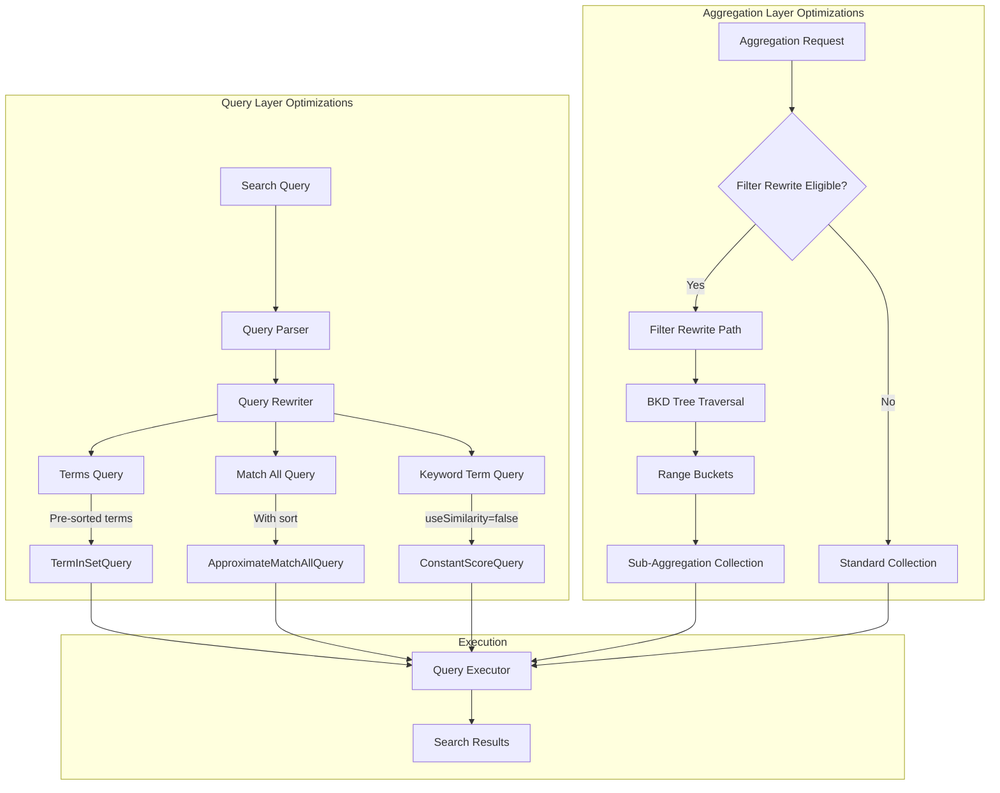

---
tags:
  - domain/core
  - component/server
  - performance
  - search
---
# Query Performance Optimizations

## Summary

Query performance optimizations in OpenSearch encompass a collection of enhancements that improve search latency, aggregation speed, and overall query execution efficiency. These optimizations target different aspects of query processing including term query execution, match_all query short-circuiting, aggregation filter rewriting, and keyword field scoring.

## Details

### Architecture



### Data Flow

```mermaid
flowchart TB
    subgraph "Terms Query Optimization"
        Terms[Terms Array] --> Sort{Already Sorted?}
        Sort --> |"Yes"| Direct[Direct to TermInSetQuery]
        Sort --> |"No"| SortOp[Sort Operation]
        SortOp --> Direct
    end
    
    subgraph "ApproximateMatchAllQuery"
        MA[Match All + Sort] --> Bound[Add Bounded Range]
        Bound --> APR[ApproximatePointRangeQuery]
        APR --> Collect{Collected 10K?}
        Collect --> |"Yes"| Stop[Short Circuit]
        Collect --> |"No"| Continue[Continue Collection]
    end
    
    subgraph "Filter Rewrite Sub-Aggregation"
        Range[Range Aggregation] --> Traverse[BKD Tree Traversal]
        Traverse --> DocIds[DocIdSet per Bucket]
        DocIds --> Defer[Deferred Sub-Agg Collection]
        Defer --> Metrics[Metric Aggregations]
    end
```



### Components

| Component | Description |
|-----------|-------------|
| `TermInSetQuery` | Lucene query for matching multiple terms efficiently |
| `ApproximateMatchAllQuery` | Wrapper that adds bounded range to match_all for early termination |
| `ApproximatePointRangeQuery` | Point range query that short-circuits after collecting sufficient docs |
| `SubAggRangeCollector` | Collector that builds DocIdSets for deferred sub-aggregation processing |
| `ConstantScoreQuery` | Query wrapper that returns constant score instead of BM25 |
| `useSimilarity` | Keyword field parameter controlling scoring behavior |

### Configuration

| Setting | Description | Default |
|---------|-------------|---------|
| `useSimilarity` | Enable BM25 scoring for keyword term queries | `false` (v3.0.0+) |
| `index.max_terms_count` | Maximum terms allowed in terms query | 65,536 |

### Usage Examples

#### Keyword Field Mapping

```json
// Default behavior (v3.0.0+): No scoring, faster queries
PUT /my-index
{
  "mappings": {
    "properties": {
      "status": {
        "type": "keyword"
      }
    }
  }
}

// Opt-in to BM25 scoring (slower, but provides relevance scores)
PUT /my-index
{
  "mappings": {
    "properties": {
      "category": {
        "type": "keyword",
        "useSimilarity": true
      }
    }
  }
}
```

#### Terms Query (Benefits from Pre-sorted Optimization)

```json
GET /products/_search
{
  "query": {
    "terms": {
      "product_id": ["A001", "A002", "A003", "B001", "B002"]
    }
  }
}
```

#### Match All with Sort (Benefits from ApproximateMatchAllQuery)

```json
GET /logs/_search
{
  "query": {
    "match_all": {}
  },
  "sort": [
    { "@timestamp": "desc" }
  ],
  "size": 100
}
```

#### Date Histogram with Sub-Aggregations (Benefits from Filter Rewrite)

```json
GET /metrics/_search
{
  "size": 0,
  "aggs": {
    "by_minute": {
      "date_histogram": {
        "field": "@timestamp",
        "fixed_interval": "1m"
      },
      "aggs": {
        "avg_cpu": { "avg": { "field": "cpu_usage" } },
        "max_memory": { "max": { "field": "memory_usage" } },
        "min_latency": { "min": { "field": "latency" } }
      }
    }
  }
}
```

## Limitations

- **ApproximateMatchAllQuery**: Only applies when sorting on numeric fields with point values indexed
- **Filter Rewrite Sub-Aggregation**: 
  - Works best with dense data (many documents per bucket)
  - May add overhead for sparse datasets
  - Does not support composite aggregations
  - Requires match_all or range query on the aggregation field
- **Keyword Scoring**: Disabling scoring changes result ordering for multi-term queries that previously relied on IDF
- **Terms Query**: Pre-sorted optimization only helps when input terms are already sorted

## Change History

- **v3.0.0** (2025-04): Added ApproximateMatchAllQuery, sub-aggregation support in filter rewrite, disabled keyword term scoring by default, and pre-sorted terms optimization for TermInSetQuery

## Related Features
- [OpenSearch Dashboards](../opensearch-dashboards/opensearch-dashboards-ai-chat.md)

## References

### Documentation
- [Terms Query Documentation](https://docs.opensearch.org/3.0/query-dsl/term/terms/)
- [Date Histogram Documentation](https://docs.opensearch.org/3.0/aggregations/bucket/date-histogram/)
- [Filter Results Documentation](https://docs.opensearch.org/3.0/search-plugins/filter-search/)
- [Forum Discussion](https://forum.opensearch.org/t/avoid-re-sorting-when-initializing-terminsetquery/23865): TermInSetQuery sorting overhead

### Pull Requests
| Version | PR | Description | Related Issue |
|---------|-----|-------------|---------------|
| v3.0.0 | [#17714](https://github.com/opensearch-project/OpenSearch/pull/17714) | Pass in-order terms as sorted to TermInSetQuery |   |
| v3.0.0 | [#17772](https://github.com/opensearch-project/OpenSearch/pull/17772) | Add ApproximateMatchAllQuery for match_all with sort |   |
| v3.0.0 | [#17447](https://github.com/opensearch-project/OpenSearch/pull/17447) | Support sub agg in filter rewrite optimization | [#12602](https://github.com/opensearch-project/OpenSearch/issues/12602) |
| v3.0.0 | [#17889](https://github.com/opensearch-project/OpenSearch/pull/17889) | Disable scoring of keyword term search by default | [#17823](https://github.com/opensearch-project/OpenSearch/issues/17823) |

### Issues (Design / RFC)
- [Issue #12602](https://github.com/opensearch-project/OpenSearch/issues/12602): Proposal for sub-aggregation support in filter rewrite
- [Issue #17823](https://github.com/opensearch-project/OpenSearch/issues/17823): Keyword term search performance regression since 2.18
- [Issue #13788](https://github.com/opensearch-project/OpenSearch/issues/13788): ApproximatePointRangeQuery for range queries
- [Lucene Issue #14445](https://github.com/apache/lucene/issues/14445): Keyword term query performance regression
