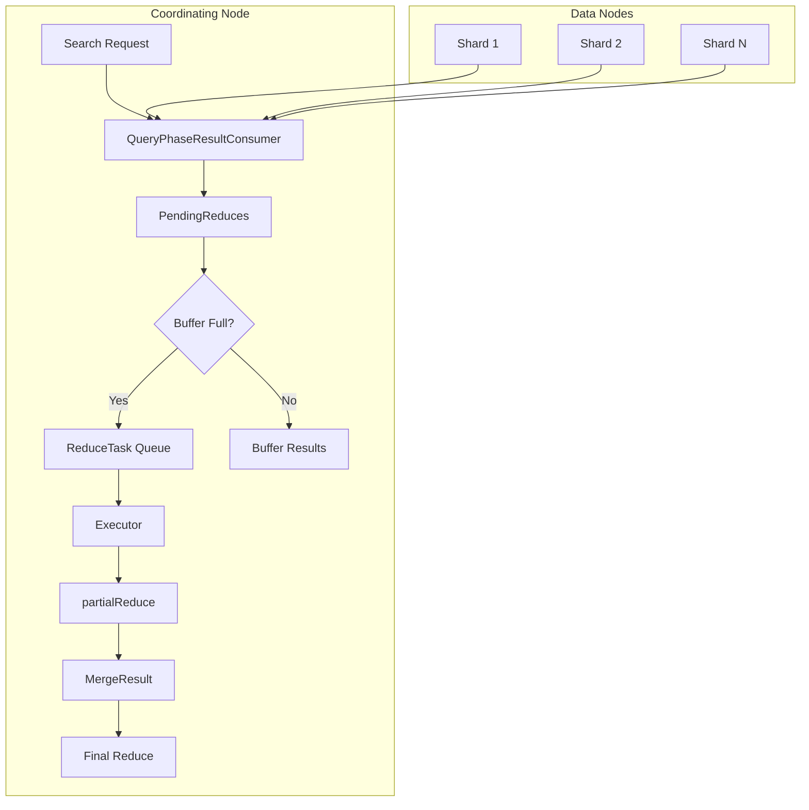
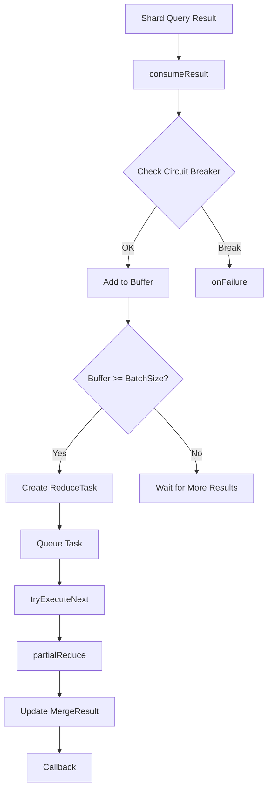

---
tags:
  - opensearch
---
# Query Phase Result Consumer

## Summary

The `QueryPhaseResultConsumer` is a core component in OpenSearch's distributed search architecture that handles incremental reduction of aggregation results as shard-level query results are consumed. It manages memory through circuit breaker accounting and coordinates partial reduce operations to efficiently process search results from multiple shards.

## Details

### Architecture



### Data Flow



### Components

| Component | Description |
|-----------|-------------|
| `QueryPhaseResultConsumer` | Main class that extends `ArraySearchPhaseResults` and implements incremental reduction |
| `PendingReduces` | Inner class managing buffered results, reduce task queue, and circuit breaker accounting |
| `ReduceTask` | Encapsulates a batch of query results to be reduced along with callback |
| `ReduceResult` | Immutable record holding partial reduce outcome (TopDocs, Aggregations, estimated size) |

### Configuration

| Setting | Description | Default |
|---------|-------------|---------|
| `search.batched_reduce_size` | Number of shard results to buffer before triggering partial reduce | 512 |
| `indices.breaker.request.limit` | Circuit breaker limit for request memory | 60% of JVM heap |

### Key Methods

| Method | Description |
|--------|-------------|
| `consumeResult()` | Receives shard query result, buffers it, triggers reduce if threshold reached |
| `reduce()` | Performs final reduction after all shards respond |
| `partialReduce()` | Reduces buffered results into intermediate MergeResult |
| `tryExecuteNext()` | Executes next queued reduce task if none running |

### Usage Example

The `QueryPhaseResultConsumer` is used internally by the search coordinator. Users interact with it indirectly through the Search API:

```json
POST /my-index/_search
{
  "size": 10,
  "aggs": {
    "my_terms": {
      "terms": {
        "field": "category",
        "size": 100
      }
    }
  }
}
```

For large aggregations across many shards, the consumer incrementally reduces results to manage memory:

```json
POST /my-index/_search?batched_reduce_size=256
{
  "size": 0,
  "aggs": {
    "large_agg": {
      "terms": {
        "field": "user_id",
        "size": 10000
      }
    }
  }
}
```

## Limitations

- Partial reduces add CPU overhead; for simple queries without aggregations, the overhead may not be beneficial
- Circuit breaker estimation is approximate and may over/under-estimate actual memory usage
- Concurrent reduce tasks are serialized (only one running at a time) to maintain result ordering

## Change History

- **v3.3.0** (2025-10-02): Hardened circuit breaker logic with proactive memory checks before consuming results; centralized failure handling in `onFailure` method; renamed classes for clarity (`PendingMerges` → `PendingReduces`, `MergeTask` → `ReduceTask`, `MergeResult` → `ReduceResult`)
- **v3.3.0** (2025-09-04): Fixed incomplete callback loops by adding graceful failure handling, clearing pending merge tasks on failure, and properly canceling tasks when failures are detected


## References

### Documentation
- [Circuit Breaker Settings](https://docs.opensearch.org/3.0/install-and-configure/configuring-opensearch/circuit-breaker/): OpenSearch circuit breaker configuration
- [Search API Documentation](https://docs.opensearch.org/3.0/api-reference/search-apis/search/): OpenSearch Search API reference
- [Search Settings](https://docs.opensearch.org/3.0/install-and-configure/configuring-opensearch/search-settings/): Search configuration options

### Pull Requests
| Version | PR | Description | Related Issue |
|---------|-----|-------------|---------------|
| v3.3.0 | [#19396](https://github.com/opensearch-project/OpenSearch/pull/19396) | Harden the circuit breaker and failure handle logic in query result consumer |   |
| v3.3.0 | [#19231](https://github.com/opensearch-project/OpenSearch/pull/19231) | Fix incomplete callback loops in QueryPhaseResultConsumer | [#19094](https://github.com/opensearch-project/OpenSearch/issues/19094) |

### Issues (Design / RFC)
- [Issue #19094](https://github.com/opensearch-project/OpenSearch/issues/19094): Flaky Test Report for SearchPhaseControllerTests
