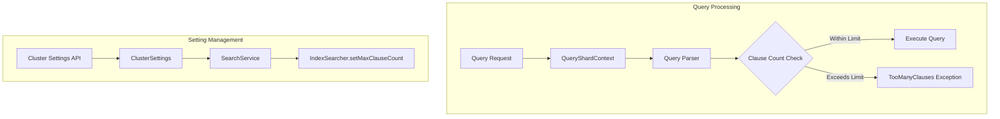

---
tags:
  - opensearch
---
# Query Settings

## Summary

OpenSearch provides cluster-level settings to control query behavior, including limits on boolean query complexity. The `indices.query.bool.max_clause_count` setting defines the maximum number of clauses allowed in boolean queries and affects wildcard/prefix query expansion.

## Details

### Architecture



### Components

| Component | Description |
|-----------|-------------|
| `SearchService.INDICES_MAX_CLAUSE_COUNT_SETTING` | Dynamic cluster setting for max clause count |
| `IndexSearcher.setMaxClauseCount()` | Lucene method to enforce clause limit |
| `QueryParserHelper.checkForTooManyFields()` | Validates field expansion against limit |

### Configuration

| Setting | Description | Default | Dynamic |
|---------|-------------|---------|---------|
| `indices.query.bool.max_clause_count` | Maximum clauses in boolean queries | 1024 | Yes (v2.16.0+) |

### Usage Example

#### Check Current Setting

```json
GET _cluster/settings?include_defaults=true&filter_path=*.indices.query.bool.max_clause_count
```

#### Update Setting Dynamically

```json
PUT _cluster/settings
{
  "transient": {
    "indices.query.bool.max_clause_count": 2048
  }
}
```

#### Persistent Update

```json
PUT _cluster/settings
{
  "persistent": {
    "indices.query.bool.max_clause_count": 4096
  }
}
```

### Affected Query Types

The max clause count affects:
- Boolean queries with many clauses
- Wildcard queries that expand to many terms
- Prefix queries that expand to many terms
- Query string queries with field expansion
- Multi-match queries across many fields

### Error Handling

When the clause limit is exceeded:

```json
{
  "error": {
    "root_cause": [
      {
        "type": "too_many_clauses",
        "reason": "maxClauseCount is set to 1024"
      }
    ]
  }
}
```

## Limitations

- Very high values can cause memory issues with complex queries
- Setting changes take effect immediately but don't affect in-flight queries
- The limit is enforced at the `IndexSearcher` level (Lucene)

## Change History

- **v2.16.0** (2024-08-06): Changed `indices.query.bool.max_clause_count` from static to dynamic setting. Moved setting from `SearchModule` to `SearchService`.
- **v1.0.0**: Initial implementation inherited from Elasticsearch 7.10 with static setting.

## References

### Documentation
- [Index Settings](https://docs.opensearch.org/latest/install-and-configure/configuring-opensearch/index-settings/): Configuration reference
- [Query String](https://docs.opensearch.org/latest/query-dsl/full-text/query-string/): Query string query documentation
- [Simple Query String](https://docs.opensearch.org/latest/query-dsl/full-text/simple-query-string/): Simple query string documentation

### Pull Requests
| Version | PR | Description | Related Issue |
|---------|-----|-------------|---------------|
| v2.16.0 | [#13568](https://github.com/opensearch-project/OpenSearch/pull/13568) | Set INDICES_MAX_CLAUSE_COUNT dynamically | [#12549](https://github.com/opensearch-project/OpenSearch/issues/12549), [#1526](https://github.com/opensearch-project/OpenSearch/issues/1526) |

### Issues (Design / RFC)
- [Issue #12549](https://github.com/opensearch-project/OpenSearch/issues/12549): Feature request for dynamic maxClauseCount update
- [Issue #1526](https://github.com/opensearch-project/OpenSearch/issues/1526): Original request to make setting dynamic
