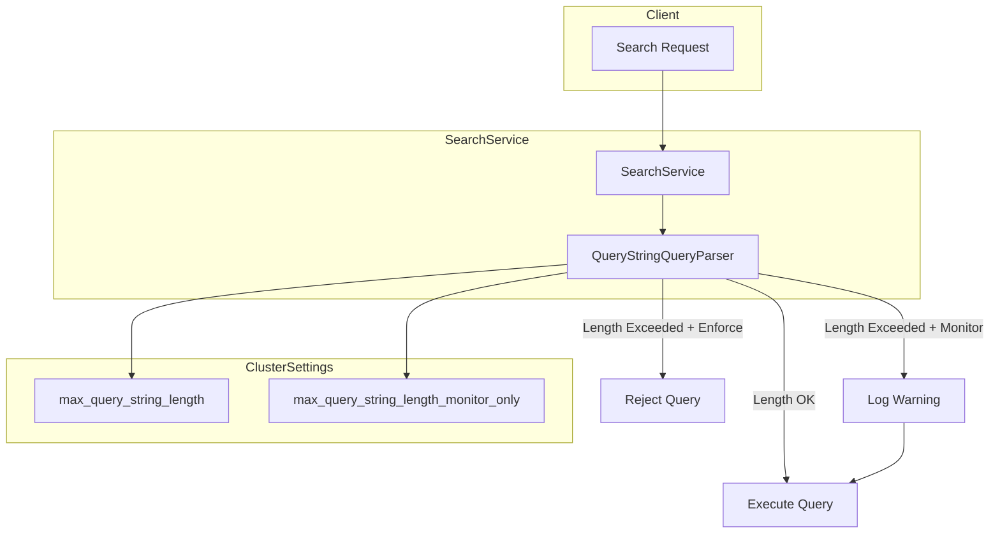
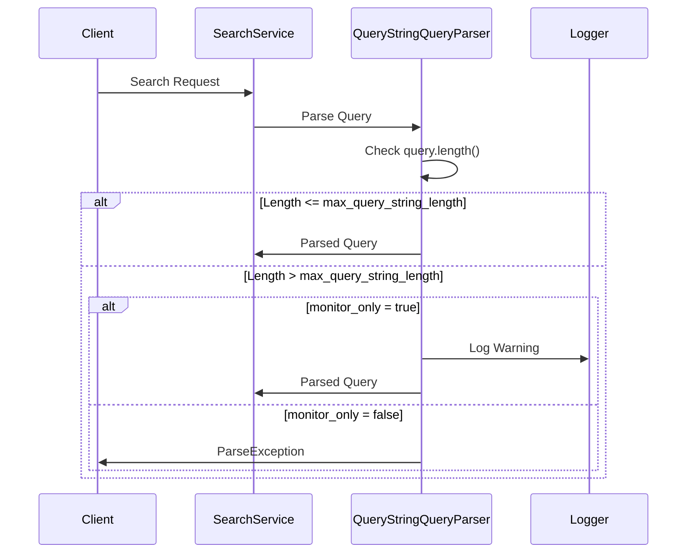

---
tags:
  - opensearch
---
# Query String Monitoring

## Summary

Query String Monitoring provides cluster-level settings to control and monitor the length of query strings in `query_string` and `simple_query_string` queries. This feature helps administrators protect clusters from potentially expensive or malicious queries with excessively long query strings, while providing a monitoring mode to assess impact before enforcing strict limits.

## Details

### Architecture



### Components

| Component | Description |
|-----------|-------------|
| `SearchService` | Registers cluster settings and propagates updates to QueryStringQueryParser |
| `QueryStringQueryParser` | Validates query string length and applies monitoring/enforcement logic |
| `ClusterSettings` | Stores the max length and monitoring mode configuration |

### Configuration

| Setting | Description | Default | Dynamic |
|---------|-------------|---------|---------|
| `search.query.max_query_string_length` | Maximum allowed length for query strings | `Integer.MAX_VALUE` | Yes |
| `search.query.max_query_string_length_monitor_only` | When `true`, log warnings instead of rejecting queries | `false` | Yes |

### Data Flow



### Usage Example

```json
// Set a query string length limit with monitoring enabled
PUT _cluster/settings
{
  "persistent": {
    "search.query.max_query_string_length": 10000,
    "search.query.max_query_string_length_monitor_only": true
  }
}

// Example query that would trigger monitoring
GET my-index/_search
{
  "query": {
    "query_string": {
      "query": "term1 OR term2 OR term3 OR ... (very long query)"
    }
  }
}

// After assessment, enforce the limit
PUT _cluster/settings
{
  "persistent": {
    "search.query.max_query_string_length_monitor_only": false
  }
}
```

## Limitations

- Only applies to `query_string` and `simple_query_string` query types
- Cluster-wide setting only; cannot be configured per-index
- Warning logs may increase log volume in high-traffic environments
- Does not limit other query types or overall request size

## Change History

- **v3.4.0** (2025-12-09): Added `search.query.max_query_string_length_monitor_only` setting for monitoring mode
- **v2.19.4** (2025-10-01): Initial implementation of `search.query.max_query_string_length` setting


## References

### Documentation
- [Query String Query Documentation](https://docs.opensearch.org/3.0/query-dsl/full-text/query-string/): Official documentation
- [PR #19539](https://github.com/opensearch-project/OpenSearch/pull/19539): Monitoring mode implementation
- [PR #19491](https://github.com/opensearch-project/OpenSearch/pull/19491): Original max length setting

### Pull Requests
| Version | PR | Description | Related Issue |
|---------|-----|-------------|---------------|
| v3.4.0 | [#19539](https://github.com/opensearch-project/OpenSearch/pull/19539) | Introduced monitoring mode for query string query max length |   |
| v2.19.4 | [#19491](https://github.com/opensearch-project/OpenSearch/pull/19491) | Initial implementation of `search.query.max_query_string_length` setting |   |
