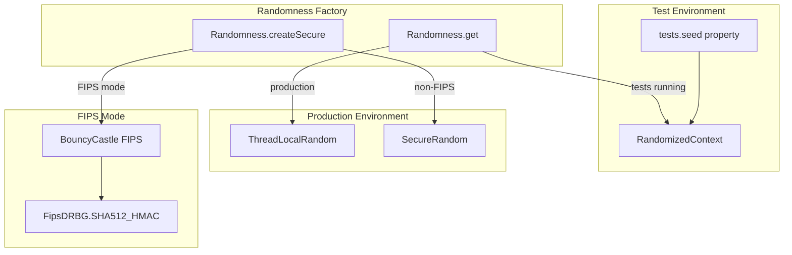
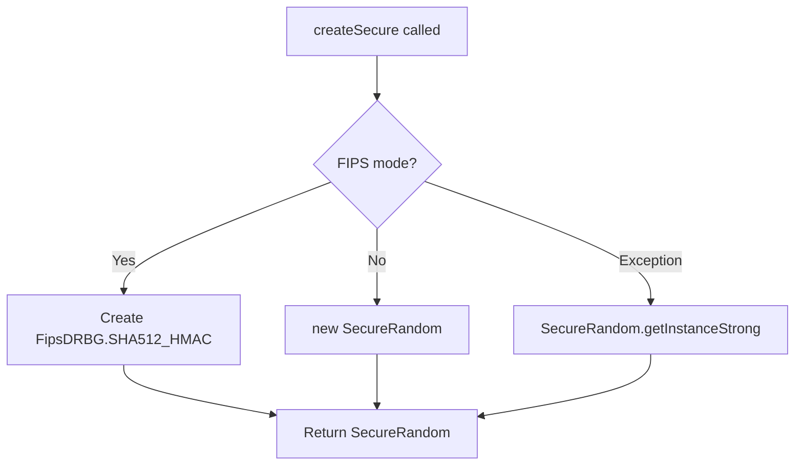

---
tags:
  - opensearch
---
# Randomness

## Summary

The `Randomness` class provides factory methods for producing reproducible and secure sources of randomness in OpenSearch. It handles both test environments (reproducible random) and production environments (secure random), with special support for FIPS-compliant cryptographic random number generation.

## Details

### Architecture



### Components

| Component | Description |
|-----------|-------------|
| `Randomness.get()` | Returns reproducible Random in tests, ThreadLocalRandom in production |
| `Randomness.get(Settings, Setting)` | Returns seeded Random from settings, or default |
| `Randomness.createSecure()` | Returns SecureRandom appropriate for the runtime environment |
| `Randomness.shuffle(List)` | Shuffles a list using the appropriate Random source |

### Configuration

The class uses reflection to detect the runtime environment:

| Environment | Detection Method | Random Source |
|-------------|-----------------|---------------|
| Test | `RandomizedContext` class present | `RandomizedContext.getRandom()` |
| Production | No test context | `ThreadLocalRandom.current()` |
| FIPS | `CryptoServicesRegistrar.isInApprovedOnlyMode()` | `FipsDRBG.SHA512_HMAC` |
| Non-FIPS | Default | `new SecureRandom()` |

### SecureRandom Implementation Details



### Usage Example

```java
// Get a random source (reproducible in tests)
Random random = Randomness.get();

// Get a seeded random from settings
Random seededRandom = Randomness.get(settings, NODE_ID_SEED_SETTING);

// Get a secure random for cryptographic operations
SecureRandom secureRandom = Randomness.createSecure();

// Shuffle a list
List<String> items = new ArrayList<>(Arrays.asList("a", "b", "c"));
Randomness.shuffle(items);
```

## Limitations

- The fallback path uses `SecureRandom.getInstanceStrong()` which may block on low-entropy systems
- FIPS mode requires BouncyCastle FIPS provider on the classpath
- Test reproducibility requires the `tests.seed` system property to be set

## Change History

- **v3.2.0** (2025-07-16): Fixed blocking issue by reverting to `new SecureRandom()` in non-FIPS mode


## References

### Documentation
- [Java SecureRandom Documentation](https://docs.oracle.com/en/java/javase/21/docs/api/java.base/java/security/SecureRandom.html)
- [BouncyCastle FIPS Documentation](https://www.bouncycastle.org/fips-java/)

### Pull Requests
| Version | PR | Description | Related Issue |
|---------|-----|-------------|---------------|
| v3.2.0 | [#18758](https://github.com/opensearch-project/OpenSearch/pull/18758) | Use `new SecureRandom()` to avoid blocking | [#18729](https://github.com/opensearch-project/OpenSearch/issues/18729) |

### Issues (Design / RFC)
- [Issue #18729](https://github.com/opensearch-project/OpenSearch/issues/18729): OpenSearch 3.1.0 freezes when running on AlmaLinux 8
