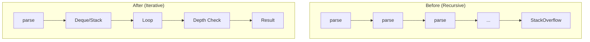

---
tags:
  - opensearch
---
# Recursive Parser Refactoring

## Summary

OpenSearch refactored several recursive parsing methods to use iterative approaches, preventing stack overflow errors and improving stability when processing deeply nested structures such as WKT geometry collections, filter paths, and Grok patterns.

## Details

### Architecture

### Components

| Component | Class | Method | Depth Limit |
|-----------|-------|--------|-------------|
| WKT Parser | `WellKnownText` | `parseGeometryCollection` | 1000 |
| FilterPath Parser | `FilterPath` | `parse` | N/A |
| Grok Validator | `Grok` | `validatePatternBank` | 500 |

### WKT GeometryCollection Parser

Parses Well-Known Text (WKT) format for geometry collections. The iterative implementation uses a `Deque<List<Geometry>>` to track nested collections.

Key changes:
- `MAX_DEPTH_OF_GEO_COLLECTION = 1000` constant added
- Uses `ArrayDeque` for stack-based iteration
- Separates `parseSimpleGeometry` from `parseGeometryCollection`

### FilterPath Parser

Parses filter paths used in response filtering (e.g., `_source` filtering). The refactored implementation uses regex-based splitting.

Key changes:
- Uses `String.split("(?<!\\\\)\\\\.")` to split by unescaped dots
- Builds `FilterPath` chain from end to start
- Handles empty strings and null values

### Grok Pattern Validator

Validates Grok pattern banks for circular references. The iterative implementation uses a custom `Frame` class.

Key changes:
- `MAX_PATTERN_DEPTH_SIZE = 500` constant added
- Uses `Frame` class with `patternName`, `path`, and `startIndex`
- Tracks visited patterns with `HashSet`
- Uses `pathMap` for circular reference detection

## Limitations

- Depth limits are hardcoded and not configurable
- GeometryCollection depth: 1000 levels maximum
- Grok pattern depth: 500 levels maximum

## Change History

- **v2.16.0** (2024-08-06): Refactored WKT parser, FilterPath parser, and Grok validator to iterative approaches

## References

### Documentation

- [Geo-shape field type](https://opensearch.org/docs/latest/field-types/supported-field-types/geo-shape/)
- [Grok processor](https://opensearch.org/docs/latest/ingest-pipelines/processors/grok/)

### Pull Requests
| Version | PR | Description |
|---------|-----|-------------|
| v2.16.0 | [#14086](https://github.com/opensearch-project/OpenSearch/pull/14086) | Switch to iterative version of WKT format parser |
| v2.16.0 | [#14200](https://github.com/opensearch-project/OpenSearch/pull/14200) | Refactoring FilterPath.parse by using an iterative approach |
| v2.16.0 | [#14206](https://github.com/opensearch-project/OpenSearch/pull/14206) | Refactoring Grok.validatePatternBank by using an iterative approach |

### Related Issues
| Issue | Description |
|-------|-------------|
| [#12067](https://github.com/opensearch-project/OpenSearch/issues/12067) | Replace recursive FilterPath.parse with iterative approach |
