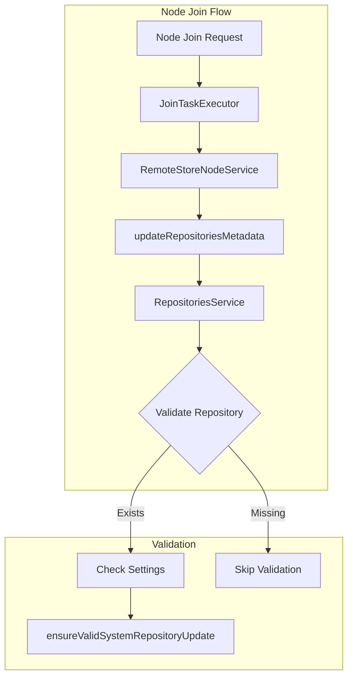

---
tags:
  - opensearch
---
# Remote Repository Validation

## Summary

Remote repository validation ensures that repository metadata in the cluster state is consistent with the RepositoriesService during node join operations. This validation is part of the cluster manager's responsibility when processing node joins that include remote store repository configurations.

## Details

### Architecture



### Components

| Component | Description |
|-----------|-------------|
| `JoinTaskExecutor` | Executes node join tasks on the cluster manager |
| `RemoteStoreNodeService` | Handles remote store node operations including repository metadata updates |
| `RepositoriesService` | Manages repository lifecycle and provides repository access |

### Validation Process

When a node with remote store repositories joins the cluster:

1. `JoinTaskExecutor` invokes `RemoteStoreNodeService.updateRepositoriesMetadata()`
2. For each repository in the joining node's metadata:
   - Check if repository already exists in cluster state
   - If exists, verify it's also present in RepositoriesService
   - Validate that restricted system repository settings haven't changed
3. If validation passes, merge repository metadata into cluster state

### Configuration

Remote store repositories are configured via node attributes in `opensearch.yml`:

```yaml
# Remote cluster state repository
node.attr.remote_store.state.repository: my-remote-state-repo
node.attr.remote_store.repository.my-remote-state-repo.type: s3
node.attr.remote_store.repository.my-remote-state-repo.settings.bucket: my-bucket

# Remote routing table repository
node.attr.remote_store.routing_table.repository: my-routing-repo
node.attr.remote_store.repository.my-routing-repo.type: s3
node.attr.remote_store.repository.my-routing-repo.settings.bucket: my-bucket
```

## Limitations

- Repository validation depends on RepositoriesService being in sync with cluster state
- In edge cases where publish succeeds but commit fails, validation may be skipped

## Change History

- **v2.19.0** (2024-12-10): Added defensive handling for RepositoriesService out-of-sync scenarios during node joins ([#16763](https://github.com/opensearch-project/OpenSearch/pull/16763))

## References

### Documentation

- [Remote-backed storage](https://docs.opensearch.org/2.19/tuning-your-cluster/availability-and-recovery/remote-store/index/)
- [Remote cluster state](https://docs.opensearch.org/2.19/tuning-your-cluster/availability-and-recovery/remote-store/remote-cluster-state/)

### Pull Requests

| Version | PR | Description |
|---------|-----|-------------|
| v2.19.0 | [#16763](https://github.com/opensearch-project/OpenSearch/pull/16763) | Skip remote-repositories validations for node-joins when RepositoriesService is not in sync with cluster-state |

### Issues

| Issue | Description |
|-------|-------------|
| [#16762](https://github.com/opensearch-project/OpenSearch/issues/16762) | Commit Failures During Node Joins with Repositories Configured Result in Persistent NullPointerExceptions |
