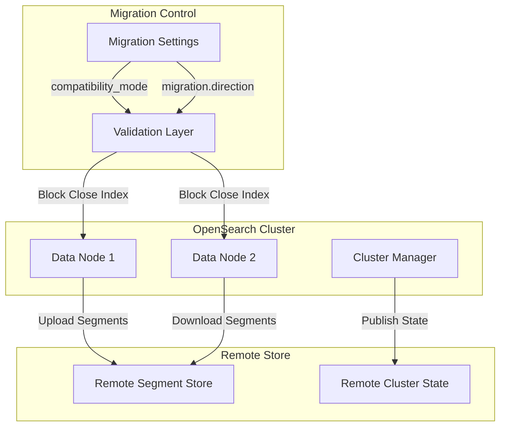
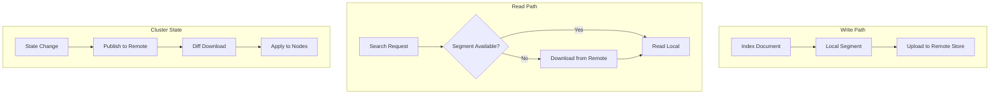

---
tags:
  - opensearch
---
# Remote Store

## Summary

Remote Store (remote-backed storage) is an OpenSearch feature that automatically creates backups of all index transactions and sends them to remote storage. It provides data durability and disaster recovery capabilities by storing segment data and cluster state in remote storage systems like Amazon S3. Remote Store requires segment replication to be enabled and supports migration from document-replication-based clusters through a rolling upgrade mechanism.

## Details

### Architecture



### Data Flow



### Components

| Component | Description |
|-----------|-------------|
| `RemoteStoreNodeService` | Manages remote store node settings and migration direction |
| `RemoteClusterStateService` | Handles cluster state publication and retrieval from remote store |
| `RemoteStorePinnedTimestampService` | Manages pinned timestamps for remote store operations |
| `TransportCloseIndexAction` | Validates close index requests during migration |

### Configuration

| Setting | Description | Default |
|---------|-------------|---------|
| `cluster.remote_store.compatibility_mode` | Controls node compatibility during migration (`strict`, `mixed`) | `strict` |
| `cluster.migration.direction` | Migration direction (`none`, `remote_store`) | `none` |
| `node.attr.remote_store.segment.repository` | Repository name for segment storage | - |
| `node.attr.remote_store.translog.repository` | Repository name for translog storage | - |
| `cluster.remote_store.pinned_timestamps.enabled` | Enable pinned timestamps feature | `false` |
| `cluster.remote_state.download.serve_read_api.enabled` | Controls full cluster state download from remote on term mismatch | `true` |

### Usage Example

#### Configuring Remote Store Migration

```yaml
# opensearch.yml - Node configuration
node.attr.remote_store.segment.repository: my-segment-repo
node.attr.remote_store.translog.repository: my-translog-repo
node.attr.remote_store.state.repository: my-state-repo
```

```bash
# Enable mixed mode for migration
PUT /_cluster/settings
{
  "persistent": {
    "cluster.remote_store.compatibility_mode": "mixed",
    "cluster.migration.direction": "remote_store"
  }
}
```

#### Completing Migration

```bash
# After all nodes are migrated, clear migration settings
PUT /_cluster/settings
{
  "persistent": {
    "cluster.remote_store.compatibility_mode": null,
    "cluster.migration.direction": null
  }
}
```

## Limitations

- Requires segment replication to be enabled
- Close index operations are blocked during migration (when `compatibility_mode=mixed` and `migration.direction=remote_store`)
- OpenSearch 2.15+ nodes cannot revert to document replication after migration
- Migration must be performed as a rolling upgrade

## Change History

- **v3.1.0** (2026-01-10): Added close index request rejection during migration; Fixed cluster state diff download failures during alias operations
- **v3.0.0** (2024-12-16): Added `cluster.remote_state.download.serve_read_api.enabled` setting to control full cluster state download on term mismatch


## References

### Documentation
- [Migrating to remote-backed storage](https://docs.opensearch.org/3.0/tuning-your-cluster/availability-and-recovery/remote-store/migrating-to-remote/): Official migration documentation
- [Remote-backed storage](https://docs.opensearch.org/3.0/tuning-your-cluster/availability-and-recovery/remote-store/index/): Remote store overview
- [Remote Store Stats API](https://docs.opensearch.org/3.0/tuning-your-cluster/availability-and-recovery/remote-store/remote-store-stats-api/): API documentation

### Pull Requests
| Version | PR | Description | Related Issue |
|---------|-----|-------------|---------------|
| v3.1.0 | [#18327](https://github.com/opensearch-project/OpenSearch/pull/18327) | Disabling _close API invocation during remote migration | [#18328](https://github.com/opensearch-project/OpenSearch/issues/18328) |
| v3.1.0 | [#18256](https://github.com/opensearch-project/OpenSearch/pull/18256) | Apply cluster state metadata and routing table diff when building cluster state from remote | [#18045](https://github.com/opensearch-project/OpenSearch/issues/18045) |
| v3.0.0 | [#16798](https://github.com/opensearch-project/OpenSearch/pull/16798) | Setting to disable full cluster state download from remote on term mismatch | [#8957](https://github.com/opensearch-project/documentation-website/issues/8957) |

### Issues (Design / RFC)
- [Issue #18328](https://github.com/opensearch-project/OpenSearch/issues/18328): Reject close index requests during DocRep to SegRep migration
- [Issue #18045](https://github.com/opensearch-project/OpenSearch/issues/18045): Remote Cluster State Diff Download Failures during IndicesAliases Action
