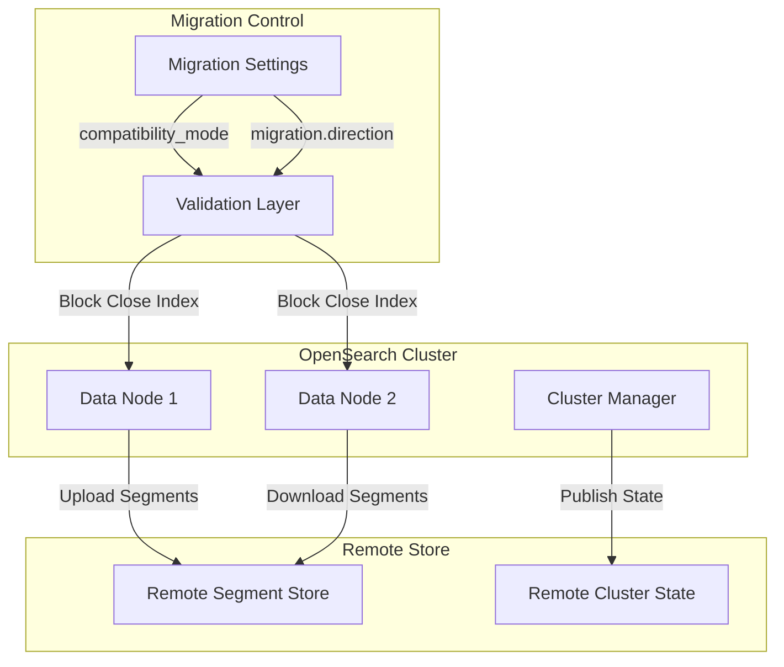
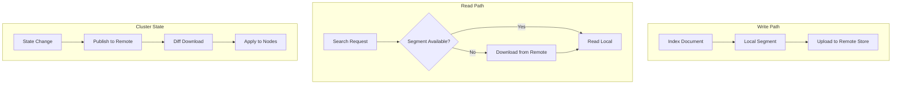

---
tags:
  - opensearch
---
# Remote Store

## Summary

Remote Store (remote-backed storage) is an OpenSearch feature that automatically creates backups of all index transactions and sends them to remote storage. It provides data durability and disaster recovery capabilities by storing segment data and cluster state in remote storage systems like Amazon S3. Remote Store requires segment replication to be enabled and supports migration from document-replication-based clusters through a rolling upgrade mechanism.

## Details

### Architecture


```mermaid
graph TB
    subgraph "OpenSearch Cluster"
        CM[Cluster Manager]
        DN1[Data Node 1]
        DN2[Data Node 2]
    end
    
    subgraph "Remote Store"
        RS[Remote Segment Store]
        RCS[Remote Cluster State]
    end
    
    subgraph "Migration Control"
        MC[Migration Settings]
        VAL[Validation Layer]
    end
    
    CM -->|Publish State| RCS
    DN1 -->|Upload Segments| RS
    DN2 -->|Download Segments| RS
    
    MC -->|compatibility_mode| VAL
    MC -->|migration.direction| VAL
    VAL -->|Block Close Index| DN1
    VAL -->|Block Close Index| DN2
```

### Data Flow


```mermaid
flowchart TB
    subgraph "Write Path"
        W1[Index Document] --> W2[Local Segment]
        W2 --> W3[Upload to Remote Store]
    end
    
    subgraph "Read Path"
        R1[Search Request] --> R2{Segment Available?}
        R2 -->|Yes| R3[Read Local]
        R2 -->|No| R4[Download from Remote]
        R4 --> R3
    end
    
    subgraph "Cluster State"
        CS1[State Change] --> CS2[Publish to Remote]
        CS2 --> CS3[Diff Download]
        CS3 --> CS4[Apply to Nodes]
    end
```

### Components

| Component | Description |
|-----------|-------------|
| `RemoteStoreNodeService` | Manages remote store node settings and migration direction |
| `RemoteClusterStateService` | Handles cluster state publication and retrieval from remote store |
| `RemoteStorePinnedTimestampService` | Manages pinned timestamps for remote store operations |
| `TransportCloseIndexAction` | Validates close index requests during migration |

### Configuration

| Setting | Description | Default |
|---------|-------------|---------|
| `cluster.remote_store.compatibility_mode` | Controls node compatibility during migration (`strict`, `mixed`) | `strict` |
| `cluster.migration.direction` | Migration direction (`none`, `remote_store`) | `none` |
| `node.attr.remote_store.segment.repository` | Repository name for segment storage | - |
| `node.attr.remote_store.translog.repository` | Repository name for translog storage | - |
| `cluster.remote_store.pinned_timestamps.enabled` | Enable pinned timestamps feature | `false` |
| `cluster.remote_state.download.serve_read_api.enabled` | Controls full cluster state download from remote on term mismatch | `true` |
| `cluster.remote_store.state.cleanup.batch_size` | Number of manifests to process per cleanup batch | `1000` |
| `cluster.remote_store.state.cleanup.max_batches` | Maximum number of batches per cleanup run | `3` |
| `cluster.remote_store.uploaded_segments_cleanup_threshold` | Map size threshold to trigger stale segment cleanup; `-1` disables | `1000` |

### Usage Example

#### Configuring Remote Store Migration

```yaml
# opensearch.yml - Node configuration
node.attr.remote_store.segment.repository: my-segment-repo
node.attr.remote_store.translog.repository: my-translog-repo
node.attr.remote_store.state.repository: my-state-repo
```

```bash
# Enable mixed mode for migration
PUT /_cluster/settings
{
  "persistent": {
    "cluster.remote_store.compatibility_mode": "mixed",
    "cluster.migration.direction": "remote_store"
  }
}
```

#### Completing Migration

```bash
# After all nodes are migrated, clear migration settings
PUT /_cluster/settings
{
  "persistent": {
    "cluster.remote_store.compatibility_mode": null,
    "cluster.migration.direction": null
  }
}
```

## Limitations

- Requires segment replication to be enabled
- Close index operations are blocked during migration (when `compatibility_mode=mixed` and `migration.direction=remote_store`)
- OpenSearch 2.15+ nodes cannot revert to document replication after migration
- Migration must be performed as a rolling upgrade

## Change History

- **v3.6.0** (2026-04-15): Fixed EncryptedBlobContainer ignoring limit in `listBlobsByPrefixInSortedOrder`, causing JVM exhaustion with large manifest counts; Fixed stale cluster metadata pile-ups by implementing batched manifest deletions with configurable `cluster.remote_store.state.cleanup.batch_size` and `cluster.remote_store.state.cleanup.max_batches` settings, corrected deletion order (manifests deleted last), and fixed `lastCleanupAttemptStateVersion` only updating on success; Fixed unbounded `segmentsUploadedToRemoteStore` map growth by adding threshold-based cleanup via `cluster.remote_store.uploaded_segments_cleanup_threshold` setting
- **v3.1.0** (2026-01-10): Added close index request rejection during migration; Fixed cluster state diff download failures during alias operations
- **v3.0.0** (2024-12-16): Added `cluster.remote_state.download.serve_read_api.enabled` setting to control full cluster state download on term mismatch
- **v2.19.0** (2025-02-18): Fixed stale cluster state custom file deletion bug in `RemoteClusterStateCleanupManager`; Reverted minimum codec version upload logic for remote state manifest; Added OpenSearch version-aware deserialization for custom metadata to fix cluster upgrade failures
- **v2.16.0** (2024-08-06): Added rate limiter for low priority uploads; Refactored remote routing table service to align with remote state interfaces; Added shard-diff path to diff manifest to reduce remote store read calls; Fixed S3 multipart upload failures for remote cluster state objects


## References

### Documentation
- [Migrating to remote-backed storage](https://docs.opensearch.org/3.0/tuning-your-cluster/availability-and-recovery/remote-store/migrating-to-remote/): Official migration documentation
- [Remote-backed storage](https://docs.opensearch.org/3.0/tuning-your-cluster/availability-and-recovery/remote-store/index/): Remote store overview
- [Remote Store Stats API](https://docs.opensearch.org/3.0/tuning-your-cluster/availability-and-recovery/remote-store/remote-store-stats-api/): API documentation

### Pull Requests
| Version | PR | Description | Related Issue |
|---------|-----|-------------|---------------|
| v3.6.0 | [#20514](https://github.com/opensearch-project/OpenSearch/pull/20514) | Fix `listBlobsByPrefixInSortedOrder` in EncryptedBlobContainer to respect limit | [#20543](https://github.com/opensearch-project/OpenSearch/issues/20543) |
| v3.6.0 | [#20566](https://github.com/opensearch-project/OpenSearch/pull/20566) | Batched deletions of stale ClusterMetadataManifests | [#20564](https://github.com/opensearch-project/OpenSearch/issues/20564) |
| v3.6.0 | [#20976](https://github.com/opensearch-project/OpenSearch/pull/20976) | Stale segments cleanup based on map size threshold | [#20960](https://github.com/opensearch-project/OpenSearch/issues/20960) |
| v3.1.0 | [#18327](https://github.com/opensearch-project/OpenSearch/pull/18327) | Disabling _close API invocation during remote migration | [#18328](https://github.com/opensearch-project/OpenSearch/issues/18328) |
| v3.1.0 | [#18256](https://github.com/opensearch-project/OpenSearch/pull/18256) | Apply cluster state metadata and routing table diff when building cluster state from remote | [#18045](https://github.com/opensearch-project/OpenSearch/issues/18045) |
| v3.0.0 | [#16798](https://github.com/opensearch-project/OpenSearch/pull/16798) | Setting to disable full cluster state download from remote on term mismatch | [#8957](https://github.com/opensearch-project/documentation-website/issues/8957) |
| v2.19.0 | [#16670](https://github.com/opensearch-project/OpenSearch/pull/16670) | Fix stale cluster state custom file deletion | - |
| v2.19.0 | [#16403](https://github.com/opensearch-project/OpenSearch/pull/16403) | Revert uploading of remote cluster state manifest using min codec version | - |
| v2.16.0 | [#14374](https://github.com/opensearch-project/OpenSearch/pull/14374) | Rate limiter for remote store low priority uploads | [#14373](https://github.com/opensearch-project/OpenSearch/issues/14373) |
| v2.16.0 | [#14668](https://github.com/opensearch-project/OpenSearch/pull/14668) | Refactor remote-routing-table service inline with remote state interfaces | [#14067](https://github.com/opensearch-project/OpenSearch/issues/14067) |
| v2.16.0 | [#14684](https://github.com/opensearch-project/OpenSearch/pull/14684) | Add shard-diff path to diff manifest to reduce remote store read calls | [#15125](https://github.com/opensearch-project/OpenSearch/issues/15125) |
| v2.19.0 | [#16494](https://github.com/opensearch-project/OpenSearch/pull/16494) | Add opensearch version info while deserialization | - |
| v2.16.0 | [#14888](https://github.com/opensearch-project/OpenSearch/pull/14888) | Create new IndexInput for multi part upload | [#14808](https://github.com/opensearch-project/OpenSearch/issues/14808) |

### Issues (Design / RFC)
- [Issue #20543](https://github.com/opensearch-project/OpenSearch/issues/20543): EncryptedBlobContainer ignores limit for listing blobs in sorted order
- [Issue #20564](https://github.com/opensearch-project/OpenSearch/issues/20564): Remote Cluster State cleanup failures due to deletion timeouts causing stale metadata pile-ups
- [Issue #20960](https://github.com/opensearch-project/OpenSearch/issues/20960): Memory build up due to stale segment cleanup not triggering in Remote Store domains
- [Issue #18328](https://github.com/opensearch-project/OpenSearch/issues/18328): Reject close index requests during DocRep to SegRep migration
- [Issue #18045](https://github.com/opensearch-project/OpenSearch/issues/18045): Remote Cluster State Diff Download Failures during IndicesAliases Action
