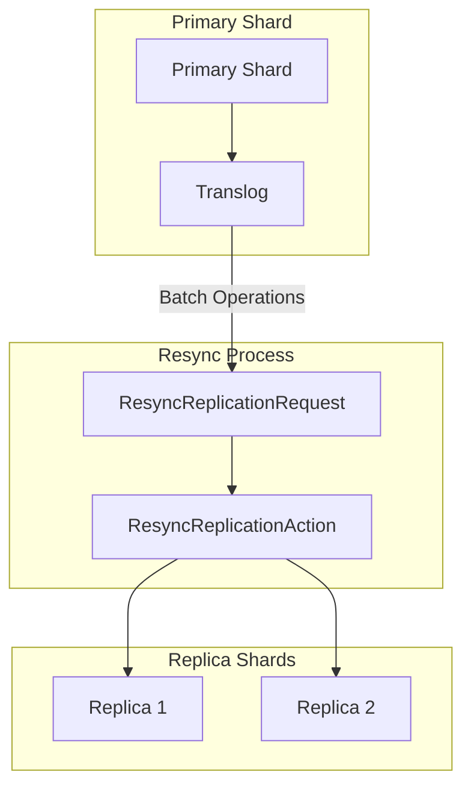
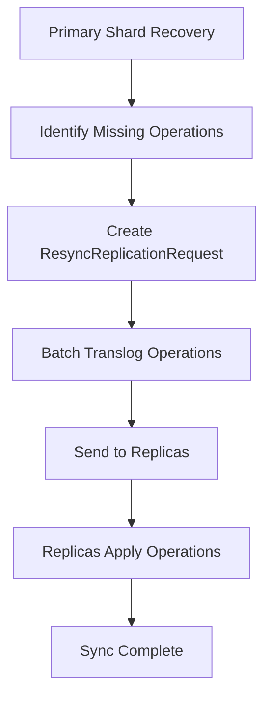

---
tags:
  - domain/core
  - component/server
  - indexing
---
# Replication

## Summary

Replication in OpenSearch ensures data durability and high availability by maintaining copies of data across multiple shards. The core replication infrastructure includes mechanisms for primary-replica synchronization, including the resync process that ensures replicas stay consistent with the primary shard after recovery or failover scenarios.

## Details

### Architecture



### Data Flow



### Components

| Component | Description |
|-----------|-------------|
| `ResyncReplicationRequest` | Request class that batches translog operations for primary-replica resync |
| `ResyncReplicationAction` | Transport action that handles resync requests |
| `ReplicatedWriteRequest` | Base class for replicated write operations |
| `Translog.Operation` | Individual translog operations (index, delete, etc.) |

### Key Fields in ResyncReplicationRequest

| Field | Type | Description |
|-------|------|-------------|
| `trimAboveSeqNo` | `long` | Sequence number above which operations should be trimmed |
| `maxSeenAutoIdTimestampOnPrimary` | `long` | Maximum auto-generated ID timestamp seen on primary |
| `operations` | `Translog.Operation[]` | Array of translog operations to resync |

### Usage Example

The resync mechanism is internal to OpenSearch and triggered automatically during:

```
1. Replica shard recovery after node restart
2. Shard relocation between nodes
3. Primary shard failover and promotion
```

## Limitations

- Resync operations are internal and not directly exposed via API
- Large resync operations can impact cluster performance during recovery
- Network bandwidth is consumed during resync between primary and replicas

## Change History

- **v2.18.0** (2024-10-22): Fixed `hashCode()` calculation in `ResyncReplicationRequest` to properly handle array fields using `Arrays.hashCode()`

## Related Features
- [OpenSearch Dashboards](../opensearch-dashboards/opensearch-dashboards-ai-chat.md)

## References

### Documentation
- [Segment replication documentation](https://docs.opensearch.org/latest/tuning-your-cluster/availability-and-recovery/segment-replication/index/): Alternative replication strategy
- [Cross-cluster replication](https://docs.opensearch.org/latest/tuning-your-cluster/replication-plugin/index/): Replication across clusters

### Pull Requests
| Version | PR | Description | Related Issue |
|---------|-----|-------------|---------------|
| v2.18.0 | [#16378](https://github.com/opensearch-project/OpenSearch/pull/16378) | Fix array hashCode calculation in ResyncReplicationRequest |   |
