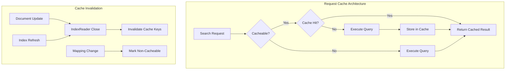

---
tags:
  - opensearch
---
# Request Cache

## Summary

The OpenSearch request cache is a shard-level caching mechanism that stores the results of frequently executed search queries to improve search performance and reduce cluster load. It automatically invalidates cached entries when documents are updated or index settings change, ensuring fresh results.

## Details

### Architecture



### Data Flow


### Components

| Component | Description |
|-----------|-------------|
| `IndicesRequestCache` | Main cache implementation managing cached search results |
| `IndicesRequestCache.CacheCleanupManager` | Manages cleanup keys and scheduled cache cleaning |
| `TransportClearIndicesCacheAction` | Handles cache clear API requests with node-level optimization |
| `TransportBroadcastByNodeAction` | Base class providing node-level hook for post-shard operations |
| `QueryShardContext` | Tracks query cacheability during query building |

### Configuration

| Setting | Description | Default |
|---------|-------------|---------|
| `indices.cache.cleanup_interval` | Interval for background cleanup task | `1m` |
| `indices.requests.cache.size` | Cache size as percentage of heap | `1%` |
| `index.requests.cache.enable` | Enable/disable cache per index | `true` |
| `indices.requests.cache.maximum_cacheable_size` | Maximum `size` parameter for cacheable queries | `0` |

### Cacheability Rules

Queries are **not cacheable** when:
- `size` > `indices.requests.cache.maximum_cacheable_size` (default: only `size=0` cacheable)
- Query uses `Math.random()` or other non-deterministic functions
- Query uses relative times like `now` or `new Date()`
- Query is a scroll query or profiled query
- Query is a DFS query
- Query targets keyword fields with `use_similarity: true` (v3.3.0+)
- Query targets keyword fields with `split_queries_on_whitespace: true` (v3.3.0+)

### Usage Example

```bash
# Enable request cache for an index
PUT /my_index/_settings
{
  "index.requests.cache.enable": true
}

# Force cache a specific request
GET /my_index/_search?request_cache=true
{
  "size": 0,
  "aggs": {
    "popular_tags": {
      "terms": { "field": "tags" }
    }
  }
}

# Clear request cache
POST /my_index/_cache/clear?request=true

# Monitor cache statistics
GET /_nodes/stats/indices/request_cache
```

### Monitoring

```bash
# Node-level cache stats
GET /_nodes/stats/indices/request_cache

# Response includes:
# - memory_size_in_bytes: Current cache size
# - evictions: Number of evictions
# - hit_count: Cache hits
# - miss_count: Cache misses
```

## Limitations

- Only queries with `size=0` are cached by default (configurable in v2.19+)
- Cache is invalidated on every index refresh
- Queries on keyword fields with non-default `use_similarity` or `split_queries_on_whitespace` are not cacheable
- Cache size is limited to a percentage of heap memory

## Change History

- **v3.3.0**: Optimized cache clear performance by adding node-level hook; disabled caching for keyword fields with non-default `use_similarity` or `split_queries_on_whitespace`


## References

### Documentation
- [Documentation: Index request cache](https://docs.opensearch.org/3.0/search-plugins/caching/request-cache/)
- [Documentation: Tiered cache](https://docs.opensearch.org/3.0/search-plugins/caching/tiered-cache/)

### Pull Requests
| Version | PR | Description | Related Issue |
|---------|-----|-------------|---------------|
| v3.3.0 | [#19263](https://github.com/opensearch-project/OpenSearch/pull/19263) | Remove unnecessary iteration per-shard in request cache cleanup | [#19183](https://github.com/opensearch-project/OpenSearch/issues/19183) |
| v3.3.0 | [#19385](https://github.com/opensearch-project/OpenSearch/pull/19385) | Disable request cache for queries on fields with non-default keyword parameters | [#19279](https://github.com/opensearch-project/OpenSearch/issues/19279) |

### Issues (Design / RFC)
- [Issue #19118](https://github.com/opensearch-project/OpenSearch/issues/19118): Repeated iteration through keys on cache clear API
- [Issue #19183](https://github.com/opensearch-project/OpenSearch/issues/19183): Add node-level hook to TransportBroadcastByNodeAction
- [Issue #19279](https://github.com/opensearch-project/OpenSearch/issues/19279): Dynamically updating mapping parameters does not wipe request cache entries
